# Elastic Search Guide

This are my notes on **ElasticSearch** and **search methods** with focus on Machine Learning.

I created most of the content in this `README.md` after following the course [Complete Guide to Elasticsearch (Udemy), by Bo Andersen](https://www.udemy.com/course/elasticsearch-complete-guide), but extended it mainly consulting the official Elastic documentation and other sources that deal with data structures for search operations. The course by Bo Andersen has a Github repository with a summary of all the commands used: [codingexplained/complete-guide-to-elasticsearch](https://github.com/codingexplained/complete-guide-to-elasticsearch).

My repository is structured as follows:

- [`README.md`](./README.md): main guide.
- [`elasticsearch_catalogue.md`](./elasticsearch_catalogue.md): summary/catalogue of all the commands/queries in the guide.
- [`notebooks/`](./notebooks/) contains notebooks with Python code about different related topics:
  - ElasticSearch usage with Python: [`elastic_intro.ipynb`](./notebooks/)
  - Data structures used for search operations: [`search_data_structures.ipynb`](./notebooks/search_data_structures.ipynb)
    - Inverted indices
    - Doc Values
    - KD-Trees
    - etc.
  - ...
- [`notebooks/products-bulk.json`](./notebooks/products-bulk.json): dummy data which contains 1000 products with their properties, used in the guide/course.
  - Similarly, other dummy datasets added later: [`department.json`](./notebooks/department.json), [`orders-bulk.json`](./notebooks/orders-bulk.json), [`recipes-bulk.json`](./notebooks/recipes-bulk.json)

Additionally, [`relevant_search/README.md`](./relevant_search/README.md) contains my notes on the book [Relevant SEARCH, by Doug Turnbull and John Berryman](https://www.manning.com/books/relevant-search).

Mikel Sagardia, 2024.  
No guarantees.

Table of contents:

- [Elastic Search Guide](#elastic-search-guide)
  - [Introduction](#introduction)
    - [Elastic Stack](#elastic-stack)
    - [Common Application Architecture](#common-application-architecture)
  - [Getting Started: Setting Up Elastic Search and Kibana](#getting-started-setting-up-elastic-search-and-kibana)
    - [Setup](#setup)
      - [Elastic Cloud](#elastic-cloud)
      - [Windows](#windows)
      - [Unix: Mac OSX, Linux](#unix-mac-osx-linux)
      - [Docker](#docker)
      - [Summary: How to Start Elastic Search](#summary-how-to-start-elastic-search)
    - [Basic Architecture: Cluster, Nodes, Documents, Indices](#basic-architecture-cluster-nodes-documents-indices)
    - [Inspecting a Cluster with the Console](#inspecting-a-cluster-with-the-console)
    - [Interacting with the Cluster via cURL and Python](#interacting-with-the-cluster-via-curl-and-python)
    - [Building an Index](#building-an-index)
      - [Inverted Index](#inverted-index)
      - [B-Tree](#b-tree)
      - [BKD Tree, Block KD-tree](#bkd-tree-block-kd-tree)
      - [Doc Values](#doc-values)
    - [Sharding and Scalability](#sharding-and-scalability)
    - [Replication and Snapshots](#replication-and-snapshots)
      - [Creating Indices](#creating-indices)
    - [Adding Nodes to the Cluster](#adding-nodes-to-the-cluster)
    - [Node Roles](#node-roles)
  - [Managing Documents](#managing-documents)
    - [Warning: Mapping Types are Deprecated](#warning-mapping-types-are-deprecated)
    - [Creating and Deleting Indices](#creating-and-deleting-indices)
    - [Indexing and Deleting Documents](#indexing-and-deleting-documents)
    - [Retrieving Documents by ID](#retrieving-documents-by-id)
    - [Updating Documents](#updating-documents)
    - [Scripted Updates](#scripted-updates)
    - [Upserts](#upserts)
    - [Routing Documents to Shards](#routing-documents-to-shards)
    - [How Elasticsearch Reads and Writes Document Data](#how-elasticsearch-reads-and-writes-document-data)
    - [Document Versioning and Optimistic Concurrency Control](#document-versioning-and-optimistic-concurrency-control)
    - [Update and Delete by Query](#update-and-delete-by-query)
    - [Batch or Bulk Processing](#batch-or-bulk-processing)
      - [Bulk/Batch Processing with cURL](#bulkbatch-processing-with-curl)
  - [Mapping \& Analysis](#mapping--analysis)
    - [Introduction to Analysis](#introduction-to-analysis)
    - [Using the Analysis API](#using-the-analysis-api)
    - [Understanding Inverted Indices](#understanding-inverted-indices)
    - [Introduction to Mapping](#introduction-to-mapping)
    - [Data Types](#data-types)
    - [Type Coercion](#type-coercion)
    - [Arrays](#arrays)
    - [Adding Explicit Mappings and Retrieving](#adding-explicit-mappings-and-retrieving)
      - [Dot Notation](#dot-notation)
      - [Retrieving Mappings](#retrieving-mappings)
    - [Extending Mappings to Existing Indices: Adding New Fields](#extending-mappings-to-existing-indices-adding-new-fields)
    - [Date Type](#date-type)
    - [Missing Fields](#missing-fields)
    - [Overview of Mapping Parameters](#overview-of-mapping-parameters)
    - [Updating Existing Mappings: Reindexing](#updating-existing-mappings-reindexing)
    - [Field Aliases](#field-aliases)
    - [Multi-Field Mappings](#multi-field-mappings)
    - [Index Templates](#index-templates)
    - [Introduction to Dynamic Mappings](#introduction-to-dynamic-mappings)
    - [Configuring Dynamic Mappings](#configuring-dynamic-mappings)
    - [Dynamic Templates](#dynamic-templates)
    - [Mapping Recommendations](#mapping-recommendations)
    - [Stemming and Stop Words](#stemming-and-stop-words)
    - [Analyzers and Search Queries](#analyzers-and-search-queries)
    - [Built-in Analyzers](#built-in-analyzers)
    - [Custom Analyzer](#custom-analyzer)
    - [Adding/Updating Analyzers to/from Existing Indices](#addingupdating-analyzers-tofrom-existing-indices)
  - [Searching for Data](#searching-for-data)
    - [Term-Level Queries](#term-level-queries)
    - [Retrieving Documents by IDs](#retrieving-documents-by-ids)
    - [Range Searches](#range-searches)
    - [Prefixes, Wildcards, Regex](#prefixes-wildcards-regex)
    - [Querying by Field Existence](#querying-by-field-existence)
    - [Intorduction to Full Text Queries](#intorduction-to-full-text-queries)
    - [Match Query: Full-Text Query](#match-query-full-text-query)
    - [Relevance Scoring](#relevance-scoring)
    - [Searching Multiple Fields](#searching-multiple-fields)
    - [Phrase searches](#phrase-searches)
    - [Bool Compound Queries](#bool-compound-queries)
    - [Query and Filter Execution Contexts](#query-and-filter-execution-contexts)
    - [Boosting Queries](#boosting-queries)
    - [Disjunction Max](#disjunction-max)
    - [Querying Nested Objects](#querying-nested-objects)
    - [Nested Inner Hits](#nested-inner-hits)
    - [Nested Fields Limitations](#nested-fields-limitations)
  - [Joining Queries](#joining-queries)
    - [Mapping Document Relationships](#mapping-document-relationships)
    - [Querying Related/Joined Documents](#querying-relatedjoined-documents)
    - [Multi-level Relations](#multi-level-relations)
    - [Parent/Child Inner Hits](#parentchild-inner-hits)
    - [Terms Lookup Mechanism](#terms-lookup-mechanism)
  - [Controlling Query Results](#controlling-query-results)
    - [Specifying the Result Format](#specifying-the-result-format)
    - [Source Filtering](#source-filtering)
    - [Specifying the Result Size and Offset](#specifying-the-result-size-and-offset)
    - [Pagination](#pagination)
    - [Sorting Results](#sorting-results)
  - [Aggregations](#aggregations)
    - [Metric Aggregations](#metric-aggregations)
    - [Bucket Aggregations](#bucket-aggregations)
    - [Nested Aggregations](#nested-aggregations)
    - [Filtering Out Documents](#filtering-out-documents)
    - [Bucket Rules with Filters](#bucket-rules-with-filters)
    - [Range Aggregations](#range-aggregations)
    - [Histograms](#histograms)
    - [Global Aggregation](#global-aggregation)
    - [Missing Field Values](#missing-field-values)
    - [Aggregation of Nested Objects](#aggregation-of-nested-objects)
  - [Improving Search Results](#improving-search-results)
    - [Proximity Searches](#proximity-searches)
    - [Affecting Relevance Scoring with Proximity](#affecting-relevance-scoring-with-proximity)
    - [Fuzzy Queries](#fuzzy-queries)
    - [Adding Synonyms](#adding-synonyms)
    - [Adding Synonyms from File](#adding-synonyms-from-file)
    - [Highlighting Matches in Fields](#highlighting-matches-in-fields)
    - [Stemming](#stemming)
  - [Kibana](#kibana)
  - [License](#license)


## Introduction

[Elastic Search](https://www.elastic.co/) is an open source analytics and full-text search engine.

We can add complex search functionalities to our applications (e.g., Wiki, e-commerce, etc.), similar to Google, with:

- autocompletion
- highlighting
- typo correction
- handling synonyms
- adjusting relevance
- etc.

We can also query structured data and we can use the platform as an analytics tool (with visualization).

Common example: APM (Application Performance Management) = store logs, be able to search in them, visualize in dashboard, etc.

We can apply ML techniques to get insights from data: forecasts, anomaly detection, etc.

In ES data is stored in **Documents**, represented as `JSON` objects:

- A Document is analog to a **row** in a relational DB.
- A Document contains **Fields**, analog to columns in a relational DB.

We perform queries via a REST API, also with `JSONs`.

Some other properties:

- ES is written in Java, on top of [Apache Lucene](https://lucene.apache.org/core/).
- Easy to use, but has many features.
- Distributed.
- Highly scalable.
- Used by many large companies: FB, Netflix, etc.
- Queries can be done using Query DSL

### Elastic Stack

Elastic has built several products which can interact with each other:

- Elastic Search (ES): search.
- **Kibana**: analytics and visualization; dashboard for Elastic Search, ML. [Kibana Demo](https://demo.elastic.co/app/dashboards#/view/welcome_dashboard).
- Logstash: processing of logs and any data; events from different sources (there are many input/output plugins) are processed (e.g., clean, structure, etc.) and sent to Elastic Search or other destinations.
- X-Pack: additional features for ES and Kibana, such as 
  - security and access management, 
  - monitoring of resources (CPU, memory, etc.), 
  - **machine learning** (anomaly detection, forecasting, etc.)
  - graph structures
  - SQL capabilities, besides Query DSL
- Beats - Filebeats, Metricbeats, etc.: lightweight agents which collect and send data to ES. Filebeats collects logs. They are for data ingestion.


### Common Application Architecture

Let's consider an e-commerce site, where users can buy things via a web store/page. We have these components:

- The web frontend.
- The application backend.
- A relational DB where all the products are stored.

If we want to add realtime search capabilities to the web page so that users can find things easily, we need to add **Elastic Search**.

The best approach is to **replicate** all the data entries in the DB into ES; we can do that 

- initially with a script
- and then, we let the backend update ES when the DB is updated, too.

Then, we might connect **Kibana** to ES in order to visualize data in a dashboard: number of orders per week, revenue, etc.


As our web grows, we might have increeased traffic and the servers might be suffering; that's when we add **Metricbeat**, which monitors performance and resources on the backend machine and sends them to ES. Basically, ES opens an ingest node where Metricbeat sends data. We can visualize all that in Kibana, too.

Similarly, we can monitor access and error logs. We do that with **Filebeat**, similar to Metricbeat.

As the web grows we might need some data processing before ingestion to ES. One option would be to implement that processing in the backend, but it has several drawbacks: 

- the backend should run the web, not loose resources processing logs, 
- if we have a decentrilized architecture (i.e., microservices), the logging is also decentralized, and we might want to have a centralized and homogeneous processing.

Thus, it makes sense to add **Logstash** to the architecture, which enables log/data processing before ingestion to ES. Although the data from Metricbeat often times doesn't need to be processed, the data from Filebeat could need to be processed, so it is first sent to Logstash, which transforms it and sends it to ES. However, we always have the felxibility to send the data to ES first, without any processing.

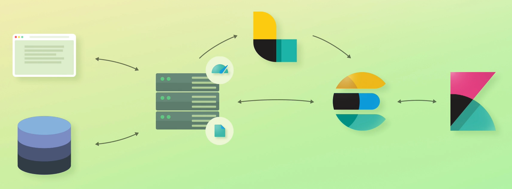

<!--
Our database and ES should be synchronized. However, ideally, our application should have read permissions in ES. How is that possible?
-->

## Getting Started: Setting Up Elastic Search and Kibana

### Setup

There are many options to install Elastic Search and Kibana:

- Install on local machine: Windows, Mac OS, Linux
- Install as Docker image
- Use Elastic Cloud
- ...

Usually, we want to have an ES cluster on the cloud for scalability; it can be a self-managed ES cluster, not necessarily the Elastic Cloud solution.

#### Elastic Cloud

Elastic Cloud has everything set up and running for us: [https://cloud.elastic.co](https://cloud.elastic.co). There's a free trial for 14 days since the moment we create the cluster; after the 14 days the cluster is shut down.

This is a hosted and managed solution, the easiest one to learn how to use ES.

We can leave everything with the default options:

- If we are asked, we choose a pre-configured Elastic Stack solution.
- Additionally, we can select where to store our data! (platform &mdash; AWS, GCP, Azure &mdash;, and location &mdash; Europe, US, etc. &mdash;).
- If shown, we copy the credentials: `user:elastic`, `pw:...`
- In the new version some other variables are shown: `Elasticsearch endpoint`, `Cloud ID`.
- I copied everything to the non-committed/pushed file `elastic_cloud.txt`.

#### Windows

Full, official guide: [Install Elasticsearch with .zip on Windows](https://www.elastic.co/guide/en/elasticsearch/reference/current/zip-windows.html).

ES and Kibana can be downloaded from 

- [https://www.elastic.co/downloads/elasticsearch](https://www.elastic.co/downloads/elasticsearch)
- [https://www.elastic.co/downloads/kibana](https://www.elastic.co/downloads/kibana)

ES is programmed in Java and Kibana uses npm. However, we don't need to install those dependencies, since they are provided in the archive folder which is contained in the downloaded application. In other words, they are run directly from the uncompressed archive which is downloaded.

To set them up:

- Download the archives of Elastic Search and Kibana.
- Unzip both archives (maybe we need WinRAR/7zip or a similar, because Kibana has a very large archive...).
- Go to the extracted directory and start `elasticsearch`.

```powershell
# Elastic Search: go to extracted directory and run binary
cd C:\Users\msagardia\packages\elasticsearch-8.14.3
bin\elasticsearch.bat
# Unix: bin/elasticsearch
```

:warning: **IMPORTANT**: save the ZIP archive, since we need to extract it every time we want a new node!

When we run `bin\elasticsearch.bat` for the first time a **cluster is created** and its configuration is performed in some minutes. Some values are created are delivered:

- A **superuser** and its password, we copy and save them, e.g., in `.env`
  - User: `elastic`, PW: `...`
  - These are our credentials; we can create other users with restricted pws later one
  - To reset the superuser pw: `bin/elasticsearch-reset-password -u elastic`
- A fingerprint certificate; data is transmitted encrypted.
  - We copy it to `.env`: `ELASTIC_FINGERPRINT`.
- An enrollment token: necessary for secure communications with ES from other nodes, e.g., Kibana.
  - We copy the token to `.env`: `ELASTIC_ENROLLMENT_TOKEN`.
  - We use it to enroll Kibana.
  - The token is valid for 30 mins, but we can create new ones: `bin/elasticsearch-create-enrollment-token.bat -s kibana`
  - We can use this enrollment token to add other nodes, too

When the ES cluster is up and running, we launch Kibana:

```powershell
# Kibana: go to extracted directory and run binary
cd C:\Users\msagardia\packages\kibana-8.14.3
bin\kibana.bat
# Unix: bin/kibana
```

After a short moment, Kibaba is ready at port `5601`:

- We open the URL in the Terminal, which has a security code: `http://localhost:5601/?code=xxxxxx`.
- We are requested for the enrollment token, `ELASTIC_ENROLLMENT_TOKEN`, which we paste.

Now everything is setup. We can log in into Kibana, which is like the GUI for ES. We can user the superuser credentials.

To shut down, we need to `Ctrl+C` both Terminals. To start again, we need to run `bin\elasticsearch.bat` and `bin\kibana.bat` in separate terminals again.

**IMPORTANT: However, we might need to add the following line to the file `.../kibana-8.14.3/config/kibana.yaml`**:

```
elasticsearch.hosts: ["https://localhost:9200"]
```


#### Unix: Mac OSX, Linux

Full, official guide: [Install Elasticsearch from archive on Linux or MacOS](https://www.elastic.co/guide/en/elasticsearch/reference/current/targz.html).

**The guide I used: [Beginner's guide to running Elasticsearch and Kibana v8+ Locally (macOS/Linux and Windows)](https://dev.to/lisahjung/beginners-guide-to-running-elasticsearch-and-kibana-v8-locally-macoslinux-and-windows-5820).**

Very similar setup as with Windows: download, uncompress, run scripts, copy credentials, etc.

In the case of MacOS, we need to deactivate the Gatekeeper to be able to run Kibana. So before running `bin/kibana`:

```bash
cd .../path/where/es/directory/is

# Download ElasticSearch and unpack it: https://www.elastic.co/downloads/elasticsearch
# Set complete folder runnable for Mac
xattr -d -r com.apple.quarantine elasticsearch-8.15.0
cd elasticsearch-8.15.0
bin/elasticsearch
# Take and copy to .env
# ELASTIC_USER="elastic"
# ELASTIC_PASSWORD
# ELASTIC_FINGERPRINT
# ELASTIC_ENROLLMENT_TOKEN

# Download Kibana and unpack it: https://www.elastic.co/downloads/kibana
# Set complete folder runnable for Mac
xattr -d -r com.apple.quarantine kibana-8.15.0
# In a  new Terminal
cd kibana-8.15.0
bin/kibana
# Wait for
#   Kibana has not been configured.
#   Go to http://localhost:5601/?code=xxx to get started.
# Open the website
# Paste: ELASTIC_FINGERPRINT
# Introduce: ELASTIC_USER, ELASTIC_PASSWORD
```

<!--
Maybe, some changes/additions need to be done in the configuration YAMLs of Kibana and/or ElasticSearch.

For instance, in `config/kibana.yml`:

```yaml
...
# If you are receiving HTTP traffic on a HTTPS channel
elasticsearch.hosts: ["https://localhost:9200"]

# Create encryption keys
# bin/kibana-encryption-keys generate  
xpack.security.encryptionKey: "your_security_encryption_key"
xpack.reporting.encryptionKey: "your_reporting_encryption_key"
xpack.encryptedSavedObjects.encryptionKey: "your_saved_objects_encryption_key"
elasticsearch.ssl.verificationMode: none
# Add elastic user
elasticsearch.username: "elastic"
elasticsearch.password: "your_password"
...
```

In `config/elasticsearch.yml`:

```yaml
...
# If your disk is quite full
cluster.routing.allocation.disk.watermark.low: 90%
cluster.routing.allocation.disk.watermark.high: 95%
cluster.info.update.interval: 1m
```
-->

#### Docker

Full, official guide: [Install Elasticsearch with Docker](https://www.elastic.co/guide/en/elasticsearch/reference/current/docker.html).

#### Summary: How to Start Elastic Search

```powershell
## If already installed and used,
## set variables in all Terminals

## -- Terminal 1 (set variables)
# Elastic Search: go to extracted directory and run binary
cd C:\Users\msagardia\packages\elasticsearch-8.14.3
bin\elasticsearch.bat
# Unix: bin/elasticsearch
# Wait until cluster up & running: "... current.health="GREEN"..."
# If provided, copy to .env
# - ELASTIC_USER
# - ELASIC_PASSWORD
# - ELASTIC_FINGERPRINT
# - ELASTIC_ENROLLMENT_TOKEN
# To get new ELASTIC_ENROLLMENT_TOKEN
# bin/elasticsearch-create-enrollment-token.bat -s kibana
# Also, after first time, add to .../kibana-8.14.3/config/kibana.yaml:
# elasticsearch.hosts: ["https://localhost:9200"]

## -- Terminal 2 (set variables)
# Kibana: go to extracted directory and run binary
cd C:\Users\msagardia\packages\kibana-8.14.3
bin\kibana.bat
# Unix: bin/kibana
# Kibana Web UI: http://localhost:5601
# NOTE: It takes some minutes until Kibana is available...
# Use ELASTIC_USER & ELASIC_PASSWORD as credentials

## -- Browser
# Kibana Web UI: http://localhost:5601
# Elastic Search API: https://localhost:9200
```

Troubleshooting: If we get an error, make sure that `.../kibana-8.14.3/config/kibana.yaml` contains the line

```
elasticsearch.hosts: ["https://localhost:9200"]
```

And, additionally, check:

```powershell
# Set variables in Powershell for easier and more secure use.
# To use them: $Env:ELASTIC_USER
$Env:ELASTIC_USER = "elastic"
$Env:ELASTIC_PASSWORD = "..."
# Bash. To use them: $ELASTIC_USER
export ELASTIC_USER="elastic"
export ELASTIC_PASSWORD="..."

# Example: Basic query to get general cluster info
cd C:\Users\msagardia\packages\elasticsearch-8.14.3
curl.exe --cacert config\certs\http_ca.crt -u "$($Env:ELASTIC_USER):$($Env:ELASTIC_PASSWORD)" --insecure -X GET https://localhost:9200 --noproxy localhost
```

### Basic Architecture: Cluster, Nodes, Documents, Indices

Elastic Search is distirbuted and it consists of **nodes** within a **cluster**:

- When we start an ES instance, it is really a **node** which can contain some TBs of data.
- If our data grows, we can start another instance = another node.
- In developement, we can start several nodes on our device without the need of dealing with VMs or containers; in production, different nodes are usually assigned to different VMs or containers.
- Each/all node/s belong to a **cluster**. Usually we have one cluster for application. Clusters are completely independent from each other.
- When a node starts up:
  - it joins an existing cluster
  - or it starts a cluster and joins to it.
  - Therefore, even a setup with a single node is nested in a cluster.

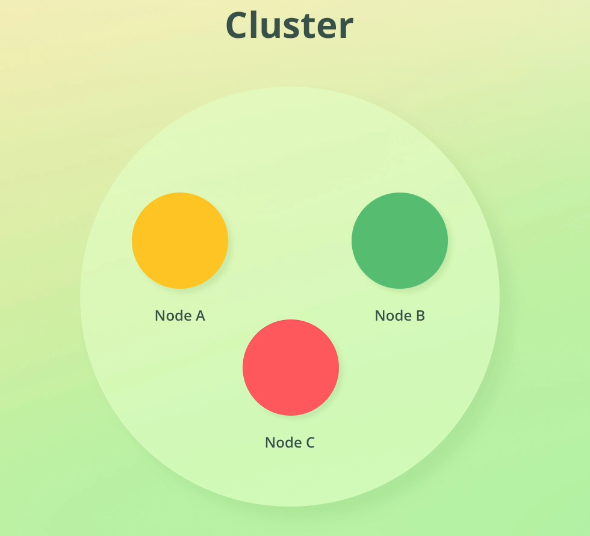

Each data in our nodes is a **Document**, which:

- can be represented as a `JSON`,
- is equivalent to a row in a relational DB,
- consists of the **Fields** we want, which are equivalent to columns in a relational DB.

In addition to our fields, we also store some other metadata in the Document `JSONs`.

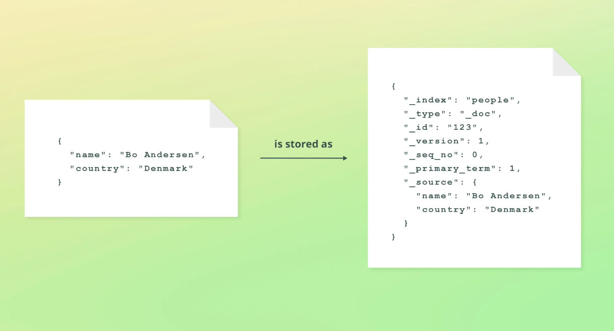

Documents are stored in **Indices**:

- Indices are logical groups of Documents, e.g., *People Index*, *Departments Index*.
- There are no limits in terms of how many Documents go into an Index.
- We run our search queries against Indices.


### Inspecting a Cluster with the Console


When we have started both `elasticsearch` and `kibana`, we open the web UI under the URL:

[`http://localhost:5601/`](http://localhost:5601/)

Then, we can start the **Console** in the web UI:

    Hamburger Menu > Management > Dev Tools

We can use the console to communicate with ES:

- The console uses the REST API under the hood.
- The console is the easiest way to communicate with ES: it has autocompletion.
- However, we often will use the REST API via cURL or related services.

The console takes HTTP methods:

1. **GET:** Retrieve data from Elasticsearch, such as documents or index information.
2. **POST:** Send data to Elasticsearch, typically used for creating or updating documents.
3. **PUT:** Create or replace documents or indices.
4. **DELETE:** Remove documents or indices.
5. **HEAD:** Retrieve metadata without the body.
6. **PATCH:** Apply partial updates to documents.

The query structure is

    HTTP Method + API & Command & Query
    JSON (optional parameters, if required)

For instance:

```bash
# Get cluster health: _cluster API, health Command
GET /_cluster/health
```

When we run that command (play button), we get back a `JSON`:

```json
{
  "cluster_name": "elasticsearch",
  "status": "green",
  "timed_out": false,
  "number_of_nodes": 1,
  "number_of_data_nodes": 1,
  "active_primary_shards": 31,
  "active_shards": 31,
  "relocating_shards": 0,
  "initializing_shards": 0,
  "unassigned_shards": 0,
  "delayed_unassigned_shards": 0,
  "number_of_pending_tasks": 0,
  "number_of_in_flight_fetch": 0,
  "task_max_waiting_in_queue_millis": 0,
  "active_shards_percent_as_number": 100
}
```

Further examples:

```bash
# List all nodes: _cat API (Compact Aligned Text), nodes Command, v Query (verbose)
# In our case we see a single node and its IP + properties
GET /_cat/nodes?v

# List indices
# We only have system indices, leading with a .
GET /_cat/indices?v
```

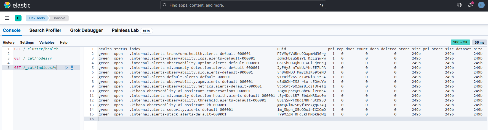

### Interacting with the Cluster via cURL and Python

We can interact with ES using its REST API, e.g., via `cURL`. We need to:

- use a certificate located in the elastic package (although that can be bypassed with the flag `--insecure`),
- use HTTPS, not HTTP,
- use our user and PW credentials.

```powershell
# General structure
cd /path/to/elasticsearch
curl --cacert config/certs/http_ca.crt -u elastic:<YOUR_PASSWORD_HERE> [--insecure] -X <HTTP_METHOD> [-H ...] [-d ...] <URL+API+Command+Query>
# NOTE: Sometimes the certificate doesn't work,
# so we can add the flag --insecure.
# This bypasses the SSL certificate verification.
# That should not be done in production!
# The option -H is a header, often used with -d
# and -d is the data we send.
# Example (Windows needs to escape "):
# ... -H "Content-Type: application/json" -d '{"name":"John", "age":30}'
# ... -H "Content-Type: application/json" -d '{\"name\":\"John\", \"age\":30}'

# Set variables in Powershell for easier and more secure use.
# To use them: $Env:ELASTIC_USER
$Env:ELASTIC_USER = "elastic"
$Env:ELASTIC_PASSWORD = "..."
# Bash. To use them: $ELASTIC_USER
export ELASTIC_USER="elastic"
export ELASTIC_PASSWORD="..."

# Example: Basic query to get general cluster info
cd C:\Users\msagardia\packages\elasticsearch-8.14.3
curl.exe --cacert config\certs\http_ca.crt -u "$($Env:ELASTIC_USER):$($Env:ELASTIC_PASSWORD)" --insecure -X GET https://localhost:9200 --noproxy localhost

# Example: Get the index products (not created yet)
curl.exe --cacert config\certs\http_ca.crt -u "$($Env:ELASTIC_USER):$($Env:ELASTIC_PASSWORD)" --insecure -X GET -H "Content-Type: application/json" -d '{ \"query\": { \"match_all\": {} } }' https://localhost:9200/products/_search --noproxy localhost
# Bash: -d '{ "query": { "match_all": {} } }'

# Example: GET /_cat/nodes?v -> get all nodes
curl.exe --cacert config\certs\http_ca.crt -u "$($Env:ELASTIC_USER):$($Env:ELASTIC_PASSWORD)" --insecure -X GET "https://localhost:9200/_cat/nodes?v" --noproxy localhost

# Example: GET /_cat/indices?v -> list all indices
curl.exe --cacert config\certs\http_ca.crt -u "$($Env:ELASTIC_USER):$($Env:ELASTIC_PASSWORD)" --insecure -X GET "https://localhost:9200/_cat/indices?v" --noproxy localhost
```

See also [Bulk/Batch Processing with cURL](#bulkbatch-processing-with-curl).

Besides using `cURL`, we can also connect to Elastic Search using Python. The notebook [`notebooks/elastic_intro.ipynb`](./notebooks/elastic_intro.ipynb) shows how to do that via `requests` and the package `elasticsearch`:

```python
import os
import requests
from requests.auth import HTTPBasicAuth
from dotenv import load_dotenv
load_dotenv()

elastic_user = os.getenv("ELASTIC_USER")
elastic_password = os.getenv("ELASIC_PASSWORD")

### -- requests

# Define the URL
url = "https://localhost:9200/_cat/nodes?v"

# Make the GET request
response = requests.get(
    url,
    auth=HTTPBasicAuth(elastic_user, elastic_password),
    #verify=False,  // Disable SSL verification
    verify="C:\\Users\\msagardia\\packages\\elasticsearch-8.14.3\\config\\certs\\http_ca.crt",
    proxies={"http": None, "https": None}  // Bypass proxy
)

# Print the response
print(response.text)

# Define the URL
url = "https://localhost:9200/_cat/indices?v"

# Make the GET request
response = requests.get(
    url,
    auth=HTTPBasicAuth(elastic_user, elastic_password),
    #verify=False,  // Disable SSL verification
    verify="C:\\Users\\msagardia\\packages\\elasticsearch-8.14.3\\config\\certs\\http_ca.crt",
    proxies={"http": None, "https": None}  // Bypass proxy
)

# Print the response
print(response.text)

### -- elasticsearch

import warnings
from urllib3.exceptions import InsecureRequestWarning
from elasticsearch import Elasticsearch

# Suppress only the specific InsecureRequestWarning
warnings.simplefilter('ignore', InsecureRequestWarning)

# Create an instance of the Elasticsearch client
es = Elasticsearch(
    ['https://localhost:9200'],
    basic_auth=(elastic_user, elastic_password),
    verify_certs=False  // This disables SSL verification, similar to --insecure
)

# Make a GET request to /_cat/nodes?v
response = es.cat.nodes(format="json")

# Print the response
print(response)

# Make a GET request to /_cat/indices?v
response = es.cat.indices(format="json")

# Print the response
print(response)
```

### Building an Index

This is my understanding of how an index works. The key idea is that we'd like to be able to search very quickly our documents.

Let's imagine we want to build an index similar to the ones in Elastic Search. Our goal is fast search in our database.

On one side, we store our Documents, probably as files.

On the other side we build the following structures:

- An **inverted index** which maps terms with documents and frequencies.
- A **B-tree**, which allows fast search and filtering of given (often data/numeric) single-dimensional fields.
- A **BKD-tree**, a variant of the k-d tree (k-dimensional tree) optimized for indexing multi-dimensional data.
- **Doc Values** or fields in **Column Format**, which allow faster sorting and aggregation operations.

In the following, I explain my intuitions of each of them.

#### Inverted Index

An inverted index is a table which maps terms with document ids, positions and frequencies. A possible data structure for that would by a hash table (like a Python dictionary).

An inverted index can be built as follows:

- Each new document is processed by tokenizing (& stemming) its text.
- For each term/token an entry is created and maintained, which contains:
  - List of document ids where the term/token appears.
  - Positions in the document where the term/token appears: field, character position, etc.
  - TF-IDF frequencies to understand how relevant the term is.

TF-IDF, Term Frequency Inverse Document Frequency:

- TF: Measures how frequently a term (word) occurs in a document.

      TF(t,d) = num times term t appears in document d / total num terms in d

- IDF: Measures the importance of a term in the corpus.

      IDF(t,D) = log(total num documents in corpus D / num documents containing term t)

- TF-IDF: **Importance of a term in a document.**

      TFIDF(t,d,D) = TF(t,d) * IDF(t,D)

Probably, for each token = term t, a table of `TF(t,d)` is maintained, as well as the value `IDF(t,D)`. Then, the `TFIDF(t,d,D)` is updated, which is unique for each `(t,d)` pair.

When we start a text search, the query will be tokenized into the indexed terms and those terms are searched in the inverted index (hash table).

With that, we have a list of all the candidate documents. We can:

- get a set of documents common to all terms
- rank the set according to their importance thanks to the `TFIDF(t,d,D)`; the TFIDF is associated to each term-document, but we could compute an aggregate value for each query-document pair.

See [ml_search/search_examples.ipynb](./ml_search/search_examples.ipynb) for a simple implementation.

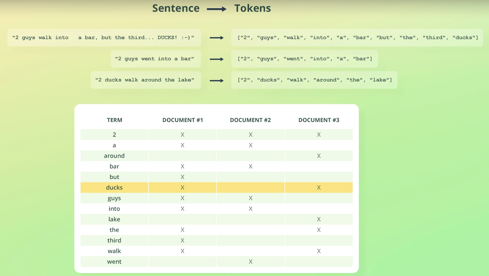

I can imagine several data structures could contain an inverted index:

- A hash table/map where the keys are the terms and the values are lists of documents or document IDs. Pro: fastest; con: larger memory usage.
- A binary search tree which, similarly, stores the terms in its nodes, as well as the pointers to the document lists; the terms can be ordered lexicographically. Pro: better memory usage, possible to perform range searches (but not needed here, right?); con: slightly slower.
- A trie which stores all possible terms and in its leaves contain pointers to document lists. Pro: terms with shared prefixes/suffixes are related; con: possible memory overhead if many shared prefixes?

Apparently, [Apache Lucene](https://lucene.apache.org/core/) uses a type of memory-optimized tries called *Finite State Transducers (FST)* for inverted indices.

#### B-Tree

A B-tree is a self-balancing tree data structure that maintains sorted data and allows for efficient insertion, deletion, and search operations. It is commonly used in databases and file systems. Key features:

- Balanced Tree Structure: Ensures that the tree remains balanced by maintaining a certain number of keys in each node. The balancing is automatic.
- Multiple Children: Each node can have multiple children (more than two), which makes the tree shallower and operations faster.
- Efficient Search: By dividing keys among nodes, B-trees allow for `log(n)` search time.
- Disk Storage Friendly: Minimizes disk reads by maximizing the number of keys stored in each node, suitable for systems that read and write large blocks of data.
- Scalability: Handles large amounts of data efficiently.

Operations:

- Search: Similar to binary search but generalized to multiple children.
- Insertion: Adds elements in sorted order, splitting nodes as necessary.
- Deletion: Removes elements while maintaining tree balance, merging nodes if needed.

B-trees are often applied to numerical fields; for instance, let's consider these documents:

```python
[
  { "id": 1, "name": "Product A", "price": 10, "date": "2023-01-01" },
  { "id": 2, "name": "Product B", "price": 20, "date": "2023-01-05" },
  { "id": 3, "name": "Product C", "price": 15, "date": "2023-02-01" },
  { "id": 4, "name": "Product D", "price": 25, "date": "2023-02-03" },
  { "id": 5, "name": "Product E", "price": 30, "date": "2023-02-05" }
]
```

When documents are indexed, the price and date fields are stored using B-trees. This ensures that these fields are efficiently organized for range queries and sorting.

The creation process could be the following:

- Initial Insertion: Start with the root node. Insert the first document's price as the root.
- Subsequent Insertions: Add each document's price in sorted order. If the current node has space (according to B-tree properties, which vary by B-tree degree), insert the new value. Otherwise, split the node and promote the middle value.
- Balancing: Ensure the tree remains balanced. Splitting nodes and promoting middle values help maintain the B-tree properties, ensuring that no node has too many or too few children.

In the previous list of Documents:

    Insert Document 1:
        Root: 10

    Insert Document 2:
        Root: 10
        Child: 20

    Insert Document 3:
        Root: 10
        Children: 15, 20

    Insert Document 4:
        Root: 15
        Children: 10, 20, 25

    Insert Document 5:
        Root: 15
        Children: 10, 20, 25, 30

```
       15
      / | \
    10 20  25
            \
            30
```

See [ml_search/search_examples.ipynb](./ml_search/search_examples.ipynb) for a simple implementation.

#### BKD Tree, Block KD-tree

A BKD tree (Block KD-tree) is a variant of the k-d tree (k-dimensional tree) optimized for indexing multi-dimensional data. It is particularly used in systems like Elasticsearch and [Apache Lucene](https://lucene.apache.org/core/) for efficient range searches and nearest neighbor queries in high-dimensional spaces.

Key Characteristics:

- Multi-Dimensional Indexing: Designed to handle multi-dimensional data, making it suitable for spatial and temporal indexing. The B-tree is primarily for single-dimensional data.
- Block-Based: Organizes data into blocks, improving performance for large datasets by reducing the number of I/O operations.
- Efficient Range Queries: Optimized for range queries across multiple dimensions.
- Space-Partitioning: Partitions the space into hyper-rectangles, recursively subdividing it into smaller regions.

Use Cases:

- Geospatial Data: Indexing and querying geographical locations.
- Time-Series Data: Managing data points that have multiple attributes, such as timestamp, location, and other dimensions.
- Full-Text Search: Used in search engines like Elasticsearch for indexing and querying multi-dimensional data such as text, numerical data, and more.

See [ml_search/search_examples.ipynb](./ml_search/search_examples.ipynb) for a simple implementation of a KD-tree and comparison to brute-force nearest vector search with numpy.

#### Doc Values

Doc Values are columnar data of numerical fields. Columnar data is stored as an array, i.e., the values are contiguous in memory. That enables much faster operations in the entire field/column, such as sorting or aggregation operations, like average computation.

I would implement the Doc Value structures with:

- An array which contains the document ids, i.e., an index.
- An array which contains the values in a column/fields, ordered according to the id index.
- A bitstring (an array of bits) used to mask whether to consider the array values or not.

Then, if we want to compute the min/max, mean or similar values of a field/column:

- We take the associated column/field array
- Update the bitstring according to the previous search results (e.g., B-trees & inverted indices).
- Run the column/field-wise operation with the masked array.

See [ml_search/search_examples.ipynb](./ml_search/search_examples.ipynb) for a simple implementation.

### Sharding and Scalability

If our node is full, we can create a new one which will increase the storage capacity of the cluster. In the process, **Sharding** is used:

- Shrading is a way to divide indices into smaller pieces.
- Each piece is referred to as shard.
- Sharding is done at the index level.
- Main purpose: horizontally scale data volume.
- Each shard is independent and a almost a fully functional index on its own.
- Each shard is an [Apache Lucene](https://lucene.apache.org/core/) index.
- Each shard can be as big as possible in terms of storage, but it can contain 2 billion documents.
- When we apply sharding, each query is parallelized, i.e., each node and shard run the query.
- We can have primary and replica shard:
  - Primary Shards: These are the main shards that contain the original data.
  - Replica Shards: These are copies of the primary shards and provide failover capabilities, ensuring high availability.

For instance, if we have an index of 600 GB and 2 nodes of 500 GB each, we can divide the index in 2 shards, A and B. Then, each shard goes to a node.


The column `pri` when we run `GET request to /_cat/indices?v` is the number of primary shards.

An index contains a single shard by default. If we need to create a new shard, we can use the split API. Similarly, we can recue the number of shards with a shrink API. The number of shards we should use depends on

- the number of indices
- the number of nodes and their capacity
- the number of queries
- ...

Note: when we create an index, we define a number of primar shards and keep it fixed; i.e., we cannot change that number. The reason is that we use that number for routing. Routing consists in deciding which shard to pick to find a Document.

Good rule of thumb: if we're going to have millions of documents, use a couple of shards. That number 5 was the default in the older versions.

### Replication and Snapshots

Sometimes node fail; a way to enable fault-tolerance is to replicate shards. Elastic Search replicates shards by default: shards are copied, creating replica shards:

-  When creating an index we can choose how many replicas we'd like (default is 1 replica, i.e, we have 2 shards: primary + replica).
- A replica shard should be always in a different node as the primary shard, i.e., the shard it was copied from, because otherwise we are not fault-tolerant. Thus, replication makes sense in terms of robustness when we have a cluster with at least 2 nodes.
  - In a cluster with a single node, the default replica will be unassigned and the index will be in yellow status.
- A replica shard can be used instead of the primary shard for all the operations.
- For critical operations, we replicate at least 2x, i.e., we'l nned at least 3 nodes.

Replication not only ensure fault-tolerance, but it can also ease the use of parallel queries: we run the same query in two index (shard) copies.; thus, the throughput increases. We can apply that also by having replica shards in the same node, i.e., the same copies in the same node. That is called a **replication group**. In those cases, multi-threding is used.

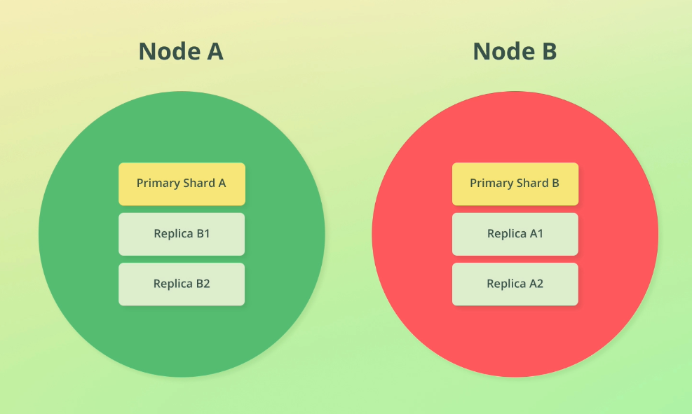

In addition to replication, Elastic Search also allows to take snapshots and backups:

- Snapshots can be used to restore to a given point.
- Snapshots can be taken at index level or for the entire cluster.
- Snapshots are state dumps to a file; those files can be used to restore the cluster, if something goes wrong.

#### Creating Indices

- When we create an index, a replica is automaticaly generated
- However, if we have a single node, that replica is unassigned, so the index is in "yellow" state, not "green" state.
- The system indices (those with leading . in their name) are auto-replicated when we create new nodes; i.e., with one node, they have no replicas.

Here's some commands to create an index and inspect it:

```bash
# Create Index pages
PUT /pages

# Get list of all indices
# pages should appear, but in "yellow" status, 
# because its shard replica is not assigned to another node
GET /_cat/indices?v

# Get list of all shards
# pages shoudl appear 2x, but the replica shard should be UNASSIGNED
GET /_cat/shards?v
```

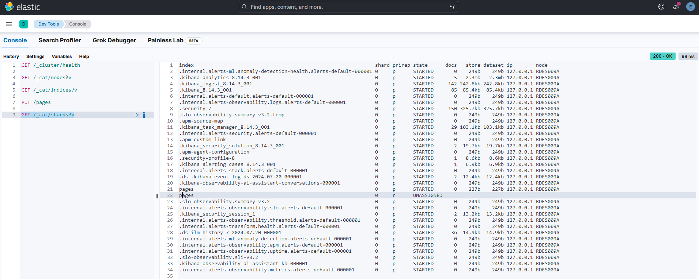

### Adding Nodes to the Cluster

Sharding for fault-tolerance and replication for increasing throughput can be done if we have at least 2 nodes. In managed cloud solutions, nodes are added automatically. However, in local deployments, we need to create nodes manually.

If we are running Elastic Search in a development environment, we can set new nodes as follows:

- Download and extract again the elasticsearch archive in the `.../packages` directory. Name that new folder `elastic-second-node`. It should be at the same level as `elasticsearch-8.14.3/`, which is the first node. Do not copy the folder `elasticsearch-8.14.3/`, but extract a new folder frmo the original archive!
- Open `.../packages/elastic-second-node/config/elasticsearch.yaml` and uncomment/modify the line `node.name = elastic-second-node`
- Create an enrollment token for the second node.
  ```powershell
  cd .../packages/elasticsearch-8.14.3
  bin\elasticsearch-create-enrollment-token.bat --scope node
  // we take/copy the ENROLLMENT_TOKEN
  ```
- Go to `.../packages/elastic-second-node` and start a second `elasticsearch` with the enrollment token:
  ```powershell
  cd .../packages/elastic-second-node
  bin\elasticsearch --enrollment-token <ENROLLMENT_TOKEN>
  ```
- Go to Kibana/Web UI and check the cluster: now, we should have 2 nodes.
- We can kill a node simple with `Ctrl+C` in the Terminal where it is running. When that occurs, the clusters performs some house-keeping: [Delaying allocation when a node leaves](https://www.elastic.co/guide/en/elasticsearch/reference/current/delayed-allocation.html).

:warning: **IMPORTANT**: 

- This approach is only for development environments; in production, we need to perform further configurations.
- **I have not achieved to perform all these steps on a Windows machine:** I was getting a certificate error when running `bin\elasticsearch-create-enrollment-token.bat --scope node`.

I we don't add further nodes, we can continue, but the cluster and the shards/indices will be in "yellow" state, because they are not distributed across several nodes.

### Node Roles

Depending what they're used for, nodes can have different roles:

- Master: `node.master: true | false`. Resposible for performing cluster-wide operations, e.g., deleting indices, etc. For large projects, we should have dedicated master nodes.
- Data: `node.data: true | false`. Stores data and perform search queries.
- Ingest: `node.ingest: true | false`. Runs ingest pipelines, i.e., processing and adding a document to an index. Such a pipeline is like a simplified Logstash pipeline, where simple transformations are performed.
- Machine Learning:
  - `node.ingest: true | false`: to run ML jobs.
  - `xpack.ml.enabled: true | false`: enable/disable ML API for the node
- Coordination: Distribution of queries and aggregation of results; if a node has none of the previous nodes, it is a coordination node.
- Voting-only: `node.voting_only: true | false`. Rarely used; it votes which is the master node. It appears in very large projects.

We can see the roles when we run the command `GET /_cat/nodes?v`.

The field `node.role` in the response table contains the initial letters of each role assigned to each node.

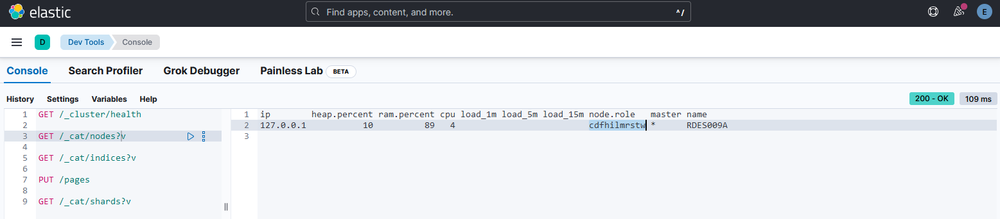

## Managing Documents

### Warning: Mapping Types are Deprecated

NOTE: There used to be mapping types in Elasticsearch, which is not the case anymore. Maybe in some cases the old query style that takes those mapping types is used, which contains the `default` keyword; this needs to be changed to the new syntax:

```json
// Old syntax
GET /products/default/_search
// New syntax
GET /products/_search
```

### Creating and Deleting Indices

```json
// Create an index
PUT /pages

// Delete an index
DELETE /pages

// Create an index with specific properties
PUT /products
{
  "settings": {
    "number_of_shards": 2
  }
}
```

### Indexing and Deleting Documents

Indexing a document means to create/add it into the index.

```json
// Simple JSON Document indexed = created
// An _id is automatically assigned if not provided
// As we can see in the returned JSON
// Also, we see we have 2 shards
POST /products/_doc
{
  "name": "Coffee Maker",
  "price": 64,
  "in_stock": 10
}

// Here, we index a Document = we create one
// but we force it to be of id 100
// Note that the HTTP method is PUT, not POST!
// We can use the same code
// to replace entirely a Document
PUT /products/_doc/100
{
  "name": "Toaster",
  "price": 49,
  "in_stock": 4
}

// Delete the document with ID 100
DELETE /products/_doc/100

// Get all Documents in the index products
// The result is a JSON in which result['hits']['hits']
// contains a list of al Document JSONs
GET /products/_search
{
  "query": {
    "match_all": {}
  }
}

// Delete all the documents of an index
POST /products/_delete_by_query
{
  "query": {
    "match_all": {}
  }
}

// If the index was not created and we index
// a Document, the index will be created automatically
// and the Document added to it
PUT /products_test/_doc/1
{
  "price": 7.4
}
```

### Retrieving Documents by ID

```json
// Retrieve Document by ID
GET /products/_doc/100
```

We get:

```json
{
  "_index": "products",
  "_id": "100",
  "_version": 1,
  "_seq_no": 1,
  "_primary_term": 1,
  "found": true,
  "_source": {
    "name": "Toaster",
    "price": 49,
    "in_stock": 4
  }
}
```

Notes:

- If the `id=100` would not exist, we'd get `"found":false`.
- The `JSON` has many metadata fields; the actual document is in `_source`.

### Updating Documents

In reality, Documents are **inmutable** in Elastic Search. Under the hood, when we update a Document, we replace it with a new one which contains teh modifications. 

```json
// Update an existing field
// To update a Document, 
// we need to pass a JSON with an object "doc"
// The returned JSON contains "result": "updated"
POST /products/_update/100
{
  "doc": {
    "in_stock": 3
  }
}

// Add a new field: "tags": ["electronics"]
POST /products/_update/100
{
  "doc": {
    "tags": ["electronics"]
  }
}
```

If we want to completely replace a Document, though, we can explicitly use `PUT`, which is intended for creating documents (recall, there is no real updating in ES, but entirely replacing: remove + create):

```json
PUT /products/_doc/100
{
  "name": "Toaster",
  "price": 79,
  "in_stock": 4
}
```

### Scripted Updates

We can write scripts in the `JSON` used to perform the update. The scripts go in a `script` object, which contains:

- a `source` field with the script
- a `params` field with the parameters used in the script

The Document entity is accessed by the variable `ctx`, short for context. This variable has several methods/data, e.g.:

- `ctx.op`: with this, we can modify the update operation nature, e.g.:
  - `noop`: no update done
  - `delete`: Document deleted
- `ctx._source`: this gives us access to the Document `JSON`

Additionally, we can add conditionals

```json
// Go to Document with ID 100
// Decrease by one unit the field in_stock
POST /products/_update/100
{
  "script": {
    "source": "ctx._source.in_stock--"
  }
}

// Go to Document with ID 100
// Assign the value 10 to the field in_stock
POST /products/_update/100
{
  "script": {
    "source": "ctx._source.in_stock = 10"
  }
}

// Go to Document with ID 100
// Modify field in_stock with the values in params
POST /products/_update/100
{
  "script": {
    "source": "ctx._source.in_stock -= params.quantity",
    "params": {
      "quantity": 4
    }
  }
}

// Go to Document with ID 100
// If in_stock == 0, perform no operation
// Else, decrease in_stock in one unit
POST /products/_update/100
{
  "script": {
    "source": """
      if (ctx._source.in_stock == 0) {
        ctx.op = 'noop';
      }
      
      ctx._source.in_stock--;
    """
  }
}

POST /products/_update/100
{
  "script": {
    "source": """
      if (ctx._source.in_stock > 0) {
        ctx._source.in_stock--;
      }
    """
  }
}

// Go to Document with ID 100
// If in_stock < 0, delete the Document (product)
// Else, decrease in_stock in one unit
POST /products/_update/100
{
  "script": {
    "source": """
      if (ctx._source.in_stock < 0) {
        ctx.op = 'delete';
      }
      
      ctx._source.in_stock--;
    """
  }
}
```

### Upserts

*Upserting* means:

- If the Document exists, it is updated.
- Else, a new Document is created.

```json
// Upsert: Update or Insert/Create
// If the product 101 doesn't exist, this creates it
// Else, it increases in_stock in one unit
POST /products/_update/101
{
  "script": {
    "source": "ctx._source.in_stock++"
  },
  "upsert": {
    "name": "Blender",
    "price": 399,
    "in_stock": 5
  }
}
```

### Routing Documents to Shards

In general we'll have

- several nodes,
- several indices,
- and several shards per index, distributed acorss the nodes

Howe does ElasticSearch know where (in which shard) to find the Documents we query?

That is accomplished thanks to **Routing**. A default Routing strategy is fixed as `_routing` (hidden metadata in a Document) and it is used to obtain the Shard number of a Document given its ID by the formula:

    shard_num = hash(_routing) & num_primary_shards

Routing

- enables automatically finding the shard number of a document
- and uniformly distributes Documents in the index shards

**But** it forces to create the shards of an index in the beginning and freeze them, otherwise the formula doesn't work. I we want to add a new shard later on, we need to create a new index and re-index all the Documents to it.

It is possible to chage the default Routing strategy, too.

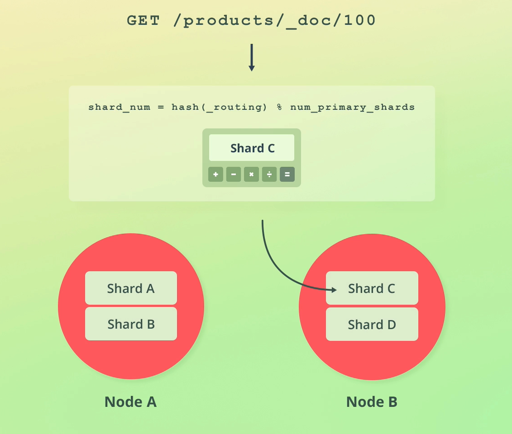

### How Elasticsearch Reads and Writes Document Data

In general, shards are organized in **Replica Groups**: several copies of a primary shard grouped together. Thus, Routing selectes the Replica Group rather than the shard, if we have properly set the Replica Groups.

Then, if the request/query is **Read**-only operation, **Adaptive Replica Selection (ARS)** is performed, to pick among the shards in the Replica Group &mdash; however, note that the replica shards are fully functioning copies, so ARS is for load balancing purposes only. The selection is done with the goal of achieving the best performance.

When the request/query involves **writing**, the operation is directed to the *primary shard* of the Replica Group:

- The primary shards validates the request and field values.
- Then, the operation is forwarded in parallel the replicas.

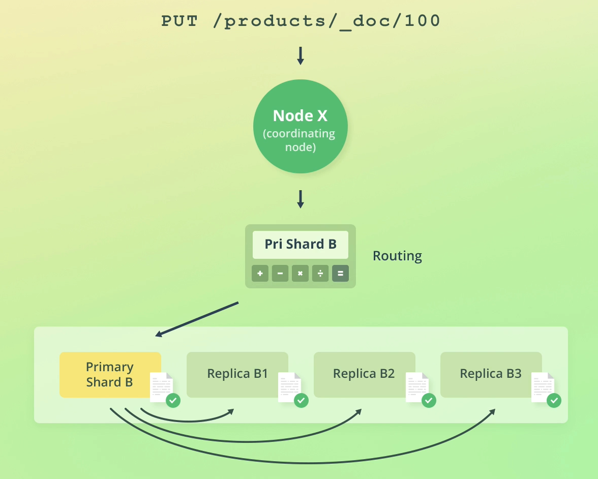

Many things can go wrong in forwarding operations and synchronization of states in distributed systems, e.g., due to network delays or when a node fails. To ensure that all replica shards are consistent, ES uses **Primary Terms** and **Sequence Numbers**:

- **Primary Term** (`_primary_term`) is the number of times a primary shard has been updated; this value is sent along with the forwarded operations. That way, errors can be detected.
- **Sequence Numbers** (`_seq_no`) are operation counters: each operation has an increasing counter which is forwarded to the replicas. That way, we know the order of the operations.

In addition, other sequence numbers are maintained within a Replica Group to speed up synchronization:

- Local checkpoint: sequence number of each shard related to the las operation.
- Global checkpoint: minimum sequene number among all replicas, i.e., last synchronization/alignment.

### Document Versioning and Optimistic Concurrency Control

By default, every time a Document is updated, `_version` increases a unit; however, only the last version of the Document is stored.

We can also use *external* versioning, i.e., the version number is stored outside, e.g., in a relational DB.

**However, it is not best practice to rely on `_version` anymore; instead, `_primary_term` and `_seq_no` should be used.**

In other words, `_primary_term` and `_seq_no` are used to specify the correct version of the Document and synchronize operations in the ES distributed system. This is called **Optimistic Concurrency Control** and it prevents unwanted de-synchronized operations that might occur when requests associated to the same Document and field happen in parallel.

Optimistic Concurrency Control is implemented by passing the reference `_primary_term` and `_seq_no` in the update request:

- First, we get the values of the Document to update and fetch the current values of `_primary_term` and `_seq_no`.
- Then we build an update query/request conditioning `_primary_term` and `_seq_no` to have the fetched reference values.

If we have a multi-threaded application where multiple threads could modify the same value of a Document, we should use this approach!

```json
// Get Document with ID 100
// _primary_term and seq_no are in the metadata
// We take them to formulate the conditioned update request
GET /products/_doc/100

// Update Document/product with ID 100 
// if _primary_term == 1 and seq_no == 5 (reference values obtained in previous query)
// If _primary_term and seq_no don't match, we get an error
POST /products/_update/100?if_primary_term=1&if_seq_no=5
{
  "doc": {
    "in_stock": 123
  }
}
```

### Update and Delete by Query

We can perform operations similar to the SQL `UPDATE WHERE` with the API `_update_by_query`.
To that end

- we write a `script` with the update we'd like
- we add a `query` field which filters the Documents we'd like to update; if we want all, we use `"match_all"`.

Note that this kind of filtered update might lead to errors/conflicts; if one error occurs, the request is aborted by default, but we can specify to proceed upon conflicts, too.

```json
// Update a set of filtered Documents: _update_by_query
// Write the update in "script"
// Write the filterin "query"
// Errors/conflicts can occur; by default the request is aborted
// but we can specify to proceed if we want
POST /products/_update_by_query
{
  "conflicts": "proceed",
  "script": {
    "source": "ctx._source.in_stock--"
  },
  "query": {
    "match_all": {}
  }
}
```

Similarly, we can `_delete_by_query`:

```json
// Delete all Documents that match the query
// in this case ALL DOCUMENTS!
// If errors/conflicts occur, the request is aborted
// unless we specify "conflicts": "proceed"
POST /products/_delete_by_query
{
  "conflicts": "proceed",
  "query": {
    "match_all": { }
  }
}
```

### Batch or Bulk Processing

We can use the **Bulk API** (`_bulk`) to process multiple Documents in batch.

The syntax for that is `NDJSON`, a modified `JSON` specification:

```ndjson
<JSON with action + metadata>\n
<OPTIONAL: source or doc fields>\n
<JSON with action + metadata>\n
<OPTIONAL: source or doc fields>\n
...
```

For example, the following bulk request indexes 2 Documents:

```json
POST /_bulk
{ "index": { "_index": "products", "_id": 200 } }             // action + metadata
{ "name": "Espresso Machine", "price": 199, "in_stock": 5 }   // source
{ "create": { "_index": "products", "_id": 201 } }            // action + metadata
{ "name": "Milk Frother", "price": 149, "in_stock": 14 }      // source
```

The `_bulk` API with the `NDJSON` specification has these properties:

- We can choose from 4 **actions**: `index, create, update, delete`; these are specified as a key in a `JSON` object. Difference between `index` and `create`:
  - `index`: always runs, even if the Document exists.
  - `create`: it fails if the Document exists.
- All actions except `delete` require a second line with the source document, also a `JSON` action.
- We can feed many actions in a `JSON` file.
- Each line must end with a return (`\n`), even the last one, i.e., we need to have a blank line at the end.
- If a single action fails, the processing **is not** stopped, but it continues.
- If all actions are for the same index, we can specify it in the API commad: `/_bulk/products`.
- If we are using `cURL` or HTTP requests, the header `Content-Type` should be `Content-Type: application/x-ndjson`.
- It is much more efficient to use the `_bulk` API if we have many requests, because we significantly minimize the traffic (round-trips are avoided).
- To avoid concurrency issues, we can still use `if_primary_term` and `if_seq_no` in the action metadata.

More examples:

```json
// Create new Documents
// We can list many (action, source) pairs
// Always newline after a line, also in last JSON
// Four actions: create, index, update, delete
// Each action needs a source (the Document fields), except delete
POST /_bulk
{ "index": { "_index": "products", "_id": 200 } }
{ "name": "Espresso Machine", "price": 199, "in_stock": 5 }
{ "create": { "_index": "products", "_id": 201 } }
{ "name": "Milk Frother", "price": 149, "in_stock": 14 }

// Update Documents + Delete
POST /_bulk
{ "update": { "_index": "products", "_id": 201 } }
{ "doc": { "price": 129 } }
{ "delete": { "_index": "products", "_id": 200 } }

// If all actions are for the same index,
// we can specify it in the API commad
POST /products/_bulk
{ "update": { "_id": 201 } }
{ "doc": { "price": 129 } }
{ "delete": { "_id": 200 } }

// Get all Documents in an index
GET /products/_search
{
  "query": {
    "match_all": {}
  }
}
```

#### Bulk/Batch Processing with cURL

`cURL` commands to ingest [`products-bulk.json`](./products-bulk.json) with and without certificate:

```bash
# Set variables in Powershell for easier and more secure use.
# To use them: $Env:ELASTIC_USER
$Env:ELASTIC_USER = "elastic"
$Env:ELASTIC_PASSWORD = "..."
$Env:ELASTIC_HOME = "..."
# Bash. To use them: $ELASTIC_USER
export ELASTIC_USER="elastic"
export ELASTIC_PASSWORD="..."
export ELASTIC_HOME="..."

# Without CA certificate validation.
# This is fine for development clusters, but don't do this in production!
# "@products-bulk.json" means we ingest a file, not a path
curl --insecure -u $ELASTIC_USER:$ELASIC_PASSWORD -H "Content-Type:application/x-ndjson" -XPOST https://localhost:9200/products/_bulk --data-binary "@products-bulk.json"
# Windows
curl.exe --insecure -u "$($Env:ELASTIC_USER):$($Env:ELASTIC_PASSWORD)" -H "Content-Type:application/x-ndjson" -XPOST https://localhost:9200/products/_bulk --data-binary "@products-bulk.json"  --noproxy localhost

# With CA certificate validation. 
# The certificate is located at $ELASTIC_HOME/config/certs/http_ca.crt
# "@products-bulk.json" means we ingest a file, not a path
curl --cacert $ELASTIC_HOME/config/certs/http_ca.crt -u $ELASTIC_USER:$ELASIC_PASSWORD -H "Content-Type:application/x-ndjson" -XPOST https://localhost:9200/products/_bulk --data-binary "@products-bulk.json"
# Windows
curl.exe --cacert "$($Env:ELASTIC_HOME)\config\certs\http_ca.crt" -u "$($Env:ELASTIC_USER):$($Env:ELASTIC_PASSWORD)" -H "Content-Type:application/x-ndjson" -XPOST https://localhost:9200/products/_bulk --data-binary "@products-bulk.json" --noproxy localhost
```

The equivalent using Python, as shown in [`notebooks/elastic_intro.ipynb`](./notebooks/elastic_intro.ipynb):

```python
import os
import requests
from requests.auth import HTTPBasicAuth
from dotenv import load_dotenv
load_dotenv()

elastic_user = os.getenv("ELASTIC_USER")
elastic_password = os.getenv("ELASIC_PASSWORD")
elastic_home = os.getenv("ELASTIC_HOME")

// Verify that the environment variables are correctly set
if not all([elastic_user, elastic_password, elastic_home]):
    raise ValueError("One or more environment variables are not set")

// Define the URL
url = "https://localhost:9200/products/_bulk"

// Read the data from the file
with open("products-bulk.json", "rb") as data_file:
    data = data_file.read()

// Make the POST request
response = requests.post(
    url,
    auth=HTTPBasicAuth(elastic_user, elastic_password),
    headers={"Content-Type": "application/x-ndjson"},
    data=data,
    verify=os.path.join(elastic_home, "config", "certs", "http_ca.crt"),
    proxies={"http": None, "https": None}  // Bypass proxy
)

// Print the response
print(response.text) // {"errors":false,"took":155,"items":[{"index":{"_index":"products","_id":"...
```

## Mapping & Analysis

### Introduction to Analysis

When we index a Document, it is **analyzed**. **Analysis** is referred to as **text analysis**. ES performs an analysis of the text/sources, such that the content in `_source` is not really used during the search, but the analyzed/processed text. An analyzer has 3 building blocks:

- Character filters (`char_filter`): original text is processed by adding/removing characters. Examples:
  - `html_strip`: remove HTML characters
- Tokenizer (`tokenizer`): we have one tokenizer, which splits the text into tokens; they can modifiy/remove punctuation symbols.
- Token filters (`filter`): tokens can be modified, e.g., 
  - `lowercase`: all tokens are expressed in lower case.

The result of the analyzers is stored in a searchable data structure.

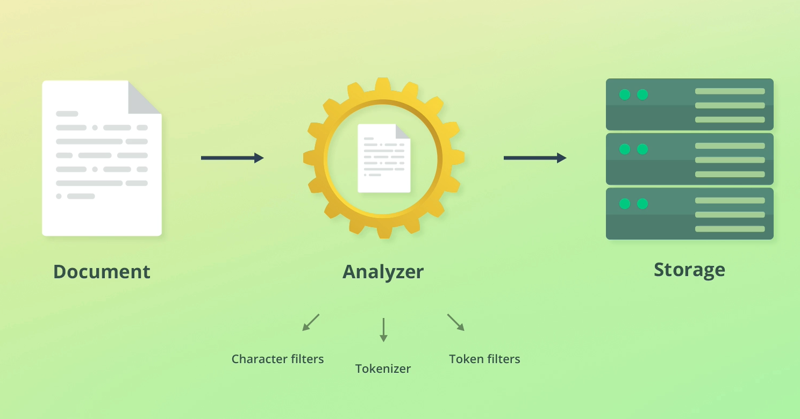

ES ships with built-in analyzers and we can combine them as we please. The standard analyzer:

- has no character filter,
- tokenizes with the `standard` tokenizer by breaking the text into words,
- has the `lowercase` token filter.

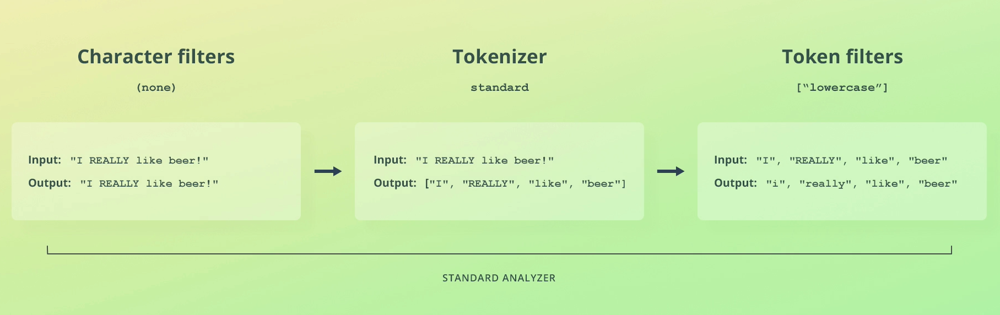

### Using the Analysis API

We can run the analyzers in our text with the `_analyze` API: 

```json
// Here a text string is analyzed
// with the standard analyzer:
// no char filter, standard tokenizer, lowercase token filter
POST /_analyze
{
  "text": "2 guys walk into   a bar, but the third... DUCKS! :-)",
  "analyzer": "standard"
}
```

The output is

```json
{
  "tokens": [
    {
      "token": "2",
      "start_offset": 0,
      "end_offset": 1,
      "type": "<NUM>",
      "position": 0
    },
    {
      "token": "guys",
      "start_offset": 2,
      "end_offset": 6,
      "type": "<ALPHANUM>",
      "position": 1
    },
    {
      "token": "walk",
      "start_offset": 7,
      "end_offset": 11,
      "type": "<ALPHANUM>",
      "position": 2
    },
    {
      "token": "into",
      "start_offset": 12,
      "end_offset": 16,
      "type": "<ALPHANUM>",
      "position": 3
    },
    {
      "token": "a",
      "start_offset": 19,
      "end_offset": 20,
      "type": "<ALPHANUM>",
      "position": 4
    },
    {
      "token": "bar",
      "start_offset": 21,
      "end_offset": 24,
      "type": "<ALPHANUM>",
      "position": 5
    },
    {
      "token": "but",
      "start_offset": 26,
      "end_offset": 29,
      "type": "<ALPHANUM>",
      "position": 6
    },
    {
      "token": "the",
      "start_offset": 30,
      "end_offset": 33,
      "type": "<ALPHANUM>",
      "position": 7
    },
    {
      "token": "third",
      "start_offset": 34,
      "end_offset": 39,
      "type": "<ALPHANUM>",
      "position": 8
    },
    {
      "token": "ducks",
      "start_offset": 43,
      "end_offset": 48,
      "type": "<ALPHANUM>",
      "position": 9
    }
  ]
}
```

The tokens have:

- the `token` expression
- the character start and end offsets
- the `type`: `<NUM>`, `<ALPHANUM>`
- the `position`

Note that punctuation is removed by the `standard` tokenizer/analyzer (also smilies); that's because they don't improve the search.

We can also explicitly define the components of the analyzer:

```json
// Analyzer components explicitly defined:
// character filer, tokenizer, token filters
// This call produces the same results are before
POST /_analyze
{
  "text": "2 guys walk into   a bar, but the third... DUCKS! :-)",
  "char_filter": [],
  "tokenizer": "standard",
  "filter": ["lowercase"]
}
```

### Understanding Inverted Indices

See the section [Inverted Index](#inverted-index).

In ES, inverted indices are:

- stored in [Apache Lucene](https://lucene.apache.org/core/), which is used for search purposes
- created for each text field.

However, not only inverted indices are used for search; inverted indices are primarily for text data, for other types, some other data structures and algorithms are used:

- B-Trees and BKD Trees for numeric data.
- Doc Values for aggregation operations.

### Introduction to Mapping

A mapping is the definition of the structure of a Document, i.e., **fields and types**; it is equivalent to a table schema in a relational DB.

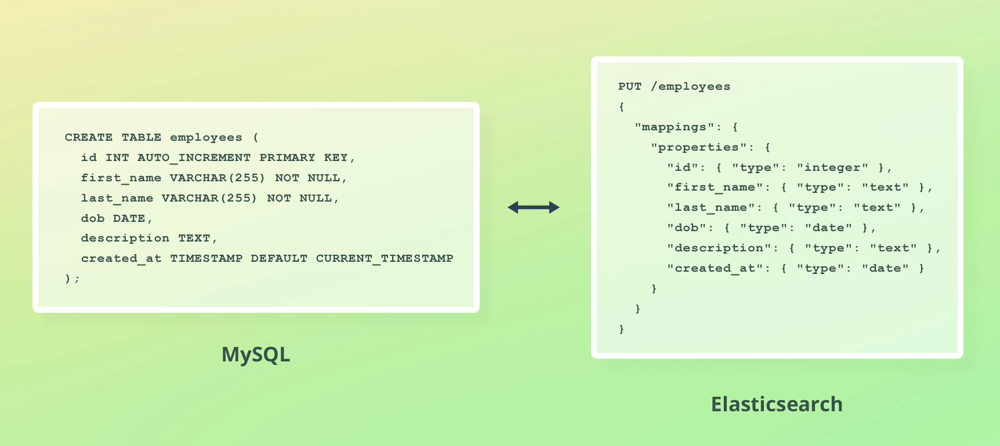

Mappings can be:

- Explicit: we define them ourselves.
- Implicit: ES generates mappings when we index Documents using our inputs.

### Data Types

There are many [field data types](https://www.elastic.co/guide/en/elasticsearch/reference/current/mapping-types.html). 

Some basic types:

- boolean
- integer
- short
- long
- float
- double
- date

Some other types specific to ES:

- object
- nested
- keyword
- text

An `object` is a  `JSON` dictionary; each Document is an `object`, and they can contain `objects` in one of their fields (so they can be nested). However, the type is not set to `object` in the mapping, but a new dictionary is opened with a nested dictionary called `properties`, which contains the fields of the object.

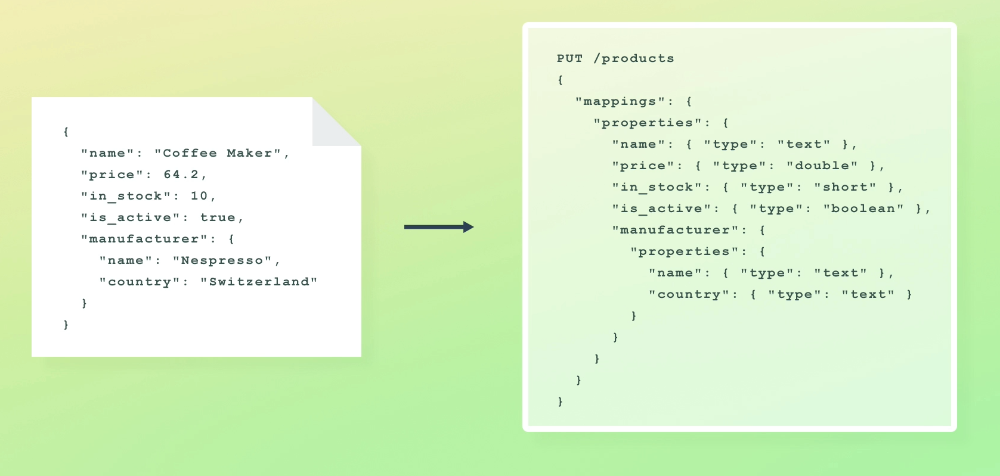

Internally, `objects` are flattened to be saved in [Apache Lucene](https://lucene.apache.org/core/).

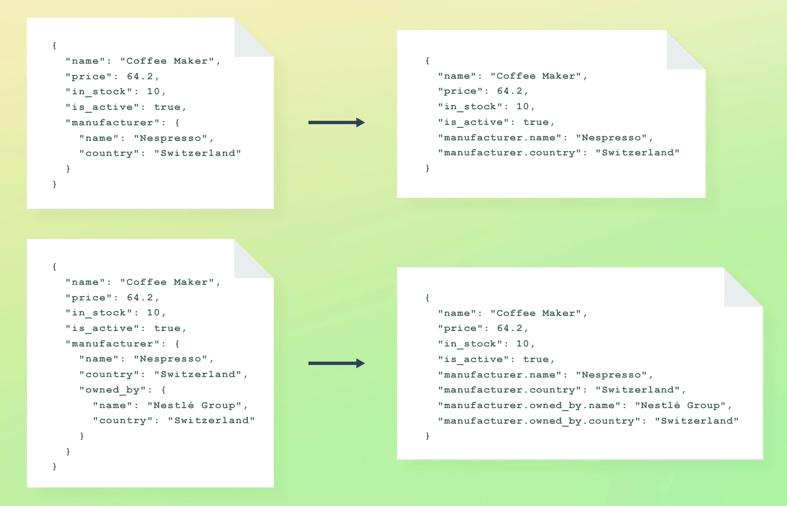

Lists of objects are decomposed into lists of fields in the flattened objects, which can be an issue when we search, because the concatenation of conditions with `AND` becomes an `OR` concatenation.

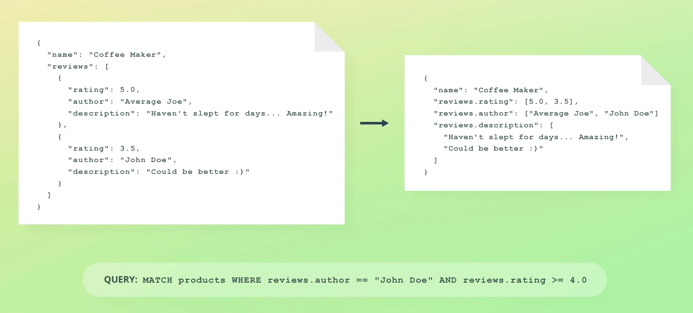

To solve the issue of the lists of objects, an extra type exists: `nested`. When we define a `nested` type, we are defining a list of objects which can deal with the aforementioned `AND-OR` situation; that's because the objects are stored independently, as independent Documents.


The type `keyword` is another interesting one: it's like a tag which can be used to exact-matching documents, i.e., for filtering. The `keyword` fields are put into the inverted indices, but they are analyzed with the `keyword` analyzer, which is a no-op analyzer: it outputs the unmodified string (even if it consists of a long text with thousands of words) as a single token. The goal with a keyword is to be able to find exactly its content. Some use-cases:

- Emails (eventhough we might want to lowercase them)
- Flags. For instance: we might want to search all articles with status `PUBLISHED`.

Then, `keyword` fields can be used for fast filtering which are the previous necessary step for aggregation and summarization operations.

Full-text searches are performed in `text` fields, and **the query text doesn't need to match exactly** the indexed text. The fields with `text` are ingested into inverted indices; each field has an inverted index.

### Type Coercion

When we index the first document to an index which was not created yet, the mappings (i.e., the schema, field-type pairs) are dynamically created.

Then, when we index the following documents, by default, the field values will be parsed as the types defined in the mapping; that means the values will be casted/coerced. In some cases it works, but in others it doesn't; for instance, if our type is `float`:

- Works: "1.0" (text) -> 1.0 (float)
- Does not work: "1.0m" -> cannot be parsed...

One important point is that the real values used during search are not the ones in `_source`, but in the [Apache Lucene](https://lucene.apache.org/core/) index. Thus, we might see *uncoerced* non-homogeneous values in `_source`.

Type coercion can be disabled.

```json
// The index coercion_test does not exist
// but it is created and Document 1 added
// The first time, the type is inferred: float
PUT /coercion_test/_doc/1
{
  "price": 7.4
}

// The next Document contains a string number
// The type was inferred as float,
// so ES will try to cast/convert the value,
// this is called Type Coercion
// This time it works!
// HOWEVER: in _source we'll see a string
// the casted float is in Apache Lucene...
PUT /coercion_test/_doc/2
{
  "price": "7.4"
}

// This time, the type conversion cannot work
// We get an ERROR
PUT /coercion_test/_doc/3
{
  "price": "7.4m"
}

GET /coercion_test/_doc/2

DELETE /coercion_test
```

### Arrays

There are no `array` types because every type can be an `array`!

Internally, text arrays are concatenated, e.g.:

    ["Smartphone", "Computer"] -> "Smartphone Computer"

In the case of non-text fields, fields are not analyzed/processed, and they are stored as arrays in the appropriate data structures within [Apache Lucene](https://lucene.apache.org/core/).

One constraint: 

- either all the values must be of the same type
- or all the values in an array should be coerceable to the type defined in their mapping.

Also, note that arrays can contain nested arrays; in that case, they are flattened:

    [1, [2, 3]] -> [1, 2, 3]

Finally, **arrays of objects need to be of type `nested` if we want to query the objects independently, as explained.**

### Adding Explicit Mappings and Retrieving

In this section, a mapping is created, i.e., the equivalent of a table schema. The syntax is very simple, we defined fields with their types inside `mappings.properties` and if we have an object, we nest `properties` within it:

```json
{
  "mappings": {
    "properties": {
      "field_1": { "type": "float" },
      "field_2": { "type": "text" },
      "field_2": {
        "properties": {
          ...
        }
      }
    }
  }
}
```

Example:

```json
// We create a mapping for the index reviews
// For simple types, we define their type key-value
// For object types, we need to nest a properties key again
PUT /reviews
{
  "mappings": {
    "properties": {
      "rating": { "type": "float" },
      "content": { "type": "text" },
      "product_id": { "type": "integer" },
      "author": {
        "properties": {
          "first_name": { "type": "text" },
          "last_name": { "type": "text" },
          "email": { "type": "keyword" }
        }
      }
    }
  }
}

// Now we index the first Document
PUT /reviews/_doc/1
{
  "rating": 5.0,
  "content": "Outstanding course! Bo really taught me a lot about Elasticsearch!",
  "product_id": 123,
  "author": {
    "first_name": "John",
    "last_name": "Doe",
    "email": "johndoe123@example.com"
  }
}
```

#### Dot Notation

Another way of adding an object is to use the *dot-notation*, which consists in defining object fields flattened by using `object_name.field_name` keys:

```json
// Objects can be defined flattened
// by using object_name.field_name keys 
PUT /reviews_dot_notation
{
  "mappings": {
    "properties": {
      "rating": { "type": "float" },
      "content": { "type": "text" },
      "product_id": { "type": "integer" },
      "author.first_name": { "type": "text" },
      "author.last_name": { "type": "text" },
      "author.email": { "type": "keyword" }
    }
  }
}

DELETE /reviews_dot_notation
```

This format is probably a bit easier.
This *dot-notation* is not exclusive to creating the mappings, it can be used any time!

#### Retrieving Mappings

```json
// Retrieving mappings for the `reviews` index
GET /reviews/_mapping

// Retrieving mapping for the `content` field
GET /reviews/_mapping/field/content

// Retrieving mapping for the `author.email` field
// using dot-notation
GET /reviews/_mapping/field/author.email
```

### Extending Mappings to Existing Indices: Adding New Fields

Case: We already have an Index and we'd like to add a field to it. We can do that with the `_mapping` API, by simply adding the field in the `properties`.

```json
// Here, we have an Index reviews
// and we add a new field to it: 
// "created_at": { "type": "date" }
// However, it is usually not possible to change/modify 
// existing mappings or their fields. 
// The alternative is to create new mappings 
// and `_reindex` the old index to the new one.
PUT /reviews/_mapping
{
  "properties": {
    "created_at": {
      "type": "date"
    }
  }
}

GET /reviews/_mapping
```

However, it is usually not possible to change/modify existing mappings or their fields. The alternative is to create new mappings and `_reindex` the old index to the new one.

### Date Type

Dates can be specified as:

- Specially formatted strings:
  - a date *without* time
  - a date *with* time
- Milliseconds since epoch (long) - Epoch: 1970-01-01

However, any date will be internally parsed and formatted and stored as *milliseconds since epoch (long)*, also for dates in queries.

**Don't provide UNIX timestamps (seconds since epoch), since they will be parsed as milliseconds since epoch!**

Standard formats must be used for the strings:

- [ISO 8601](https://en.wikipedia.org/wiki/ISO_8601): `yyyy-mm-ddThh:mm:ss`.
- [UTC timezones](https://en.wikipedia.org/wiki/UTC_offset): either we append `Z` to the date string (Greenwich) or the offset `+hh:mm`.

Examples:

```json
// Supplying only a date: "yyyy-mm-dd"
// It will be converted and stored as milliseconds since epoch
PUT /reviews/_doc/2
{
  "rating": 4.5,
  "content": "Not bad. Not bad at all!",
  "product_id": 123,
  "created_at": "2015-03-27",
  "author": {
    "first_name": "Average",
    "last_name": "Joe",
    "email": "avgjoe@example.com"
  }
}

// Supplying both a date and time: "yyyy-mm-ddThh:mm:ss"
// It will be converted and stored as milliseconds since epoch
// ISO 8601 must be used: 
// - time separated with T
// - Z for UTC time zone, no offset (Greenwich), or offset as "+hh:mm"
PUT /reviews/_doc/3
{
  "rating": 3.5,
  "content": "Could be better",
  "product_id": 123,
  "created_at": "2015-04-15T13:07:41Z",
  "author": {
    "first_name": "Spencer",
    "last_name": "Pearson",
    "email": "spearson@example.com"
  }
}

// Specifying the UTC offset
// "yyyy-mm-ddThh:mm:ss++hh:mm"
PUT /reviews/_doc/4
{
  "rating": 5.0,
  "content": "Incredible!",
  "product_id": 123,
  "created_at": "2015-01-28T09:21:51+01:00",
  "author": {
    "first_name": "Adam",
    "last_name": "Jones",
    "email": "adam.jones@example.com"
  }
}

// Supplying a timestamp (milliseconds since the epoch)
// Equivalent to 2015-07-04T12:01:24Z
PUT /reviews/_doc/5
{
  "rating": 4.5,
  "content": "Very useful",
  "product_id": 123,
  "created_at": 1436011284000,
  "author": {
    "first_name": "Taylor",
    "last_name": "West",
    "email": "twest@example.com"
  }
}

// Retrieving documents
GET /reviews/_search
{
  "query": {
    "match_all": {}
  }
}
```

### Missing Fields

All fields are optional, in contrast to relational DBs. Even when we explicitly define a mapping with some fields, we don't have to use them. Also, when searching, missing fields are ignored.

This allows for more felxibility, but it enforces additional validation/checks at the application level.

### Overview of Mapping Parameters

Apart from adding fields and their types to the mappings, we can tune some other [**Mapping parameters**](Mapping parameters):

- [`format`](https://www.elastic.co/guide/en/elasticsearch/reference/current/mapping-date-format.html): to customize `date` fields; better, stick to defaults.
- `properties`: definition of fields for `object` (implicit type) and `nested` fields.
- `coerce`: enable/disable type coercion (default: enabled).
  - index level: before `"mappings"`, we add: `"settings": {"index.mapping.coerce": false}`
  - field level: within field, we add: `"coerce": false`; field-level configuration overwrites the index level
- `doc_values`: we can disable it with setting `false` in the field to save storage (Doc Value columnar data is part of [Apache Lucene](https://lucene.apache.org/core/)); Doc Values increase speed in aggregation operations but duplicate data.
- `norms`: we can disable normalization factors used for relevance scoring by setting `false` in the field; during search, we don't only filter, but also rank, however, ranking norms require storage space, and some tagging or numerical fields (i.e., those used for filtering and aggregation) don't actually need to be ranked.
- `index`: we can set to `false` if we want to avoid a field to be indexed, i.e., it's not going to be used for search queries, although it is in `_source`; it is often used for time series, and it still can be used for aggregations.
- `null_value`: `NULL` values are ignored, they're not indexed, but if we want to search for NA data, we can add a `null_value` parameter to the field.
- `copy_to`: we can copy the values of two fields (e.g., first name and last name) to create a new field (e.g., full name), so that the new field can be used in searches, too.

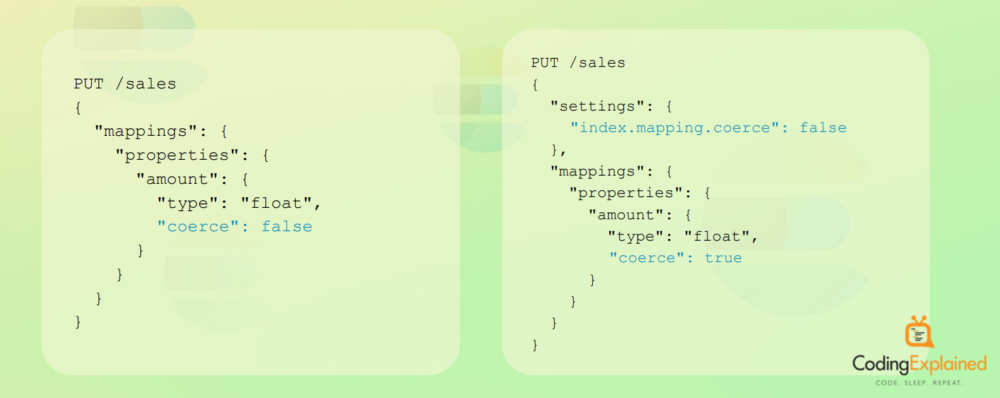

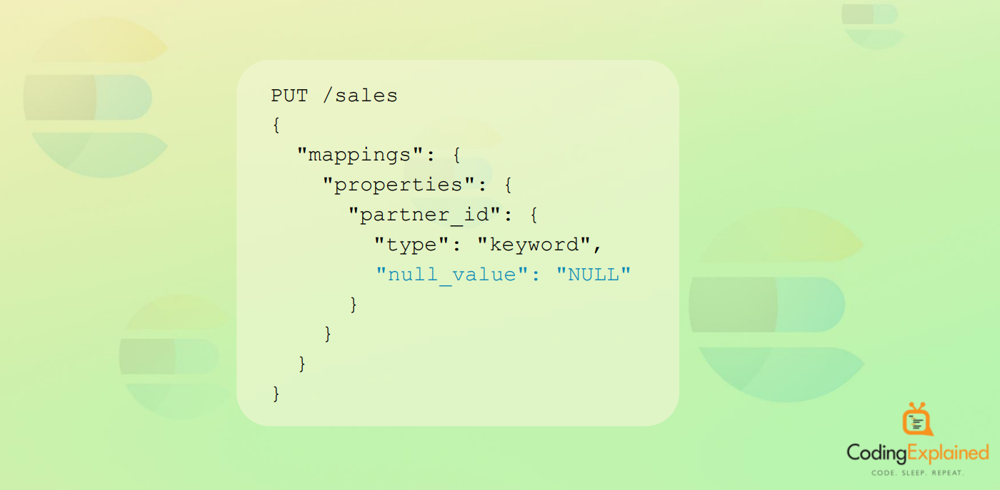

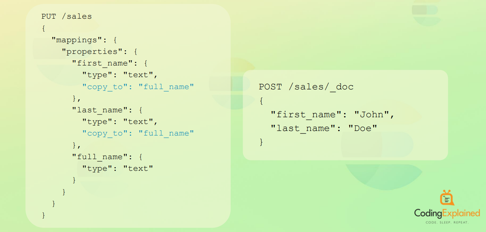

### Updating Existing Mappings: Reindexing

We have seen how new fields can be added to existing mappings. However, usually it is not possible to modify/update existing mapping fields. If we want to do that, the alternative is to create a new index and reindex the old one to it with the `_reindex` API.

That makes sense: if we want to change a text type field to be a number type, the underlying data structure is different (it wouldn't be an inverted index anymore, but a BKD tree). Therefore, we would need to re-compute everything.

However, we can sometimes add restrictions to existing fields; for instance, we can force a field to ignore items of a given length with `ignore_above`.

```json
// Get mapping of reviews index
// The field product_id is of type integer
GET /reviews/_mapping

// Here, we try to change the type of product_id
// This will yield an error.
// Alternative: create an new index and reindex this to it.
PUT /reviews/_mapping
{
  "properties": {
    "product_id": {
      "type": "keyword"
    }
  }
}

// However, we can sometimes add restrictions to existing fields
// as shown here: emails longer than 256 characters are ignored now
PUT /reviews/_mapping
{
  "properties": {
    "author": {
      "properties": {
        "email": {
          "type": "keyword",
          "ignore_above": 256
        }
      }
    }
  }
}
```

The [Reindex API](https://www.elastic.co/guide/en/elasticsearch/reference/current/docs-reindex.html) can be used as follows:

```json
// First, we get the mapping of an index
// We copy the output to paste it in the
// next command, which creates a new index
GET /reviews/_mappings

// This is the new index
// We paste the mapping obtained before
// and change the field(s) we want:
// "product_id": {"type": "integer"} -> {"type": "keyword"}
// PUT /reviews_new
// {
//   ... paste the mappings content here
// }
PUT /reviews_new
{
  "mappings" : {
    "properties" : {
      "author" : {
        "properties" : {
          "email" : {
            "type" : "keyword",
            "ignore_above" : 256
          },
          "first_name" : {
            "type" : "text"
          },
          "last_name" : {
            "type" : "text"
          }
        }
      },
      "content" : {
        "type" : "text"
      },
      "created_at" : {
        "type" : "date"
      },
      "product_id" : {
        "type" : "keyword"
      },
      "rating" : {
        "type" : "float"
      }
    }
  }
}

// After the new index is created
// we add documents to it by reindexing
// from the old index.
// Re-indexing is much cheaper than indexing
// the documents anew!
// We specify in the source and dest
// the old and the new indices, respectively
POST /_reindex
{
  "source": {
    "index": "reviews"
  },
  "dest": {
    "index": "reviews_new"
  }
}
// However, this does not change the _source objects
// That is not a problem, but if we want
// to be consistent, we can add a script
POST /_reindex
{
  "source": {
    "index": "reviews"
  },
  "dest": {
    "index": "reviews_new"
  },
  "script": {
    "source": """
      if (ctx._source.product_id != null) {
        ctx._source.product_id = ctx._source.product_id.toString();
      }
    """
  }
}

// Check that everything run ok
GET /reviews_new/_search
{
  "query": {
    "match_all": {}
  }
}

// We can also reindex only a subset
// of the documents.
// To that end, we need to change the match_all
// query by a more specific one,
// e.g., in this example, only
// reviews greater than 4.0
// are reindexed
POST /_reindex
{
  "source": {
    "index": "reviews",
    "query": {
      "range": {
        "rating": {
          "gte": 4.0
        }
      }
    }
  },
  "dest": {
    "index": "reviews_new"
  }
}

// To remove fields when reindexing
// we apply source-filtering,
// i.e., we specify the fields from _source
// that we want to copy -- the rest is ignored!
POST /_reindex
{
  "source": {
    "index": "reviews",
    "_source": ["content", "created_at", "rating"]
  },
  "dest": {
    "index": "reviews_new"
  }
}

// Renaming field names during reindexing
// However, reindexing to rename a field
// is a bed idea -- instead, use field aliases!
POST /_reindex
{
  "source": {
    "index": "reviews"
  },
  "dest": {
    "index": "reviews_new"
  },
  "script": {
    "source": """
      // Rename "content" field to "comment"
      ctx._source.comment = ctx._source.remove("content");
    """
  }
}

// Ignore reviews with ratings below 4.0
// However, it is better in general to use a query
POST /_reindex
{
  "source": {
    "index": "reviews"
  },
  "dest": {
    "index": "reviews_new"
  },
  "script": {
    "source": """
      if (ctx._source.rating < 4.0) {
        ctx.op = "noop"; // Can also be set to "delete"
      }
    """
  }
}
```

### Field Aliases

Reindexing to rename a field is a bad idea; instead, we can use field aliases. Alias fields can be used as regular fields and the original fields are unaffected; that's because queries with aliases are translated into queries with the original fields before being executed.

```json
// Reindexing to rename a field is a bed idea;
// instead, we can use field aliases.
// Here, we
// add `comment` alias pointing to the `content` field,
// so content is an alias of comment.
// Alias fields can be used as regular fields
// and the original fields are unaffected
PUT /reviews/_mapping
{
  "properties": {
    "comment": {
      "type": "alias",
      "path": "content"
    }
  }
}

// Using the field alias
// Here we search for all items
// that have outstanding in the comment alias field
GET /reviews/_search
{
  "query": {
    "match": {
      "comment": "outstanding"
    }
  }
}

// Using the "original" field name still works
GET /reviews/_search
{
  "query": {
    "match": {
      "content": "outstanding"
    }
  }
}
```

### Multi-Field Mappings

It is possible to add two types to a field in some cases; this is frequently done with key text fields:

- Text fields can be loosely used to search for non-exact words.
- Keyword fields match exact words.
- Sometimes we'd like to be flexible in a field: in some cases we want a loosely defined search (text) and in some cases an exact match (keyword).

In the used example, we have a DB with recipies. The recipes mapping has two fields where the key ingredients could appear: `description` and `ingredients`.

The `ingredients` field is defined as multifield: this can be done by adding a `fields` key under the `"type": "text"` key-value pair, which contains `"keyword": {"type": "keyword"}`. That way, we can perform both `text` (non-exact) and `keyword` (exact) searches on the field. That is an example use case of multi-field mappings.

```json
// The most common multi-field mapping
// is the one where a field is both text and keyword.
// To that end:
// We add `keyword` mapping to a `text` field
// This effectively creates an additional index:
// ingredients.keyword
// In contrast to the ingredients field,
// which allows non-exact term search
// the new (sub-)field allows exact search
PUT /multi_field_test
{
  "mappings": {
    "properties": {
      "description": {
        "type": "text"
      },
      "ingredients": {
        "type": "text",
        "fields": {
          "keyword": {
            "type": "keyword"
          }
        }
      }
    }
  }
}

// Index a test document
POST /multi_field_test/_doc
{
  "description": "To make this spaghetti carbonara, you first need to...",
  "ingredients": ["Spaghetti", "Bacon", "Eggs"]
}

// Retrieve documents: everything OK
GET /multi_field_test/_search
{
  "query": {
    "match_all": {}
  }
}

// Querying the `text` mapping
// (non-exact match/search)
GET /multi_field_test/_search
{
  "query": {
    "match": {
      "ingredients": "Spaghetti"
    }
  }
}

// Querying the `keyword` mapping (exact match)
// A new index `ingredients.keyword` has been created
// apart from `ingredients`, and here we search
// for exactly matching keywords in `ingredients.keyword`
// Thus, multi-fields allow different search types
// but bear in mind that in reality multiple indices
// are created under the hood.
GET /multi_field_test/_search
{
  "query": {
    "term": {
      "ingredients.keyword": "Spaghetti"
    }
  }
}

// Clean up
DELETE /multi_field_test
```

### Index Templates

We can create [index templates](https://www.elastic.co/guide/en/elasticsearch/reference/current/indices-put-template.html) that can be used to apply settings and mappings whenever a new index is created, if the name matches a pattern. We use the API `_index_template` for that.

General structure of an index template:

```json
// Index Template
PUT /_index_template/my-index-template        // (Arbitraty) Name
{
  "index_patterns": ["my-index-pattern*"],    // Pattern(s) to apply template in
  "template": {
    "settings": { ... },                      // Settings for new index (optional)
    "mappings": { ... }                       // Field mappings for new index (optional)
  }
}
```

Example use-case: log data, e.g., HTTP access logs that are stored in periods, i.e., 

- yearly: `access-logs-yyyy`
- monthly: `access-logs-yyyy-mm`
- weekly, daily, etc.

For each new period, we build a new index with a standardized name and pre-defined mappings.

One great advantage of index templates is that indices are created following the templates dynamically:

- When we add a `_doc`, ES check if the index exists.
- If it exists, the `_doc` is indexed.
- If not, ES checks if a matching template exists:
  - If so, a new index is created after the template and the `_doc` is indexed.
  - If not, a new default index is created after the `_doc` and the `_doc` is indexed.

Thus, no schedule jobs are needed to create periodically emerging indices.

Additionally, we can still manually create indices when a template exists; in that case, ES checks if a matching template exists, and if so our requested index and the template are merged. This is helpful, for instance, when we want to have a new index after the template but extended with a new field.

Example index template:

```json
// We can create a reusable index template
// by specifying its settings and mappings
// Example index template: access-logs-*
PUT /_index_template/access-logs
{
  "index_patterns": ["access-logs-*"],
  "template": {
    "settings": {
      "number_of_shards": 2,
      "index.mapping.coerce": false
    },
    "mappings": {
      "properties": {
        "@timestamp": { "type": "date" },
        "url.original": { "type": "wildcard" },
        "url.path": { "type": "wildcard" },
        "url.scheme": { "type": "keyword" },
        "url.domain": { "type": "keyword" },
        "client.geo.continent_name": { "type": "keyword" },
        "client.geo.country_name": { "type": "keyword" },
        "client.geo.region_name": { "type": "keyword" },
        "client.geo.city_name": { "type": "keyword" },
        "user_agent.original": { "type": "keyword" },
        "user_agent.name": { "type": "keyword" },
        "user_agent.version": { "type": "keyword" },
        "user_agent.device.name": { "type": "keyword" },
        "user_agent.os.name": { "type": "keyword" },
        "user_agent.os.version": { "type": "keyword" }
      }
    }
  }
}

// Then, we add a doc to a non-existing index
// but whose template is already created (above)
// - Index access-logs-2023-01 will be created automatically
// - doc will be indexed
POST /access-logs-2023-01/_doc
{
  "@timestamp": "2023-01-01T00:00:00Z",
  "url.original": "https://example.com/products",
  "url.path": "/products",
  "url.scheme": "https",
  "url.domain": "example.com",
  "client.geo.continent_name": "Europe",
  "client.geo.country_name": "Denmark",
  "client.geo.region_name": "Capital City Region",
  "client.geo.city_name": "Copenhagen",
  "user_agent.original": "Mozilla/5.0 (iPhone; CPU iPhone OS 12_1 like Mac OS X) AppleWebKit/605.1.15 (KHTML, like Gecko) Version/12.0 Mobile/15E148 Safari/604.1",
  "user_agent.name": "Safari",
  "user_agent.version": "12.0",
  "user_agent.device.name": "iPhone",
  "user_agent.os.name": "iOS",
  "user_agent.os.version": "12.1.0"
}

// We can also manually create an index when a template exists
// and can even extend the definition of the template,
// e.g., by adding a new field - here, url.query (keyword) is added
PUT /access-logs-2023-02
{
  "settings": {
    "number_of_shards": 1
  },
  "mappings": {
    "properties": {
      "url.query": {
        "type": "keyword"
      }
    }
  }
}

// Get/retrieve an index
GET /access-logs-2023-01
GET /access-logs-2023-02

// Retrieving an index template
GET /_index_template/access-logs

// Deleting an index template
DELETE /_index_template/access-logs
```

Final notes:

- Index template patterns cannot overlap, except we use the `priority` property.
- ES ships with some reserved index patterns:
  - `logs-*-*`
  - `metrics-*-*`
  - `synthetics-*-*`
  - `profiling-*-*`

### Introduction to Dynamic Mappings

Dynamic mapping refers to the fact that the index is automatically created when we try to ingest a Document in an index which has not been created. The fields and types are automatically inferred and the mapping is automatically created.

This list shows how this inferences occurs:

- JSON string -> `text` + `keyword` subfield (to allow both exact and non-exact searches), or `date` if possible, or `float` / `int` if possible
- JSON integer -> `long`
- JSON float -> `float`
- JSON boolean -> `boolean`
- JSON object -> `object`

However, leaving ES to automatically infer the mapping is in some cases a waste of resources; e.g., for text fields, two fields are really created, with their associated data structures.

We can combine explicit and dynamic mapping, i.e., we create an explicit mapping first and add a new field dynamically via a Document. 

```json
// Create index with one field mapping
PUT /people
{
  "mappings": {
    "properties": {
      "first_name": {
        "type": "text"
      }
    }
  }
}

// Index a test document with an unmapped field
POST /people/_doc
{
  "first_name": "Mikel",
  "last_name": "Sagardia"
}

// Retrieve mapping
// both first_name and last_name fields appear
// but last_name has two types: text + keyword
// because it was dynamically inferred
GET /people/_mapping

// Clean up
DELETE /people
```

### Configuring Dynamic Mappings

We can configure daynamic mapping in several ways:

- We can disable it with `"dynamic": false` or `"strict"`.
- We can force/activate `numeric_detection`.
- We can disable automatic date detection with `"date_detection": false`.

```json
// Disable dynamic mapping ("dynamic": false)
// New fields are ignored, if we try to insert them
// but still continue being part of _source
// Remember _source is not part of the search
// data structures.
PUT /people
{
  "mappings": {
    "dynamic": false,
    "properties": {
      "first_name": {
        "type": "text"
      }
    }
  }
}

// Disable strictly dynamic mapping ("dynamic": "strict"),
// i.e., if we try to insert new fields an error occurs.
PUT /people
{
  "mappings": {
    "dynamic": "strict",
    "properties": {
      "first_name": {
        "type": "text"
      }
    }
  }
}

// The dynamic setting is inherited to all the fields in
// the mapping, but we can overwrite it in any field.
// Here other is an object an we set "dynamic": true,
// so we can extend it, even though we cannot extend 
// the index outside from other, because it's set to "dynamic": "strict"!
PUT /computers
{
  "mappings": {
    "dynamic": "strict",
    "properties": {
      "name": {
        "type": "text"
      },
      "specifications": {
        "properties": {
          "cpu": {
            "properties": {
              "name": {
                "type": "text"
              }
            }
          },
          "other": {
            "dynamic": true,
            "properties": {  }
          }
        }
      }
    }
  }
}

// We can set "numeric_detection": true
// So that new fields will be forced to be
// numbers if possible, 
// even when they are input as text
PUT /computers
{
  "mappings": {
    "numeric_detection": true
  }
}
// New string fields are indexed
// as numbers, because it's possible
// and "numeric_detection": true
POST /computers/_doc
{
  "specifications": {
    "other": {
      "max_ram_gb": "32", // long
      "bluetooth": "5.2" // float
    }
  }
}
```

### Dynamic Templates

Another way of configuring dynamic mappings are dynamic templates, defined inside the key `dynamic_templates`. We basically define a mapping for any new field with a concrete type, e.g., every whole number needs to be parsed as a `long`. Concretely, a `dynamic_template` has these components:

- Each dynamic template in `dynamic_templates` is an object defined with a meaningfull name, e.g., `"integers"` in the example below.
- Each template needs a matching condition; this condition refers to the JSON data type which will trigger the template, e.g., `"match_mapping_type": "long"` refers to all whole numbers. Other JSON types we can reference are: `boolean, object ({...}), string, date, double, * (any)`.
- Finally, we have a `"mapping"` field in which we wan define the typea and further parameters.

```json
// dynamic_templates can be used to define the parsing
// of concrete values to a given type + parameters, among others
// Example: Map whole numbers to `integer` instead of `long`
PUT /dynamic_template_test
{
  "mappings": {
    "dynamic_templates": [
      {
        "integers": {
          "match_mapping_type": "long", // every JSON field with a whole number...
          "mapping": {
            "type": "integer" // ... will be parsed as integer
          }
        }
      }
    ]
  }
}

// Test the dynamic template
POST /dynamic_template_test/_doc
{
  "in_stock": 123
}

// Retrieve mapping (and dynamic template)
GET /dynamic_template_test/_mapping
```

One common use case would be to modify the way strings are mapped by default; instead of creating for a string a `text` and `keyword` field, we might want to create just a `text` field, or limit the length of the keyword with `ignore_above`.

```json
// One common use case would be to modify
// the way strings are mapped by default; 
// instead of creating for a string a `text` and `keyword` field, 
// we might want to create just a `text` field,
// or limit the length of the keyword with `ignore_above`.
// In the example, we modify default mapping for strings:
// We set `ignore_above` to 512,
// so all strings will get a text field and a keyword field
// but the maximum length of the keyword will be 512
PUT /test_index
{
  "mappings": {
    "dynamic_templates": [
      {
        "strings": {
          "match_mapping_type": "string",
          "mapping": {
            "type": "text",
            "fields": {
              "keyword": {
                "type": "keyword",
                "ignore_above": 512
              }
            }
          }
        }
      }
    ]
  }
}
```

For each dynamic template, we have conditions that can be specified with **`match` and/or `unmatch`** parameters:

- `"match": "text_*"`: all fields with a name that matches `text_*`; we can apply regex here!
- `"unmatch": "*_keyword"`: except all fields with a name that matches `*_keyword`; we can apply regex here!

```json
// For each dynamic template, 
// we have conditions that can be specified 
// with **`match` and/or `unmatch`** parameters:
// - `"match": "text_*"`: all fields with a name that matches `text_*`;
// we can apply regex here!
// - `"unmatch": "*_keyword"`: except all fields with a name that matches `*_keyword`;
// we can apply regex here!
PUT /test_index
{
  "mappings": {
    "dynamic_templates": [
      {
        "strings_only_text": {
          "match_mapping_type": "string",
          "match": "text_*",
          "unmatch": "*_keyword",
          "mapping": {
            "type": "text"
          }
        }
      },
      {
        "strings_only_keyword": {
          "match_mapping_type": "string",
          "match": "*_keyword",
          "mapping": {
            "type": "keyword"
          }
        }
      }
    ]
  }
}

POST /test_index/_doc
{
  "text_product_description": "A description.", // first template is matched -> type: text
  "text_product_id_keyword": "ABC-123" // second template is matched -> type: keyword
}
```

Similarly, we have the **`path_match` and `path_unmatch`** parameters, which refer to the dotted field name, i.e., `field_name.subfield_name`.

```json
// In the context of dynamic mapping definitions,
// we also have the **`path_match` and `path_unmatch`** parameters,
// which refer to the dotted field name, i.e., `field_name.subfield_name`.
PUT /test_index
{
  "mappings": {
    "dynamic_templates": [
      {
        "copy_to_full_name": {
          "match_mapping_type": "string",
          "path_match": "employer.name.*",
          "mapping": {
            "type": "text",
            "copy_to": "full_name"
          }
        }
      }
    ]
  }
}

POST /test_index/_doc
{
  "employer": {
    "name": {
      "first_name": "John",
      "middle_name": "Edward",
      "last_name": "Doe"
    }
  }
}
```

### Mapping Recommendations

Best practices:

- Prefer explicit mappings; e.g., choose `strict` over `dynamic: false`.
- Dissable mapping strings to both `text` and `keyword`, but choose.
- Disable type coercion.
- Choose appropriate numeric types; integers are sometimes enough, as compared to longs.
- Set `doc_values: false` if we won't run aggregation operations.
- Set `norms: false` if we don't need relevance scoreing.
- Set `index: false` if we won't filter values.

### Stemming and Stop Words

A word (noun, verb, etc.) can change its root form depending on 

- number (singular, plural), 
- tense (present, past, etc.), 
- conjugation (first/second/third person, etc.),
- declination (genitive/possesive), 
- modus (gerund),
- etc.

Since we create inverted indices using unique terms, this leads to many useless terms that mean the same thing. To avoid that, **stemming** algorithms transform words to a *root form*. We can choose an analyzer which performs stemming.

    drinking -> drink
    bottles -> bottl
    ...

Similarly, **stop words** are the most common words that are filtered out at any analysis, because they provide little to no value to relevance scoring. It was common to remove them in ES, but it's not that usual anymore, because the relevance ranking algorithms in ES have become better.

### Analyzers and Search Queries

When we ingest/index a document, its text fields are processed by the analyzer, which performs the **tokenization** and **stemming** of the words/symbols.

When we run a text search query, that query is processed by the same analyzer by default; otherwise, the queries wouldn't work...

### Built-in Analyzers

There are [pre-configured analyzers](https://www.elastic.co/guide/en/elasticsearch/reference/current/analysis-analyzers.html):

- `standard`: 
  - splits words
  - removes punctuation
  - lowercases
  - tokenizes
  - we can enable the removal of stop words
- `simple`: similar to `standard`
- `whitespace`
  - splits tokend by white space
  - no lowercase
  - punctuation not removed
- `keyword`: no tokenization, text used intact
- `pattern`:
  - regex used to match token separators
  - lowercase
- [Language specific analyzers](https://www.elastic.co/guide/en/elasticsearch/reference/current/analysis-lang-analyzer.html), e.g., `english`.

### Custom Analyzer

We can create custom analyzers, similar to the [built-in analyzers](https://www.elastic.co/guide/en/elasticsearch/reference/current/analysis-analyzers.html). These are created for each index, usually when creating the index; however, we can also add them later, as shown in the next section.

To create a custom analyzer, we need to build an `analyzer` object and configure it with the filters we need; we can check those filters in the [documentation](https://www.elastic.co/guide/en/elasticsearch/reference/current/analysis.html), e.g., by looking how the built-in analyzers are configured. Let's imagine we want an analyzer able to parse/process a text like the following:

    "I&apos;m in a <em>good</em> mood&nbsp;-&nbsp;and I <strong>love</strong> açaí!"

```json
// Analyze the text with the standard analyzer
// HTML characters are tokenized one by one...
// We need to create our own analyzer...
POST /_analyze
{
  "analyzer": "standard",
  "text": "I&apos;m in a <em>good</em> mood&nbsp;-&nbsp;and I <strong>love</strong> açaí!"
}

// Creation of a custom analyzer
// able to process a text with HTML tags
// and handle special characters
// Note that we create it within an index: analyzer_test
// In other words, it is created when creting the index.
// It can be added later too, though, as shown below.
PUT /analyzer_test
{
  "settings": {
    "analysis": {
      "analyzer": {
        "my_custom_analyzer": {
          "type": "custom",
          "char_filter": ["html_strip"],
          "tokenizer": "standard",
          "filter": [
            "lowercase",
            "stop",           // remove stop words
            "asciifolding"    // convert special symbols to ASCII equivalent
          ]
        }
      }
    }
  }
}

// Analyze the text with the custom analyzer
// Note that we need to run it within the index
// where it was defined
POST /analyzer_test/_analyze
{
  "analyzer": "standard",
  "text": "I&apos;m in a <em>good</em> mood&nbsp;-&nbsp;and I <strong>love</strong> açaí!"
}

// We can also alter the filters
// For instance, here we create a filter spanish_stop
// which removes Spanish stop words.
// We can do the same thing for
// - character filters
// - tokenizers
PUT /analyzer_test
{
  "settings": {
    "analysis": {
      "filter": {
        "spanish_stop": {
          "type": "stop",
          "stopwords": "_spanish_"
        }
      },
      "char_filter": {
        // Add character filters here
      },
      "tokenizer": {
        // Add tokenizers here
      },
      "analyzer": {
        "my_custom_analyzer": {
          "type": "custom",
          "char_filter": ["html_strip"],
          "tokenizer": "standard",
          "filter": [
            "lowercase",
            "spanish_stop",
            "asciifolding"
          ]
        }
      }
    }
  }
}
```

### Adding/Updating Analyzers to/from Existing Indices

When we have already created an index but we'd like to add a custom analyzer to it, we can do it via the `_settings` API. It uses the same syntax/configuration as when creating an index and adding a custom analyzer to it (i.e., previous section).

However, we need to consider that settings can be **static** and **dynamic**:

- Dynamic settings of an index can be changed without downtime, anytime.
- Static settings of an index cannot be changed when an index is open, i.e., we need to close it first.

A custom analyzer is a *static* setting, so we need to close the corresponding index, add the analyzer, and re-open the index again. The same happens for:

- character filters
- tokenizers
- other filters
- etc.

Updating an existing analyzer requires the same calls, but at the end we need to call the `_update_by_query` API to fix Documents that were indexed with the old analyzer; otherwise, there might be inconsistencies and the search doesn't work properly.

```json
// First, close the index
// This is necessary because
// the analyzer setting is static
// not dynamic, i.e., we need to
// stop any operations in the index
// before we change it
POST /analyzer_test/_close

// Then, create/add a custom analyzer
// The syntax is the same as when
// we create and configure an index
// with a custom analyzer
// Updating and existing one is done also with
// the same call, but we additionally need to
// call the _update_by_query API, shown below
PUT /analyzer_test/_settings
{
  "analysis": {
    "analyzer": {
      "my_second_analyzer": {
        "type": "custom",
        "tokenizer": "standard",
        "char_filter": ["html_strip"],
        "filter": [
          "lowercase",
          "stop",
          "asciifolding"
        ]
      }
    }
  }
}

// Re-Open the index again
// If an index is closed, no queries are accepted
// no indexing of Documents can happen
POST /analyzer_test/_open

// Check that the change took place
GET /analyzer_test/_settings

// If we have updated the analyzer,
// and not created a new one,
// we need to update the Documents
// to be processed by the new analyzer,
// otherwise the indexed values are inconsistent.
// This call re-indexes all Documents again.
POST /analyzer_test/_update_by_query?conflicts=proceed
```

## Searching for Data

Search is performed with the API `_search`:

    GET /index_name/_search

There are 2 major ways of specifying the search we'd like:

1. URI Searches: we append to the `_search` call the parameters of the search using [Apache Lucene](https://lucene.apache.org/core/) syntax (not covered in this guide):
    ```json
    GET /products/_search?q=name:sauvignong AND tags:wine
    ```
2. Query DSL: we append a JSON object which contains the search parameters; this option is covered in this guide, since it is more powerful and native to Elastic Search. However, as we see, it is more verbose and seems more complicated in the beginning:
    ```json
    GET /products/_search
    {
      "query": {
        "bool": {
          "must": [
            {
              "match": {
                "name": "sauvignong"
              }
            },
            {
              "match": {
                "tags": "wine"
              }
            }
          ]
        }
      }
    }
    ```

The simplest search query is to get all Documents in an index:

```json
// Search all documents in an index (products)
GET /products/_search
{
  "query": {
    "match_all": {}
  }
}
```

The following JSON is returned. Note the fields:

- The time it took (milliseconds).
- Whether it timed out or not.
- The total number of shards (also non-allocated), as well as the used ones.
- The number of hit/found documents; if the value is accurate, we get the relation `eq`.
- The highest relevance score: `max_score`.
- `hits.hits` contains the Documents as JSON objects `{}` listed in a list; each Document has its `_source` and its metadata.

```json
{
  "took": 59,
  "timed_out": false,
  "_shards": {
    "total": 2,
    "successful": 2,
    "skipped": 0,
    "failed": 0
  },
  "hits": {
    "total": {
      "value": 1001,
      "relation": "eq"
    },
    "max_score": 1,
    "hits": [
      { // first Document
        "_index": "products",
        "_id": "1",
        "_score": 1,
        "_ignored": [
          "description.keyword"
        ],
        "_source": {
          "name": "Wine - Maipo Valle Cabernet",
          "price": 152,
          "in_stock": 38,
          "sold": 47,
          "tags": [
            "Beverage",
            "Alcohol",
            "Wine"
          ],
          "description": "Aliquam augue quam, sollicitudin vitae, consectetuer eget, rutrum at, lorem. Integer tincidunt ante vel ipsum. Praesent blandit lacinia erat. Vestibulum sed magna at nunc commodo placerat. Praesent blandit. Nam nulla. Integer pede justo, lacinia eget, tincidunt eget, tempus vel, pede. Morbi porttitor lorem id ligula.",
          "is_active": true,
          "created": "2004/05/13"
        }
      },
      { // second Document
        "_index": "products",
        ...
      }
      ...
  }
}
```

### Term-Level Queries

Term-level queries are those which **search for exact words**, i.e., we should use them with *keywords*, *numbers*, *booleans*, *dates*, etc. These search queries are not processed by analyzers, i.e., they are not tokenized, lowercased, stemmed, etc.

- They are case-sensitive, or sensitive to any other filters/transformations in the analyzer.
- We should never use them with text fields, because tezt fields are analyzed, thus, their tokens won't be like the term we are searching for.

Exception: when we query using prefixes, wildcards and regex in the term query.

Examples:

```json
// Term-Level queries can be used
// to perform exact searches.
// They should be used with *keywords*, *numbers*, *booleans*, *dates*
// but never for *text* fields, since no analyzer is used,
// which transforms the queried word.
// Example: Term query in which we find for all product Documents
// which contain the tag "Vegetable"; the tag "vegetable"
// won't be found.
// Exception: when we query using prefixes, wildcards and regex in the term query.
GET /products/_search
{
  "query": {
    "term": {
      "tags.keyword": "Vegetable"
    }
  }
}

// Same query as before,
// but with explicit syntax
// The advantage is that we can add
// more parameters, like case_insensitive
GET /products/_search
{
  "query": {
    "term": {
      "tags.keyword": {
        "value": "Vegetable",
        "case_insensitive": true
      }
    }
  }
}

// Term-search query for multiple values
// Note the field is plural: terms
GET /products/_search
{
  "query": {
    "terms": {
      "tags.keyword": ["Soup", "Meat"]
    }
  }
}

// Term-search for 
// numbers, booleans, dates, timestamps
GET /products/_search
{
  "query": {
    "term": {
      //"in_stock": 1
      //"created": "2007/10/14"
      //"created": "2007/10/14 12:34:56"
      "is_active": true
    }
  }
}
```

### Retrieving Documents by IDs

We can retrieve documents by their IDs:

```json
// Retrieve documents by IDs
// Not all IDs we specify are required to match!
// Simply, the ones that are matched are returned
GET /products/_search
{
  "query": {
    "ids": {
      "values": ["100", "200", "300"]
    }
  }
}
```

### Range Searches

Range searches can be applied to numeric fields, date fields, etc.

In general, the `range` object is used, followed by the parameters `gt, lt` or `gte, lte`.

```json
// SELECT * FROM products WHERE in_stock >= 1 AND in_stock <= 5
// Also, we can use (gt, lt) = (>, <>) 
// instead of (gte, lte) = (>=, <=)
GET /products/_search
{
  "query": {
    "range": {
      "in_stock": {
        "gte": 1,
        "lte": 5
      }
    }
  }
}

// Dates can take days, day+time, etc.
//   "gte": "2020/01/01 00:00:00",
//   "lte": "2020/01/31 23:59:59"
// By default, dates should be specified as in the mapping
// otherwise, if we change the format, we can specify it in the query:
//   "format": "dd/MM/yyyy",
//   "gte": "01/01/2020", ...
// It's even possible to specify a timezone parameter:
//   "time_zone": "+01:00",
//   "gte": "2020/01/01 01:00:00", ...
// If no time zone provided, it's assumed the date is in UTC
GET /products/_search
{
  "query": {
    "range": {
      "created": {
        "gte": "2020/01/01",
        "lte": "2020/01/31"
      }
    }
  }
}
```

### Prefixes, Wildcards, Regex

Term-level queries are used to find exact matches; the reason is that these terms are not processed by the analyzers. However, some kind of *exception* is when we query using prefixes, wildcards and regex in the term query. In that case, the query term is flexibly defined and contains in reality many terms.

These queries must be used with `keyword` fields.

The regular expressions follow the conventions from Apache Lucene, so they might be a little different as compared to the ones used by other engnes.

```json
// Prefixes, Wildcards and Regex
// can be used in ter-level queries performed on keywords.
// "prefix"
// "wildcard" (use them as suffix):
//    ?: any single character
//    *: any set of characters once or several times
// "regexp"
//    "Bee(f|r)+": f or r one or more times
//    "Bee(f|r){1}": f or r once
//    "Bee[a-zA-Z]+": any continuation, i.e. "Bee" is a prefix
// We can also add "case_insensitive": true
GET /products/_search
{
  "query": {
    "prefix": {
      "name.keyword": {
        // This matches only a keyword which starts with "Past"
        "value": "Past"
      }
    }
  }
}

GET /products/_search
{
  "query": {
    "wildcard": {
      "name.keyword": {
        "value": "Bee*"
      }
    }
  }
}

GET /products/_search
{
  "query": {
    "regexp": {
      "tags.keyword": {
        "value": "Bee(f|r)+"
      }
    }
  }
}
```

### Querying by Field Existence

We can filter documents depending on whether a given field is indexed or not, i.e., if it exists or not.

```json
// SELECT * FROM products WHERE tags IS NOT NULL
// Notes: 
// - empty arrays [] are like NULL, so NOT indexed -> non existent
// - empty strings "" are NOT NULL -> they're indexed!
// - if the field contains `null_value`, it is indexed!
// - if we set index = False, the field is not indexed! (e.g., time series)
GET /products/_search
{
  "query": {
    "exists": {
      "field": "tags.keyword"
    }
  }
}

// SELECT * FROM products WHERE tags IS NULL
GET /products/_search
{
  "query": {
    "bool": {
      "must_not": [
        {
          "exists": {
            "field": "tags.keyword"
          }
        }
      ]
    }
  }
}
```

### Intorduction to Full Text Queries

In contrast to term-level searches (which look for exact matches), **full-text searches** refer to searches with **unstructured** text data, such as website articles or similar long-form texts in which we don't really know which data is contained.

For instance, in the following image/example, in a document which contains an article with several fields (`title, published_at, author, body`), the text `shard` is searched for.

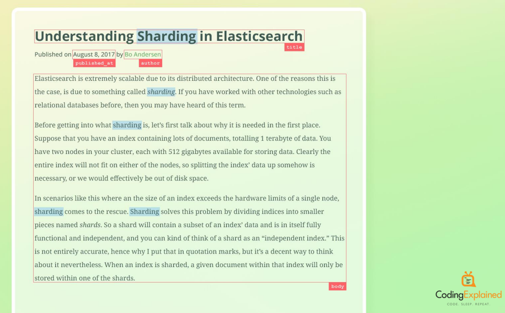

The **queries in full-text search are *analyzed***. Thus, the analyzer must be the same as the one used when indexing the documents. This is the main distinction as compared to term-level queries, which are not analyzed.

### Match Query: Full-Text Query

For term-level searches we use the `query` object `term`; for full-text searches we use the `query` object `match`.

```json
// For term-level searches we use 
// the `query` object `term`.
// For full-text searches we use 
// the `query` object `match`
// This returns many products (12)
// which have a name containing "pasta"
// or a derivate.
GET /products/_search
{
  "query": {
    "match": {
      "name": "pasta"
      //"name": "PASTA" 
      // This would result in the same, 
      // because of lowercasing in the analysis...
    }
  }
}

// We can search for documents
// with multiple words simply
// by specifying them in a string
// Recall that the string is analyzed: tokenized, etc.
GET /products/_search
{
  "query": {
    "match": {
      "name": "pasta chicken"
    }
  }
}
// If we have several search tokens
// the default operator is OR,
// i.e., not all tokens need to appear
// We can change that with "operator": "and"
GET /products/_search
{
  "query": {
    "match": {
      "name": {
        "query": "pasta chicken",
        // require all tokens to appear in results
        "operator": "and"
      }
    }
  }
}
```

### Relevance Scoring

When we use term-level queries, the relevance score of all results is `_score = 1.0` (either a document matches or not). But when we perform a full-text search, we care about *how well it matches*, i.e., the relevance, which is used for sorting.

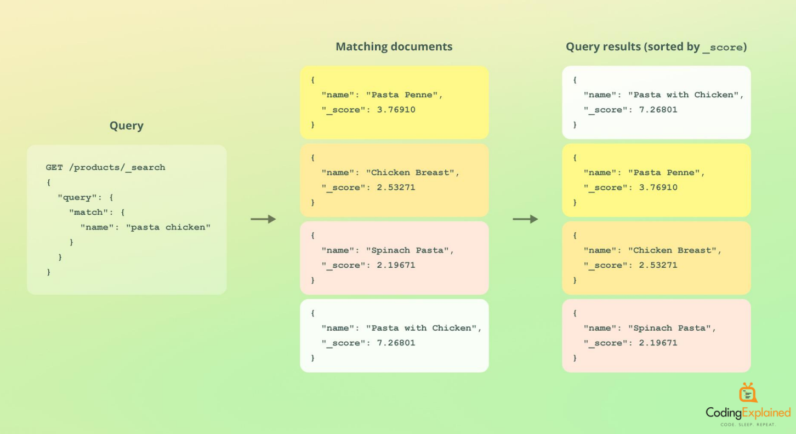

### Searching Multiple Fields

We can use `multi_match` to search in more than one field. This query enables also boosting the relevance of fields. 

Internally, `multi_match` is broken down to several `match` queries, each with a field. Then, the relevance of each matching document in each field is computed, and usually, if we have several matching fields in a document the highest is taken for the document. In case of a tie in documents, we can add a `tie_breaker` factor: in that case, the score of the field with the maximum relevance is taken and the rest of matching field scores are summed after multiplying the `tie_breaker` factor to them.

```json
// We can use `multi_match` 
// to search in more than one field.
// However, by default the score of the
// highest matching field is used for the document;
// exception: using a tie_breaker (see below)
GET /products/_search
{
  "query": {
    "multi_match": {
      "query": "vegetable",
      "fields": ["name", "tags"]
    }
  }
}

// We can modify the relevance scores
// by boosting the relevance score per field
// field_a^2: relevance scores of matches in field_a
// and doubled (x2). Again, by default the 
// highest matching field is used for the document;
// exception: using a tie_breaker (see below)
GET /products/_search
{
  "query": {
    "multi_match": {
      "query": "vegetable",
      "fields": ["name^2", "tags"]
    }
  }
}

// Here a multi_match is performed in 2 fields
// and a tie_breaker is added; as a consequence,
// the score of the document is a sum of
// - the score of the maximum matching field
// - and the scores of the other matching fields multiplied by tie_breaker
GET /products/_search
{
  "query": {
    "multi_match": {
      "query": "vegetable broth",
      "fields": ["name", "description"],
      "tie_breaker": 0.3
    }
  }
}
```

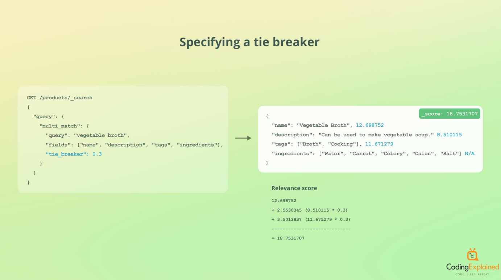

### Phrase searches

In the `match` query we can put a free text string and it will be analyzed; then, the tokens are used to search in the inverted index for the specified fields. Usually

- the order of the words doesn't matter
- and not all the words/tokens need to appear for the document to be a match.

If we use `match_phrase` instead:

- all tokens need to appear
- and the order must be the same, without terms in-between.

Recall that during the analysis (tokenization), the position of the terms in the document is recorded.

It makes sense to use this with movie, book, course titles, or the like, if we are sure anbout them.

```json
// The `match` query searches for 
// any of the tokens in any order in the fields.
// Meanwhile, with `match_phrase` we 
// require for all tokens to appear
// in the correct order and without other
// tokens in between.
GET /products/_search
{
  "query": {
    "match_phrase": {
      "name": "mango juice" // it does not appear, but "juice mango" does
    }
  }
}
```

### Bool Compound Queries

**Leaf queries** (all seen so far): they search for one or more values in one or more fields, but are independent queries:

- `term`: no analyzer used
- `match` (and related): analyzer used, full text
- `range`, `prefix`, `regexp`, `wildcard`, etc.

**Compound queries** are composed by leaf queries: several queries are performed simultaneously. To created them, we wrap the required leaf queries in a compound query, and similarly, we can nest compound queries within compound queries. In SQL this is done very easily; in Elasticsearch, we have several compound query types with their clauses.

One **common compound query is [`bool`](https://www.elastic.co/guide/en/elasticsearch/reference/current/query-dsl-bool-query.html)**, which can be composes by several leaf clauses:

- `must` and `must_not` clauses: required to match or not match.
- `should` clauses: not required to match, but desired (relevance boosted); if a query is composed by only `should` clauses, one must match at least to obtain some results.
- `filter` clauses: they are required to match, but, in contrast to `must` they don't affect relevance scores, i.e., they just filter the matches.

Note that, under the hood, `match` queries are broken down to `bool` compound queries in which `must` and `should` clauses are used with `term` queries inside (i.e., text is analyzed to tokens, which are then used as terms in the search). Thus, `match` is an abstraction for easier UX.

```json
// Compound queries perform several leaf queries simultaneously.
// The most common compound query is `bool`
// which can accept several clauses:
// - must: required to contain
// - must_not: required not to contain
// - should: not required to contain, but relevance is improved
// - filter: required to contain, relevance unaffected

// Example: must clause: the presence is required
// SELECT * FROM products  WHERE tags IN ("Alcohol")
GET /products/_search
{
  "query": {
    "bool": {
      "must": [
        {
          "term": {
            "tags.keyword": "Alcohol"
          }
        }
      ]
    }
  }
}

// Example: must_not clause: the non-presence is required
// SELECT * FROM products WHERE tags IN ("Alcohol") AND tags NOT IN ("Wine")
GET /products/_search
{
  "query": {
    "bool": {
      "must": [
        {
          "term": {
            "tags.keyword": "Alcohol"
          }
        }
      ],
      "must_not": [
        {
          "term": {
            "tags.keyword": "Wine"
          }
        }
      ]
    }
  }
}

// Example: should clause: not required to appear, but relevance is increased if it does
// If we compose our compound query only with should clauses
// at least one clause must match to get results.
// If should clauses appear among must / filter clauses
// should matches act as relevance boosters, unles we add
// the parameter `minimum_should_match` to the should clause,
// with which the should query becomes compulsory.
GET /products/_search
{
  "query": {
    "bool": {
      "must": [
        {
          "term": {
            "tags.keyword": "Alcohol"
          }
        }
      ],
      "must_not": [
        {
          "term": {
            "tags.keyword": "Wine"
          }
        }
      ],
      "should": [
        {
          "term": {
            "tags.keyword": "Beer"
          }
        }
      ]
    }
  }
}

// Example: Another bool compound query with more sub-queries
GET /products/_search
{
  "query": {
    "bool": {
      "must": [
        {
          "term": {
            "tags.keyword": "Alcohol"
          }
        }
      ],
      "must_not": [
        {
          "term": {
            "tags.keyword": "Wine"
          }
        }
      ],
      "should": [
        {
          "term": {
            "tags.keyword": "Beer"
          }
        },
        {
          "match": {
            "name": "beer"
          }
        },
        {
          "match": {
            "description": "beer"
          }
        }
      ]
    }
  }
}

// Example: should clause with minimum_should_match,
// which makes the query compulsory
GET /products/_search
{
  "query": {
    "bool": {
      "must": [
        {
          "term": {
            "tags.keyword": "Alcohol"
          }
        }
      ], 
      "should": [
        {
          "term": {
            "tags.keyword": "Beer"
          }
        },
        {
          "match": {
            "name": "beer"
          }
        }
      ],
      "minimum_should_match": 1
    }
  }
}

// Example: filter clause: similar to must,
// but they don't affect relevance scores.
// Additionally, the results are cached,
// so they increase speed/performance.
GET /products/_search
{
  "query": {
    "bool": {
      "filter": [
        {
          "term": {
            "tags.keyword": "Alcohol"
          }
        }
      ]
    }
  }
}

// Example
// SELECT * FROM products WHERE tags IN ("Beer") AND (name LIKE '%Beer%' OR description LIKE '%Beer%') AND in_stock <= 100
GET /products/_search
{
  "query": {
    "bool": {
      "filter": [
        {
          "range": {
            "in_stock": {
              "lte": 100
            }
          }
        },
        {
          "term": {
            "tags.keyword": "Beer"
          }
        }
      ],
      "should": [
        { "match": { "name": "Beer" } },
        { "match": { "description": "Beer" } }
      ],
      "minimum_should_match": 1
    }
  }
}
// Alternative, equivalent
GET /products/_search
{
  "query": {
    "bool": {
      "filter": [
        {
          "range": {
            "in_stock": {
              "lte": 100
            }
          }
        },
        {
          "term": {
            "tags.keyword": "Beer"
          }
        }
      ],
      "must": [
        {
          "multi_match": {
            "query": "Beer",
            "fields": ["name", "description"]
          }
        }
      ]
    }
  }
}
```

### Query and Filter Execution Contexts

We can distinguish two execution contexts:

- `query` execution context.
- `filter` execution contexts.

Queries are executed in a `query` context unless specified otherwise; a `query` context is the typical scope `"query": {}` and **ranks documents according to their relevance**. So these queries answer the question *how well do the documents match?*.

If we use `filter` instead of `query` or within it, we are in a `filter` context; in a `filter` context documents **are not ranked according to their relevance**, but only they are provided/filtered into the result if they match the search input. So these queries answer the question *does the document match?* Not computing the relevance is a performace improvement and the results can be cached. We need to decide whether we need relevance scoring or not.

### Boosting Queries

The `^` symbol in `multi_match` allows to boost the relevance of one field wrt. another. However, we can also use the `boosting` query, which allows to weight different sub-query matches differently.

```json
// The `boosting` query
// allows to weight different sub-query matches differently.
// Example: Get products which are a juice
GET /products/_search
{
  "size": 20, // increase page size from 10 (default) to 20
  "query": {
    "match": {
      "name": "juice"
    }
  }
}
// Next version of the query but with boosting:
// - we prioritize juices
// - we penalize apple products
GET /products/_search
{
  "size": 20,
  "query": {
    "boosting": {
      "positive": {
        "match": {
          "name": "juice"
        }
      },
      "negative": {
        "match": {
          "name": "apple"
        }
      },
      "negative_boost": 0.5 // [0.0,1.0]
    }
  }
}

// Example: Pasta products, preferably without bacon
GET /recipes/_search
{
  "query": {
    "boosting": {
      "positive": {
        "term": {
          "ingredients.name.keyword": "Pasta"
        }
      },
      "negative": {
        "term": {
          "ingredients.name.keyword": "Bacon"
        }
      },
      "negative_boost": 0.5
    }
  }
}

// Example: anything without bacon
// We always need to have a positive boosting query
// so we add match_all by default
GET /recipes/_search
{
  "query": {
    "boosting": {
      "positive": {
        "match_all": {}
      },
      "negative": {
        "term": {
          "ingredients.name.keyword": "Bacon"
        }
      },
      "negative_boost": 0.5
    }
  }
}

// Example: Show me all products, but
// - prioritize pasta products
// - penalize bacon products
GET /recipes/_search
{
  "query": {
    "boosting": {
      "positive": {
        "bool": {
          "must": [
            { "match_all": {} }
          ],
          "should": [
            {
              "term": {
                "ingredients.name.keyword": "Pasta"
              }
            }
          ]
        }
      },
      "negative": {
        "term": {
          "ingredients.name.keyword": "Bacon"
        }
      },
      "negative_boost": 0.5
    }
  }
}
```

### Disjunction Max

Disjoint max is a compound query with these properties:

- We can add several queries within it.
- For a document to be a match, it's enough if one query is a match.
- If several queries give a match, the one with the highest relevance is used to compute the document relevance.

Under the hood, the `multi_match` query is broken down to a `dis_max` query.

```json
// Disjoint max is a compound query:
// - We can add several queries within it
// - For a document to be a match, it's enough if one query is a match
// - If several queries give a match, the one with the highest relevance is used to compute the document relevance
// The `multi_match` query is broken down to a `dis_max` query internally.
GET /products/_search
{
  "query": {
    "dis_max": {
      "queries": [
        { "match": { "name": "vegetable" } },
        { "match": { "tags": "vegetable" } }
      ]
    }
  }
}
// Here, we add tie_breaker != 0.0, with which
// we take the lesser relevant scores weighted by it
GET /products/_search
{
  "query": {
    "dis_max": {
      "queries": [
        { "match": { "name": "vegetable" } },
        { "match": { "tags": "vegetable" } }
      ],
      "tie_breaker": 0.3
    }
  }
}
```

### Querying Nested Objects

In order to run the examples in this section, a new index must be bulk-created from the JSON [`recipes-bulk.json`](./notebooks/recipes-bulk.json). The notebook [`elastic_intro.ipynb`](./notebooks/elastic_intro.ipynb) has the REST call which performes that (Section: Batch/Bulk Processing).

The documents are recipes; one field is `ingredients`, which is an array of objects; each object has these fields:

```json
[
  {
    "name": "string",
    "amount": 123,
    "unit": "string (predefined categories)"
  },
]
```

Array fields are internally handled together, i.e., they are not considered individual instances. For instance, this array:

```json
[
  { ... "amount": 100 ...},
  { ... "amount": 200 ...}
  { ... "amount": 300 ...},
]
```

is treated internally as if it were

```json
...
  "ingredients.amount": [100, 200, 300]
...
```

Therefore, running a query like `"range": { "ingredients.amount": { "gte": 100 } } ` on a field that belongs to an array will not really return the instances within the array which satisfy it, but the *complete array*, if the array has at least one instance which satisfies the condition, no matter which instance it is. Thus, we are not filtering by nested object values really (e.g., recipes which contain at least 100g Parmesan).

Therefore, when we have nested fields with arrays, we need to carefully define the mapping. Concretely, in our case, we need to re-define our `ingredients` field as `nested` type (recall re-mapping requires re-indexing):

```json
"ingredients": {
  "type": "nested",
  "properties": {
    "name": {
      "type": "text",
      "fields": {
        "keyword": {
          "type": "keyword"
        }
      }
    }
```

In the following, the example queries are shown to fix the issue and deal with nested objects/fields:

```json
// Array fields are not nested fields,
// so we cannot filter documents considering each
// element of the array independenty as an object.
// In this example, ingredients is an array, so all values within it
// are handled together; thus, if a filtering query
// is run on a field of ingredients,
// we won't get the instances within the array which satisfy it, 
// but the *complete array*, 
// if the array has at least one instance which satisfies the condition.
// WARNING: This query does not work with nested objects/types
// but ingredients is not nested yet...
GET /recipes/_search
{
  "query": {
    "bool": {
      "must": [
        {
          "match": {
            "ingredients.name": "parmesan"
          }
        },
        {
          "range": {
            "ingredients.amount": {
              "gte": 100
            }
          }
        }
      ]
    }
  }
}

// The real question we want to ask is:
// Which recipies contain at least 100 units of Parmesan cheese?
// To achieve that, we need to
// - map the ingredients field as nested
// - reindex everything correctly again
// Therefore, we:
// 1. delete the index
// 2. define the mapping
// 3. bulk-process the JSON again

// 1. Delete recipes index
DELETE /recipes
// 2. Define new mapping with ingredients as type nested
// Each nested object will be stored internally 
// as a separete Lucene document.
// Additionally, we have a root document that points
// to the nested documents.
// And usually, we are interested in the root document
// but we apply queries to the nested ones
// if we want to filter using nested fields.
// IMPORTANT NOTE: while nested fields allow for
// filtering according to nested objects,
// they have the important limitation that they can contain
// only 10k instances. Thus, it is often better
// to create separate indices instead of nested fields,
// so that we can easily scale.
PUT /recipes
{
  "mappings": {
    "properties": {
      "title": { "type": "text" },
      "description": { "type": "text" },
      "preparation_time_minutes": { "type": "integer" },
      "steps": { "type": "text" },
      "created": { "type": "date" },
      "ratings": { "type": "float" },
      "servings": {
        "properties": {
          "min": { "type": "integer" },
          "max": { "type": "integer" }
        }
      },
      "ingredients": {
        "type": "nested",
        "properties": {
          "name": {
            "type": "text",
            "fields": {
              "keyword": {
                "type": "keyword"
              }
            }
          },
          "amount": { "type": "integer" },
          "unit": { "type": "keyword" }
        }
      }
    }
  }
}
// 3. Bulk-process JSON, done in the notebook
// NOTE: The bulk command is the same, only
// this time we don't let ELasticsearch infer the mapping
// but we use a manually & correctly defined one!

// Now, we can ask the correct question and the the correct answer:
// Which recipies contain at least 100 units of Parmesan cheese?
// The query for nested fields is `nest` and has the following syntax.
// Note that even we apply the query to the nested
// documents, only root documents are returned.
// We can modify how the scoring is transferred from child to root documents
// with the parameter `score_mode`,
// which can be: `avg` (default: average score of matching children), min, max, sum, none
GET /recipes/_search
{
  "query": {
    "nested": {
      "path": "ingredients", // we can use the dot notation if required
      "query": { // here, we can use the typical query as for not nested fields
        "bool": {
          "must": [
            {
              "match": {
                "ingredients.name": "parmesan"
              }
            },
            {
              "range": {
                "ingredients.amount": {
                  "gte": 100
                }
              }
            }
          ]
        }
      }
    }
  }
}
```

### Nested Inner Hits

In general, when we query conditioning nested field/object values, the parent/root documents whose nested objects satisfy the conditions are returned.

If we want to know more about which nested objects/fields matched (not only the parent object), we can add the parameter `inner_hits` to obtain more detailed information of the children documents that matched.

```json
// In general, when we query 
// conditioning nested field/object values,
// the parent/root documents whose nested objects
// satisfy the conditions are returned.
// If we want to know more about 
// which nested objects/fields matched
// (not only the parent object),
// we can add the parameter `inner_hits`.
// Nested/children docs that match are displayed
// with their offset id according to relevance.
GET /recipes/_search
{
  "query": {
    "nested": {
      "path": "ingredients",
      "inner_hits": {}, // children/nested object that match will be shown in hits
      "query": {
        "bool": {
          "must": [
            {
              "match": {
                "ingredients.name": "parmesan"
              }
            },
            {
              "range": {
                "ingredients.amount": {
                  "gte": 100
                }
              }
            }
          ]
        }
      }
    }
  }
}

// We can further specify parameters to `inner_hits`:
// - name: the JSON field name for inner hits in the response
// - size: how many inner hits we want to get (default: 3)
GET /recipes/_search
{
  "query": {
    "nested": {
      "path": "ingredients",
      "inner_hits": {
        "name": "my_hits",
        "size": 10
      }, 
      "query": {
        "bool": {
          "must": [
            { "match": { "ingredients.name": "parmesan" } },
            { "range": { "ingredients.amount": { "gte": 100 } } }
          ]
        }
      }
    }
  }
}
```

### Nested Fields Limitations

Indexing and querying nested fields can be expensive, because we create additional documents and indices under the hood.

Limitations:

- We need to use the special `nested` query.
- A maximum of 50 nested fields/objects are possible by default.
- A maximum of 10k nested documents are allowed; this is an important limitation for scalability; often times it's better to have separate indices instead of nested fields.

## Joining Queries

In relational databases (SQL), **database normalization** is performed; database normalization is the process of organizing data into multiple related tables to reduce redundancy and improve data integrity. It involves applying rules called normal forms (first normal form or 1NF, 2NF, 3NF, etc.) to structure the data logically. For instance, all categorical fields in a table A can be split into a separate tables that contain the categories with their primary keys; then, table A makes reference to those keys in its rows. 

In contrast, Elasticsearch is a NoSQL, document-oriented data store that favors denormalization. Instead of splitting data into separate tables, Elasticsearch encourages storing related data together within documents, even if this means duplicating some data. This approach optimizes search and retrieval performance, allowing for faster queries at the expense of increased storage and potential data redundancy. Therefore, Elasticsearch is not recommended as primary storage solution, but only as a search solution.

Joins are usually possible in relational DBs (SQL), not always in NoSQL DBs. **Elasticsearch allows join queries via the definition of the field `join_field`, but these queries are extremely expensive.**

**Limitations of join queries**:

- Joins must be stored in the same index.
- Parent and child documents must be indexed in the same shard.
- There can be only one `join_field` in an index, even tough we can add several children.
- A document can have only one parent, but can have several children.

**Performance issues of join queries**:

- Join queries are expensive and should be avoided.
- When does it make sense to have join fields and queries? When there is 1:N relationship between two document types and one type has significantly more documents than the other. Example: recipes (parent) and ingredients (child).
- What to do when we don't have such a use-case?
  - Consider nested types as an alternative.
  - Do not use relationships at all! Elasticsearch is for quick search, it's not a relational DB! It is preferable to de-normalize the data to allow efficient search in detriment of optimum storage.

In this section, a new index must be created running the commands in the JSON [`departments.json`](./notebooks/departments.json). No notebook is required (it's not bulk-processed), but we need to run the commands in the Kibana UI.

### Mapping Document Relationships

Recall we are using a `department` index defined as follows:

```json
// The department index is composed by
// - a department name
// - and a nested field of employees
PUT /department
{
  "mappings": {  
    "properties": {
      "name": {
        "type": "text",
        "fields": {
          "keyword": {
            "type": "keyword"
          }
        }
      },
      "employees": {
        "type": "nested"
      }
    }
  }
}
```

To define document relationships, we need to modify/add them to the mapping in the `join_field` field as parent-children entries defined as key-value paris. Then, when we add the documents, we manually specify the relationships.

```json
// To define document relationships, 
// we need to modify/add them to the mapping
// in the `join_field`
// There, we define parent-child relationships
// with key-value pairs.
// When adding documents, we can use that relationship
PUT /department/_mapping
{
  "properties": {
    "join_field": { 
      "type": "join",
      "relations": {
        // key-value pairs (parent-child); 
        // arbitraty strings
        // that don't need to match the index names!
        // We will refer to these strings (key-values)
        // when adding/indexing documents.
        // If we have several children, the value is an array
        "department": "employee"
      }
    }
  }
}
```

In the following, we add departments assigning them to the parent/key field defined in the mapping `department` and an employee object assigned to the nested child/value field `employee`:

```json
// New department document with id 1
// We assign the parent/key "department" to it
PUT /department/_doc/1
{
  "name": "Development",
  "join_field": "department"
}
// New department document with id 2
// We assign the parent/key "department" to it
PUT /department/_doc/2
{
  "name": "Marketing",
  "join_field": "department"
}
// New document with id 3
// This time it is an employee!
// We need to:
// - specify the id of the parent document (department): 1
// - define the routing id so that the employee and the department are in the same shard; the routing id refers to the highest parent id in the hierarchy, in this case, add the highest parent is actually the next parent, i.e., the parent document id
// - assign the value/child entry to the join_field
// Note that dynamic mapping is applied,
// - no employees field is specified
// - age and gender are added
// Note: the id of the parent document is used to get the shard
PUT /department/_doc/3?routing=1
{
  "name": "John Doe",
  "age": 28,
  "gender": "M",
  "join_field": {
    "name": "employee",
    "parent": 1 // department doc id, same as in routing
  }
}
```

### Querying Related/Joined Documents

We can retrieve

- child documents related to a parent: [`has_parent`](https://www.elastic.co/guide/en/elasticsearch/reference/current/query-dsl-has-parent-query.html#_sorting_2)
- or parent document given a child: [`has_child`](https://www.elastic.co/guide/en/elasticsearch/reference/current/query-dsl-has-child-query.html#_sorting)

It is possible to influce the scores of the matched documents with the parameters `score` and `score_mode`.

```json
// Querying the children by parent ID
GET /department/_search
{
  "query": {
    "parent_id": {
      "type": "employee", // the type of relation for parent we'd like to get
      "id": 1 // the id of the parent document
    }
  }
}

// Querying the children by some query related to the parent
// It is possible to modify the relevance sorting with `score`
GET /department/_search
{
  "query": {
    "has_parent": {
      "parent_type": "department", // parent/key relation name
      "query": { // any query would work, e.g., a bool query
        "term": {
          "name.keyword": "Development"
        }
      }
    }
  }
}

// Qurying the parent(s) by some query related to the children
// It is possible to modify the relevance sorting with `score_mode`
GET /department/_search
{
  "query": {
    "has_child": {
      "type": "employee", // relation type of the child: employee
      "query": { // any query related to the children fields
        "bool": {
          "must": [
            {
              "range": {
                "age": {
                  "gte": 50
                }
              }
            }
          ],
          "should": [
            {
              "term": {
                "gender.keyword": "M"
              }
            }
          ]
        }
      }
    }
  }
}
```

### Multi-level Relations

So far we have departments and employees; however, we can expand the hierarchy to contain many more parent-children relationships. Once the hierarchy is defined, to add new documents, we specify the 

- `parent` document id in the `join_field`
- and the furthest parent document id in the `rounting`.

In the following, we are going to extend the parent-child relationship by adding

- A **company** which contains departments (which have employees)
- and which also has **suppliers** (in the same level of hierarchy as departments).

```json
// We can extend the relations by adding
// more parent-children pairs
// Now, we have:
// company -> 
//    department ->
//        employee
//    supplier
PUT /company
{
  "mappings": {
    "properties": {
      "join_field": { 
        "type": "join",
        "relations": {
          // We add new relations as a key-value pairs (parent-children)
          "company": ["department", "supplier"],
          "department": "employee"
        }
      }
    }
  }
}

// Adding a company (ID: 1)
PUT /company/_doc/1
{
  "name": "My Company Inc.",
  "join_field": "company"
}
// Adding a department (ID: 2)
PUT /company/_doc/2?routing=1
{
  "name": "Development",
  "join_field": {
    "name": "department",
    "parent": 1
  }
}
// Adding an employee (ID: 3)
// NOTE: the rounting and parent values are different now!
// - routing refers to the furtherst parent (company)
// - parent refers to the next parent (department)
PUT /company/_doc/3?routing=1
{
  "name": "Bo Andersen",
  "join_field": {
    "name": "employee",
    "parent": 2
  }
}

// Search: works similarly as before
// Queries are nested one inside the other.
// In this example, a company is returned
// which has a department which has an employee
// with the specified name
GET /company/_search
{
  "query": {
    "has_child": {
      "type": "department",
      "query": {
        "has_child": {
          "type": "employee",
          "query": {
            "term": {
              "name.keyword": "John Doe"
            }
          }
        }
      }
    }
  }
}
```

### Parent/Child Inner Hits

We can work/get inner hits as before.

```json
// Including inner hits for the `has_child` query.
// Departments which have employees
// which match the specified requirements;
// inner hit employees are returned, too.
GET /department/_search
{
  "query": {
    "has_child": {
      "type": "employee",
      "inner_hits": {},
      "query": {
        "bool": {
          "must": [
            {
              "range": {
                "age": {
                  "gte": 50
                }
              }
            }
          ],
          "should": [
            {
              "term": {
                "gender.keyword": "M"
              }
            }
          ]
        }
      }
    }
  }
}

// Including inner hits for the `has_parent` query;
// inner hit departments are returned, too
// (in this case, it's trivial, i.e., only one Department)
GET /department/_search
{
  "query": {
    "has_parent": {
      "inner_hits": {},
      "parent_type": "department",
      "query": {
        "term": {
          "name.keyword": "Development"
        }
      }
    }
  }
}
```

### Terms Lookup Mechanism

The idea behind is to use the values from another document to perform the search. We could do it in other ways (e.g., with two queries), but the way shown here is the optimum, because the minimum amount of queries are performed behind the hood.

This is not really related to the `join_field` introduced in previous sections.

In the example, 2 indices are created:

- users who have a name and can follow other users
- and stories, which are posted by users.

The ultimate query which uses term lookup dynamically fetches all stories from users that User 1 follows, providing a live and up-to-date feed based on User 1's following list.

```json
// The idea behind is to use 
// the values from another document 
// to perform the search. 
// We could do it in other ways (e.g., with two queries), 
// but the way shown here is the optimum, 
// because the minimum amount of queries 
// are performed behind the hood.

// First, user and stories indices are created and filled:
// - users who have a name and can follow other users
// - and stories, which are posted by users.
PUT /users/_doc/1
{
  "name": "John Roberts",
  "following" : [2, 3]
}
PUT /users/_doc/2
{
  "name": "Elizabeth Ross",
  "following" : []
}
PUT /users/_doc/3
{
  "name": "Jeremy Brooks",
  "following" : [1, 2]
}
PUT /users/_doc/4
{
  "name": "Diana Moore",
  "following" : [3, 1]
}
PUT /stories/_doc/1
{
  "user": 3,
  "content": "Wow look, a penguin!"
}
PUT /stories/_doc/2
{
  "user": 1,
  "content": "Just another day at the office... #coffee"
}
PUT /stories/_doc/3
{
  "user": 1,
  "content": "Making search great again! #elasticsearch #elk"
}
PUT /stories/_doc/4
{
  "user": 4,
  "content": "Had a blast today! #rollercoaster #amusementpark"
}
PUT /stories/_doc/5
{
  "user": 4,
  "content": "Yay, I just got hired as an Elasticsearch consultant - so excited!"
}
PUT /stories/_doc/6
{
  "user": 2,
  "content": "Chilling at the beach @ Greece #vacation #goodtimes"
}

// Now, the term lookup query.
// The idea behind is to use the values
// from another document to perform the search.
// We could do it in other ways (e.g., with 2 queries), 
// but the way shown here is the optimum, 
// because the minimum amount of queries 
// are performed behind the hood.
// Query: Retrieve all stories posted by users 
// that user 1 is following.
GET /stories/_search
{
  "query": {
    "terms": {
      "user": {
        "index": "users",
        "id": "1",
        "path": "following"
      }
    }
  }
}
```

## Controlling Query Results

There are several ways to control or modify the results we obtain from our queries.

### Specifying the Result Format

```json
// YAML format output
GET /recipes/_search?format=yaml
{
    "query": {
      "match": { "title": "pasta" }
    }
}

// Returning pretty JSON
// This is helpful when we're debugging
// in the Terminal.
GET /recipes/_search?pretty
{
    "query": {
      "match": { "title": "pasta" }
    }
}
```

### Source Filtering

Sometimes the `_source` is not necessary at all, and we can decide to restrict its returned content to increase performance.

```json
// Sometimes the `_source` is not necessary at all,
// and we can decide to restrict 
// its returned content to increase performance.
// We can specify to return given keys/objects within the source
GET /recipes/_search
{
  "_source": false, // exclude source
  //"_source": "created", // only return field "created"
  //"_source": "ingredients.name", // only return "ingredients" object's key "name"
  //"_source": "ingredients.*", // return all object's keys 
  //"_source": [ "ingredients.*", "servings" ], // returns "ingredient" object's keys and "servings field"
  "query": {
    "match": { "title": "pasta" }
  }
}

// Also, we can be more selective, e.g.:
// Including all of the `ingredients` object's keys, except the `name` key
// (this query doesn't really make sense)
GET /recipes/_search
{
  "_source": {
    "includes": "ingredients.*",
    "excludes": "ingredients.name"
  },
  "query": {
    "match": { "title": "pasta" }
  }
}
```

### Specifying the Result Size and Offset

We can specify how many items we'd like to get in return.

```json
// Using a query parameter
GET /recipes/_search?size=2
{
  "_source": false,
  "query": {
    "match": {
      "title": "pasta"
    }
  }
}

// Using a parameter within the request body
GET /recipes/_search
{
  "_source": false,
  "size": 2,
  "query": {
    "match": {
      "title": "pasta"
    }
  }
}

// Specifying an offset with the `from` parameter
GET /recipes/_search
{
  "_source": false,
  "size": 2,
  "from": 2,
  "query": {
    "match": {
      "title": "pasta"
    }
  }
}
```

### Pagination

If we would like to paginate the results, we need to use the control of the result size and offset as shown in the previous section.

    total_pages = ceil(total_hits / page_size)
    page_size: size parameter
    from = (page_size * (page_number - 1))

Pagination needs to be implemented.

### Sorting Results

The default behavior is sorting by score, but we can alter that by specifying fields by which we would like to sort.

```json
// The default behavior is sorting by score, 
// but we can alter that by specifying fields
// by which we would like to sort.
// Sorting by ascending order (implicitly) 
// of the field preparation_time_minutes.
// The result contains a sort value
// related to the sorted field
// so we can exclude the _source object
// since we're really interested only on the
// returned, sorted values of preparation_time_minutes
GET /recipes/_search
{
  "_source": false,
  "query": {
    "match_all": {}
  },
  "sort": [
    "preparation_time_minutes"
  ]
}

// Sorting by descending order
// of the field created.
// Since created is in milliseconds,
// we include the created field from _source
// which is a date in a human readable format,
// i.e., we do it for easier interpretation.
GET /recipes/_search
{
  "_source": "created",
  "query": {
    "match_all": {}
  },
  "sort": [
    { "created": "desc" }
  ]
}

// Sorting by multiple fields:
// sorting is done in order of specification.
// We add the sorted/searched fields to
// _source just for easier interpretation.
GET /recipes/_search
{
  "_source": [ "preparation_time_minutes", "created" ],
  "query": {
    "match_all": {}
  },
  "sort": [
    { "preparation_time_minutes": "asc" },
    { "created": "desc" }
  ]
}

// Multi-value fields (e.g., arrays) can also be used
// for sorting; with them, we can specify
// an aggregation mode for the field.
// Example: ratings is an array with several scores.
// Sorting by the average rating (descending)
GET /recipes/_search
{
  "_source": "ratings",
  "query": {
    "match_all": {}
  },
  "sort": [
    {
      "ratings": {
        "order": "desc",
        "mode": "avg"
      }
    }
  ]
}
```

## Aggregations

Aggregations are related to the aggregations in relational databases (RDB), but in fact, in Elasticsearch, they can be more powerful that the ones in RDBs.

Example: let's consider the case in which we have `products` and `orders`; we can run aggregations to group orders by product id and sum the total amount of sold value.

In this section, new indices must be created and the JSON [`orders-bulk.json`](./notebooks/orders-bulk.json) must be ingested. First, the following lines show the mapping that needs to be created. 

```json
PUT /orders
{
  "mappings": {
    "properties": {
      "purchased_at": {
        "type": "date"
      },
      "lines": {
        "type": "nested",
        "properties": {
          "product_id": {
            "type": "integer"
          },
          "amount": {
            "type": "double"
          },
          "quantity": {
            "type": "short"
          }
        }
      },
      "total_amount": {
        "type": "double"
      },
      "status": {
        "type": "keyword"
      },
      "sales_channel": {
        "type": "keyword"
      },
      "salesman": {
        "type": "object",
        "properties": {
          "id": {
            "type": "integer"
          },
          "name": {
            "type": "text"
          }
        }
      }
    }
  }
}
```

Then, there is a section in the notebook [`elastic_intro.ipynb`](./notebooks/elastic_intro.ipynb) in which the bulk indexing is run to ingest [`orders-bulk.json`](./notebooks/orders-bulk.json). Alternatively, we'd have to run the following `cURL` command:

```bash
# macOS & Linux
# If hosted Elasticsearch deployment, remove the `--cacert` argument.
curl --cacert config/certs/http_ca.crt -u elastic -H "Content-Type:application/x-ndjson" -X POST https://localhost:9200/orders/_bulk --data-binary "@orders-bulk.json"

# Windows
# If hosted Elasticsearch deployment, remove the `--cacert` argument.
curl --cacert config\certs\http_ca.crt -u elastic -H "Content-Type:application/x-ndjson" -X POST https://localhost:9200/orders/_bulk --data-binary "@orders-bulk.json"
```

Once the mapping and the ingestion have been done, we should get an index with this specification:

```yaml
# GET /orders/_mapping?format=yaml
orders:
  mappings:
    properties:
      lines:
        type: "nested"
        properties:
          amount:
            type: "double"
          product_id:
            type: "integer"
          quantity:
            type: "short"
      purchased_at:
        type: "date"
      sales_channel:
        type: "keyword"
      salesman:
        properties:
          id:
            type: "integer"
          name:
            type: "text"
      status:
        type: "keyword"
      total_amount:
        type: "double"
```

### Metric Aggregations

[Metric aggregations](https://www.elastic.co/guide/en/elasticsearch/reference/current/search-aggregations-metrics.html) in Elasticsearch are the same as in relational databases (RDB).

There are two types of metric aggregations:

- Single-value numeric metric aggregations: they yield one value.
- Multi-value numeric metric aggregations: they yield multiple values.

Aggregations run always in a search query context, which by default (implicitly) is `match_all`, i.e., if not other explicit search query used.

```json
// Aggregations are similar to the ones in SQL
// Aggregations run always in a search query context, 
// which by default (implicitly) is `match_all`,
// i.e., if not other explicit search query used.
// Example: Calculating statistics with `sum`, `avg`, `min`, and `max` aggregations.
// We use the _search API,
// where we can specify any search query (e.g., range query);
// but we don't really need to write a search query,
// instead we can run an aggs query and specify 
// the field + operation (sum, avg, min, max).
// Without search query, all documents are considered.
GET /orders/_search
{
  "size": 0, // otherwise, used documents are also output
  "aggs": {
    "total_sales": { // arbitraty name of the aggregation
      "sum": { // type of aggregation operation
        "field": "total_amount" // field name to be aggregated with peration
      }
    },
    "avg_sale": {
      "avg": {
        "field": "total_amount"
      }
    },
    "min_sale": {
      "min": {
        "field": "total_amount"
      }
    },
    "max_sale": {
      "max": {
        "field": "total_amount"
      }
    }
  }
}

// Retrieving the number of distinct values
// with the operation cardinality.
// Watch out: approximate numbers produced...
GET /orders/_search
{
  "size": 0,
  "aggs": {
    "total_salesmen": {
      "cardinality": {
        "field": "salesman.id"
      }
    }
  }
}

// Retrieving the number of values
// with value_count
GET /orders/_search
{
  "size": 0,
  "aggs": {
    "values_count": {
      "value_count": {
        "field": "total_amount"
      }
    }
  }
}

// Using `stats` aggregation for common statistics:
// count, min, max, avg, sum
GET /orders/_search
{
  "size": 0,
  "aggs": {
    "amount_stats": {
      "stats": {
        "field": "total_amount"
      }
    }
  }
}
```

### Bucket Aggregations

Bucket aggregations create sets (i.e., buckets) of documents instead of metrics.

To create bucket aggregations the `terms` query is used with `aggs`, however, we should keep in mind that the count results obtained from this query are approximations, because of the distirbuted nature of Elasticsearch.

Recall that an index is split into multiple shards in different nodes; the coordinator node sends the request to all nodes/shards, gets back their answer and yields the final compiled answer to the user.

The situations in which the compilation might yield incorrect count values are the following:

- Imagine we want to get the top 3 products in terms of sales.
- The query is sent to the 3 shards of the products index and each returns the counts of the top `n = 5` products.
- Then, all results are compiled to create the overall ranking of top 3 by using those top 5 from each shard.
- However, maybe there was a top product below the 5th position in one of the shards, which is within the top 3 in another shard. Thus, the real count value of that product is not correctly computed.

Solution: if we are using several shards per index, use larger `n = size` values; the default and implicit value of `size` is 10.

```json
// Bucket aggregations create sets (i.e., buckets) of documents instead of metrics.
// We use the "terms" operation within "aggs",
// that way we create a bucket of each of the possible
// terms/values in the field we specify.
// Bucket aggregations are similar to GROUP BY in SQL.
// WARNING: counts from "terms" can be approximate
// if we are using distributed shards and use small
// top-n queries with small n=size values.
// The default size is 10; we can in crease it
// if we want a higher accuracy.
// Example: Creating a bucket for each `status` value.
// The values are returned as
// - "key": one possible value
// - "doc_count": number of documents with the possible value
// WARNING: unless we change it, only the first unique 10 terms
// are use dto create the buckets.
GET /orders/_search
{
  "size": 0,
  "aggs": {
    "status_terms": {
      "terms": {
        "field": "status"
      }
    }
  }
}

// Including `20` terms instead of the default `10`
GET /orders/_search
{
  "size": 0,
  "aggs": {
    "status_terms": {
      "terms": {
        "field": "status",
        "size": 20
      }
    }
  }
}

// Aggregating documents with missing field (or `NULL`)
GET /orders/_search
{
  "size": 0,
  "aggs": {
    "status_terms": {
      "terms": {
        "field": "status",
        "size": 20,
        "missing": "N/A"
      }
    }
  }
}

// Changing the minimum document count for a bucket to be created
// Usage example: here N/A does not really appear, so no bucket
// is created; however, if we set "min_doc_count": 0, then
// we will get a bucket of 0 documents also for the value "N/A"
GET /orders/_search
{
  "size": 0,
  "aggs": {
    "status_terms": {
      "terms": {
        "field": "status",
        "size": 20,
        "missing": "N/A",
        "min_doc_count": 0
      }
    }
  }
}

// Ordering the buckets
GET /orders/_search
{
  "size": 0,
  "aggs": {
    "status_terms": {
      "terms": {
        "field": "status",
        "size": 20,
        "missing": "N/A",
        "min_doc_count": 0,
        "order": {
          "_key": "asc"
        }
      }
    }
  }
}
```

### Nested Aggregations

Nested aggregations are sub-aggregations, i.e., bucket aggregations of bucket aggregations. The syntax is the same as before, we simply we nest `aggs` within `aggs`.

```json
// Nested aggregations are sub-aggregations, 
// i.e., bucket aggregations of bucket aggregations.
// The syntax is the same as before, 
// we simply we nest `aggs` within `aggs`.
// Retrieving statistics for each status
// First, we create buckets for each status
// then, we apply a metric aggregation for each bucket.
// As a result here, we get the stats for each bucket/group.
GET /orders/_search
{
  "size": 0,
  "aggs": {
    "status_terms": {
      "terms": {
        "field": "status"
      },
      "aggs": {
        "status_stats": {
          "stats": {
            "field": "total_amount"
          }
        }
      }
    }
  }
}

// Narrowing down the aggregation context
// Implicitly, match_all is used, i.e., all documents
// are used, but we can run a search query which
// narrows down to a subset; e.g.: a range query.
// Recall: aggregations run always in a search query context
// which is match_all (i.e., all documents) if no other query specified.
// Here, a range query is used.
GET /orders/_search
{
  "size": 0,
  "query": {
    "range": {
      "total_amount": {
        "gte": 100
      }
    }
  },
  "aggs": {
    "status_terms": {
      "terms": {
        "field": "status"
      },
      "aggs": {
        "status_stats": {
          "stats": {
            "field": "total_amount"
          }
        }
      }
    }
  }
}
```

### Filtering Out Documents

Instead of filtering in the search query and then running nested aggregations, we can directly filter in the aggregation queries.

```json
// Instead of filtering in the search query
// and then running nested aggregations, 
// we can directly filter in the aggregation queries.
// Example: Filtering out documents with low `total_amount`,
// we get the doc count.
GET /orders/_search
{
  "size": 0,
  "aggs": {
    "low_value": {
      "filter": {
        "range": {
          "total_amount": {
            "lt": 50
          }
        }
      }
    }
  }
}

// We can go beyond and add sub-aggregation queries.
// Example: Aggregating on the bucket of remaining documents
GET /orders/_search
{
  "size": 0,
  "aggs": {
    "low_value": {
      "filter": {
        "range": {
          "total_amount": {
            "lt": 50
          }
        }
      },
      "aggs": {
        "avg_amount": {
          "avg": {
            "field": "total_amount"
          }
        }
      }
    }
  }
}
```

### Bucket Rules with Filters

Instead of using `aggs` and `terms`, we can use `aggs` and `filters`. The `filters` aggregation query allows to specify any criteria for our bucket, it doesn't need to be constrained to the levels (i.e., unique values) a field has.

The query `filters`:

- Has another field `filters` within it and we define filter objects within it, which contain any search queries. For each search query, a bucket is created.
- It also can have an `aggs` field which describes a subsggregation on the filtered bucket.

```json
// Instead of using `aggs` and `terms`,
// we can use `aggs` and `filters`. 
// The `filters` aggregation query allows
// to specify any criteria for our bucket,
// it doesn't need to be constrained to the levels 
// (i.e., unique values) a field has.
// Example: Placing documents into buckets based on criteria
GET /recipes/_search
{
  "size": 0,
  "aggs": {
    "my_filter": {
      "filters": {
        "filters": {
          "pasta": {
            "match": {
              "title": "pasta"
            }
          },
          "spaghetti": {
            "match": {
              "title": "spaghetti"
            }
          }
        }
      }
    }
  }
}

// Example: Calculate average ratings for buckets
// We can define subaggregations within `filters`
GET /recipes/_search
{
  "size": 0,
  "aggs": {
    "my_filter": {
      "filters": {
        "filters": {
          "pasta": {
            "match": {
              "title": "pasta"
            }
          },
          "spaghetti": {
            "match": {
              "title": "spaghetti"
            }
          }
        }
      },
      "aggs": {
        "avg_rating": {
          "avg": {
            "field": "ratings"
          }
        }
      }
    }
  }
}
```

### Range Aggregations

Another way to create buckets are `range` aggregations, which can be:

- `range`
- `date_range`

They do the same, but one focuses on numbers and the other on dates.

```json
// With `range` aggregation
// we can create buckets associated to a range of a field
GET /orders/_search
{
  "size": 0,
  "aggs": {
    "amount_distribution": {
      "range": {
        "field": "total_amount",
        "ranges": [ // we create 3 buckets, each associated with a range
          {
            "to": 50 // [0,50]
          },
          {
            "from": 50,
            "to": 100
          },
          {
            "from": 100 // [100, inf)
          }
        ]
      }
    }
  }
}

// The operation `date_range` aggregation
// is the same as `range`, but for dates.
// We can also define keys (i.e., names) for buckets
// as done below.
GET /orders/_search
{
  "size": 0,
  "aggs": {
    "purchased_ranges": {
      "date_range": {
        "field": "purchased_at",
        "ranges": [
          {
            "from": "2016-01-01",
            "to": "2016-01-01||+6M" // date math: +6 months
          },
          {
            "from": "2016-01-01||+6M",
            "to": "2016-01-01||+1y"
          }
        ]
      }
    }
  }
}

// Specifying the date format
GET /orders/_search
{
  "size": 0,
  "aggs": {
    "purchased_ranges": {
      "date_range": {
        "field": "purchased_at",
        "format": "yyyy-MM-dd",
        "ranges": [
          {
            "from": "2016-01-01",
            "to": "2016-01-01||+6M"
          },
          {
            "from": "2016-01-01||+6M",
            "to": "2016-01-01||+1y"
          }
        ]
      }
    }
  }
}

// Enabling keys for the buckets
// A key (i.e., name) is added to each bucket.
GET /orders/_search
{
  "size": 0,
  "aggs": {
    "purchased_ranges": {
      "date_range": {
        "field": "purchased_at",
        "format": "yyyy-MM-dd",
        "keyed": true,
        "ranges": [
          {
            "from": "2016-01-01",
            "to": "2016-01-01||+6M"
          },
          {
            "from": "2016-01-01||+6M",
            "to": "2016-01-01||+1y"
          }
        ]
      }
    }
  }
}

// Defining the bucket keys manually
GET /orders/_search
{
  "size": 0,
  "aggs": {
    "purchased_ranges": {
      "date_range": {
        "field": "purchased_at",
        "format": "yyyy-MM-dd",
        "keyed": true,
        "ranges": [
          {
            "from": "2016-01-01",
            "to": "2016-01-01||+6M",
            "key": "first_half"
          },
          {
            "from": "2016-01-01||+6M",
            "to": "2016-01-01||+1y",
            "key": "second_half"
          }
        ]
      }
    }
  }
}

// Adding a sub-aggregation
GET /orders/_search
{
  "size": 0,
  "aggs": {
    "purchased_ranges": {
      "date_range": {
        "field": "purchased_at",
        "format": "yyyy-MM-dd",
        "keyed": true,
        "ranges": [
          {
            "from": "2016-01-01",
            "to": "2016-01-01||+6M",
            "key": "first_half"
          },
          {
            "from": "2016-01-01||+6M",
            "to": "2016-01-01||+1y",
            "key": "second_half"
          }
        ]
      },
      "aggs": {
        "bucket_stats": {
          "stats": {
            "field": "total_amount"
          }
        }
      }
    }
  }
}
```

### Histograms

Histograms are a bucket aggregation in which we simply define an interval and the documents are grouped depending on the interval they belong to.

```json
// Histograms are a bucket aggregation 
// in which we simply define an interval 
// and the documents are grouped depending on 
// the interval they belong to.
// Example: Distribution of `total_amount` with interval `25`
// Buckets are created every 25
// and documents assigned to them.
// Note that we could have empty buckets.
GET /orders/_search
{
  "size": 0,
  "aggs": {
    "amount_distribution": {
      "histogram": {
        "field": "total_amount",
        "interval": 25
      }
    }
  }
}

// Requiring minimum 1 document per bucket
GET /orders/_search
{
  "size": 0,
  "aggs": {
    "amount_distribution": {
      "histogram": {
        "field": "total_amount",
        "interval": 25,
        "min_doc_count": 1
      }
    }
  }
}

// Specifying fixed bucket boundaries
GET /orders/_search
{
  "size": 0,
  "query": {
    "range": {
      "total_amount": {
        "gte": 100
      }
    }
  },
  "aggs": {
    "amount_distribution": {
      "histogram": {
        "field": "total_amount",
        "interval": 25,
        "min_doc_count": 0,
        "extended_bounds": {
          "min": 0,
          "max": 500
        }
      }
    }
  }
}

// Aggregating by month with the `date_histogram` aggregation
GET /orders/_search
{
  "size": 0,
  "aggs": {
    "orders_over_time": {
      "date_histogram": {
        "field": "purchased_at",
        "calendar_interval": "month"
      }
    }
  }
}
```

### Global Aggregation

When we run a search query, we set a document context composed of the documents that match that query. Then, if we apply an aggregation, it is carried out on those selected documents. However, we can break that selection and apply the aggregation to all the documents by specifying the objecy `global`.

```json
// When we run a search query, 
// we set a document context composed of the documents
// that match that query. 
// Then, if we apply an aggregation, 
// it is carried out on those selected documents.
// However, we can break that selection
// and apply the aggregation to all the documents
// by specifying the objecy `global`.
// Example: Break out of the aggregation context
GET /orders/_search
{
  "query": {
    "range": {
      "total_amount": {
        "gte": 100
      }
    }
  },
  "size": 0,
  "aggs": {
    "all_orders": {
      "global": { },
      "aggs": {
        "stats_amount": {
          "stats": {
            "field": "total_amount"
          }
        }
      }
    }
  }
}

// The whole global exemption makes sense
// if we want to create aggregation buckets
// with different scopes together/simultaneously.
// Example: Adding aggregation without global context.
// Check how the counts for each bucket are different
GET /orders/_search
{
  "query": {
    "range": {
      "total_amount": {
        "gte": 100
      }
    }
  },
  "size": 0,
  "aggs": {
    "all_orders": {
      "global": { },
      "aggs": {
        "stats_amount": {
          "stats": {
            "field": "total_amount"
          }
        }
      }
    },
    "stats_expensive": {
      "stats": {
        "field": "total_amount"
      }
    }
  }
}
```

### Missing Field Values

We can group documents which have a `null` or missing value in a field using `aggs` and `missing`.

```json
// Aggregating documents with missing field value
// This aggregation with `missing`
// finds all documents with a status field value null
GET /orders/_search
{
  "size": 0,
  "aggs": {
    "orders_without_status": {
      "missing": {
        "field": "status"
      }
    }
  }
}

// Combining `missing` aggregation with other aggregations
GET /orders/_search
{
  "size": 0,
  "aggs": {
    "orders_without_status": {
      "missing": {
        "field": "status"
      },
      "aggs": {
        "missing_sum": {
          "sum": {
            "field": "total_amount"
          }
        }
      }
    }
  }
}
```

### Aggregation of Nested Objects

If we have nested fields and we want to run aggregations on them we need to use `aggs` and `nested`

```json
// Example: This query returns a bucket with all the employees
// because no filtering is applied.
GET /department/_search
{
  "size": 0,
  "aggs": {
    "employees": {
      "nested": {
        "path": "employees" // higher level object
      }
    }
  }
}

// We can use any sub-aggregation with
// the buckets we have created.
GET /department/_search
{
  "size": 0,
  "aggs": {
    "employees": {
      "nested": {
        "path": "employees"
      },
      "aggs": {
        "minimum_age": {
          "min": {
            "field": "employees.age"
          }
        }
      }
    }
  }
}
```

## Improving Search Results

In this section, soem new index & documenyts are created and used.

```json
// Adding test documents
PUT /proximity/_doc/1
{
  "title": "Spicy Sauce"
}
PUT /proximity/_doc/2
{
  "title": "Spicy Tomato Sauce"
}
PUT /proximity/_doc/3
{
  "title": "Spicy Tomato and Garlic Sauce"
}
PUT /proximity/_doc/4
{
  "title": "Tomato Sauce (spicy)"
}
PUT /proximity/_doc/5
{
  "title": "Spicy and very delicious Tomato Sauce"
}
```

### Proximity Searches

If we are looking for phrases, the word order matters, e.g., if we look for "spicy sauce"

- "Spicy Sauce" will be matched.
- "Spicy Tomato Sauce" won't be matched, but we want it to match!

Solution: Adding the `slop` parameter to a `match_phrase` query; `slop` refers to how many positions a term can be moved, it also allows different order of terms, i.e., it's the edit distance.

```json
// If we are looking for phrases,
// all terms need to appear
// and the word order matters, e.g., if we look for "spicy sauce"
// - "Spicy Sauce" will be matched
// - "Spicy Tomato Sauce" won't be matched, but we want it to match!
// Solution: Adding the `slop` parameter to a `match_phrase` query
// slop refers to how many positions a term can be moved,
// it also allows different order of terms, i.e., it's the edit distance.
// Also: the closest the terms are (proximity), the higher is the relevance score,
// but there's no guarantee that the documents with the closest phrases
// will rank the best, because the relevance can be affected by other factors.
GET /proximity/_search
{
  "query": {
    "match_phrase": {
      "title": {
        "query": "spicy sauce", // matches also "Spicy Tomato Sauce"
        "slop": 1
      }
    }
  }
}
GET /proximity/_search
{
  "query": {
    "match_phrase": {
      "title": {
        "query": "spicy sauce",
        "slop": 2
      }
    }
  }
}
```

### Affecting Relevance Scoring with Proximity

```json
// One easy way of affecting the relevance scores
// is to create bool queries that contain
// several optional queries.
// For instance, match looks for the terms
// and match_phrase
// boosts relevance based on proximity
// but allows some flexibility with the `slop` parameter.
// Again, there's no guarantee that the most relevant
// documents will be the first, but it's a heuristic
// in that direction.
GET /proximity/_search
{
  "query": {
    "bool": { // Within bool we can have several queries
      "must": [
        {
          "match": {
            "title": {
              "query": "spicy sauce"
            }
          }
        }
      ],
      "should": [ // Optional, but if it matches, it boosts relevance
        {
          "match_phrase": {
            "title": {
              "query": "spicy sauce",
              "slop": 5
            }
          }
        }
      ]
    }
  }
}
```

### Fuzzy Queries

We can deal with typos and related misspelling errors by using the `fuzziness` parameter in `match` queries. Also we can use the `fuzzy` query. Differences:

- The `fuzziness` parameter in a `match` query is a full text query, i.e., we use an analyzer.
- The `fuzzy` query is a term-level query, i.e., no analyzer is used and exact matches are targeted (with some edit distances, depending on teh fuzziness level).

```json
// We can deal with typos and related misspelling errors
// by using the `fuzziness` parameter in `match` queries. 
// Also we can use the `fuzzy` query. 
// Differences:
// - The `fuzziness` parameter in a `match` query is a full text query, 
// i.e., we use an analyzer.
// - The `fuzzy` query is a term-level query, i.e., 
// no analyzer is used and exact matches are targeted 
// (with some edit distances, depending on teh fuzziness level).
// Example: we want to search the term "lobster", but type "l0bster".
// We set `fuzziness` to `auto`.
// Fuzziness is implemented with the edit distance,
// i.e., the Levenshtein distance between strings.
// Generally, leaving "fuzziness": "auto" is the best approach.
// The maximum edit distance under the hood is computed
// depending on the term length; however, the maximum
// value is 2:
// a maximum number of 2 insertion/deletion/substitution/transpositions are allowed, 
// since these cover 80% of all misspellings.
GET /products/_search
{
  "query": {
    "match": {
      "name": {
        "query": "l0bster",
        "fuzziness": "auto"
      }
    }
  }
}

// Fuzziness is applied per term here.
GET /products/_search
{
  "query": {
    "match": {
      "name": {
        "query": "l0bster love",
        "operator": "and",
        "fuzziness": 1
      }
    }
  }
}

// Switching letters around with transpositions,
// one transposition is one edit distance unit.
// Transpositions can be disabled (enabled by default).
GET /products/_search
{
  "query": {
    "match": {
      "name": {
        "query": "lvie", // correct: "live"
        "fuzziness": 1
        //"fuzzy_transpositions": false
      }
    }
  }
}

// Apart from adding the fuzziness parameter
// we can also use the fuzzy query.
// BUT: the fuzzy query is a term query, i.e.
// it is not analyzed!
// Therefore, in this case the search won't yield
// any results, because the edit distance 
// lobster <-> LOBSTER
// it too high.
GET /products/_search
{
  "query": {
    "fuzzy": {
      "name": {
        "value": "LOBSTER", // correct "lobster"
        "fuzziness": "auto" // Optional
      }
    }
  }
}
```

### Adding Synonyms

Defining synonyms can help improve our queries because sometimes the same conecpt can be expressed with different words. Synonyms are defined in the analyzer, i.e., we actually create a custom analyzer which contains the synonyms in a `filter`. There are a couple of things we should consider:

- The order/place in which the synonyms are inegrated matters: if we first lowercase and the define synonyms with capital letters, they won't really work. Similarly, synonyms need to be defined before stemming, otherwise they won't be catched.
- The syntax is `matched term(s) => replacement term(s)`.
- If we define several matched terms with commas, all will be replaced one by one to the replacement terms.
- If we define several replacement terms, all will be used to replace the original terms, and all will have the same position number.
- If we define alist of words, they all take the same position.

```json
// Defining synonyms can help improve our queries 
// because sometimes the same conecpt can be expressed
// with different words. 
// Synonyms are defined in the analyzer,
// i.e., we actually create a custom analyzer 
// which contains the synonyms in a `filter`.
// There are a couple of things we should consider:
// - The order/place in which the synonyms are inegrated matters: 
// if we first lowercase and the define synonyms with capital letters,
// they won't really work. 
// Similarly, synonyms need to be defined before stemming, 
// otherwise they won't be catched.
// - The syntax is `matched term(s) => replacement term(s)`.
// - If we define several matched terms with commas, 
// all will be replaced one by one to the replacement terms.
// - If we define several replacement terms, 
// all will be used to replace the original terms,
// and all will have the same position number.
// - If we define alist of words, they all take the same position.
// Example: Creating index with custom analyzer
PUT /synonyms
{
  "settings": {
    "analysis": {
      "filter": {
        "my_synonym_filter": {
          "type": "synonym", 
          "synonyms": [
            "awful => terrible",
            "awesome => great, super", // one replaced by two, the two take same position
            "elasticsearch, logstash, kibana => elk", // all 3 replaced by elk
            "weird, strange" // if any present, both placed and in same position
          ]
        }
      },
      "analyzer": {
        "my_analyzer": {
          "tokenizer": "standard",
          "filter": [
            "lowercase",
            "my_synonym_filter"
          ]
        }
      }
    }
  },
  "mappings": {
    "properties": {
      "description": {
        "type": "text",
        "analyzer": "my_analyzer"
      }
    }
  }
}

// Testing the analyzer (with synonyms)
POST /synonyms/_analyze
{
  "analyzer": "my_analyzer",
  "text": "awesome" // great, super (both in position 0)
}
POST /synonyms/_analyze
{
  "analyzer": "my_analyzer",
  "text": "Elasticsearch" // elk
}
POST /synonyms/_analyze
{
  "analyzer": "my_analyzer",
  "text": "weird" // werid, strange (both in position 0)
}
POST /synonyms/_analyze
{
  "analyzer": "my_analyzer",
  "text": "Elasticsearch is awesome, but can also seem weird sometimes."
}

// Adding a test document
POST /synonyms/_doc
{
  "description": "Elasticsearch is awesome, but can also seem weird sometimes."
}

// Searching the index for synonyms
// Both terms will be found, even though we introduced only awesome.
GET /synonyms/_search
{
  "query": {
    "match": {
      "description": "great"
      //"description": "awesome"
    }
  }
}
```

### Adding Synonyms from File

Usually, we prefer to add synonyms to an analyzer using a file.

To that end, we need to use the parameter `synonyms_path`; there we put

- either an absolute path
- or a relative path to the config directory.

The syntax in the file is the same as when we specify the synonyms inline.

```json
// Usually, we prefer to add synonyms to an analyzer using a file.
// To that end, we need to use the parameter `synonyms_path`; there we put
// - either an absolute path
// - or a relative path to the config directory.
// The syntax in the file is the same as when we specify the synonyms inline.
PUT /synonyms
{
  "settings": {
    "analysis": {
      "filter": {
        "my_synonym_filter": {
          "type": "synonym",
          "synonyms_path": "analysis/synonyms.txt"
        }
      },
      "analyzer": {
        "my_analyzer": {
          "tokenizer": "standard",
          "filter": [
            "lowercase",
            "my_synonym_filter"
          ]
        }
      }
    }
  },
  "mappings": {
    "properties": {
      "description": {
        "type": "text",
        "analyzer": "my_analyzer"
      }
    }
  }
}
```

The file placed relative to the `.../config/` folder, `analysis/synonyms.txt`:

```
# This is a comment

awful => terrible
awesome => great, super
elasticsearch, logstash, kibana => elk
weird, strange
```

### Highlighting Matches in Fields

We can return an array of highlighted text parts where the searched tokens are matched.

```json
// We can return an array of highlighted text parts
// where the searched tokens are matched.
// Example test document
PUT /highlighting/_doc/1
{
  "description": "Let me tell you a story about Elasticsearch. It's a full-text search engine that is built on Apache Lucene. It's really easy to use, but also packs lots of advanced features that you can use to tweak its searching capabilities. Lots of well-known and established companies use Elasticsearch, and so should you!"
}

// Highlighting matches within the `description` field.
// The returned matches have a highlight object
// which contains an array with the found tokens highlighted in <em> tags
// along with the surrounding words.
GET /highlighting/_search
{
  "_source": false,
  "query": {
    "match": { "description": "Elasticsearch story" }
  },
  "highlight": {
    "fields": { // fields we want to highlight
      "description" : {} // field we want to highlight
    }
  }
}

// We can specify a custom tag
GET /highlighting/_search
{
  "_source": false,
  "query": {
    "match": { "description": "Elasticsearch story" }
  },
  "highlight": {
    "pre_tags": [ "<strong>" ],
    "post_tags": [ "</strong>" ],
    "fields": {
      "description" : {}
    }
  }
}
```

### Stemming

We can improve the matches of the search queries by applying stemming. If we create a custom analyzer to include synonyms, we should consider adding a language-based stemmer. Stemmed words can be similarly highlighted, too.

```json
// We can improve the matches of the search queries
// by applying stemming. 
// If we create a custom analyzer to include synonyms, 
// we should consider adding a language-based stemmer.
// Stemmed words can be similarly highlighted, too.
// Example: Creating a test analyzer which has a stemmer.
PUT /stemming_test
{
  "settings": {
    "analysis": {
      "filter": {
        "synonym_test": {
          "type": "synonym",
          "synonyms": [
            "firm => company",
            "love, enjoy"
          ]
        },
        "stemmer_test" : {
          "type" : "stemmer",
          "name" : "english"
        }
      },
      "analyzer": {
        "my_analyzer": {
          "tokenizer": "standard",
          "filter": [
            "lowercase",
            "synonym_test",
            "stemmer_test"
          ]
        }
      }
    }
  },
  "mappings": {
    "properties": {
      "description": {
        "type": "text",
        "analyzer": "my_analyzer"
      }
    }
  }
}

// Adding a test document
PUT /stemming_test/_doc/1
{
  "description": "I love working for my firm!"
}

// Matching the document with the base word (`work`)
GET /stemming_test/_search
{
  "query": {
    "match": {
      "description": "enjoy work"
    }
  }
}

// The query is stemmed, so the document still matches
GET /stemming_test/_search
{
  "query": {
    "match": {
      "description": "love working"
    }
  }
}

// Synonyms and stemmed words are still highlighted
GET /stemming_test/_search
{
  "query": {
    "match": {
      "description": "enjoy work"
    }
  },
  "highlight": {
    "fields": {
      "description": {}
    }
  }
}
```

## Kibana

See [`./kibana/`](./kibana/).

## License

This project is licensed under the Apache License 2.0. See the [LICENSE](./LICENSE) file for details.

