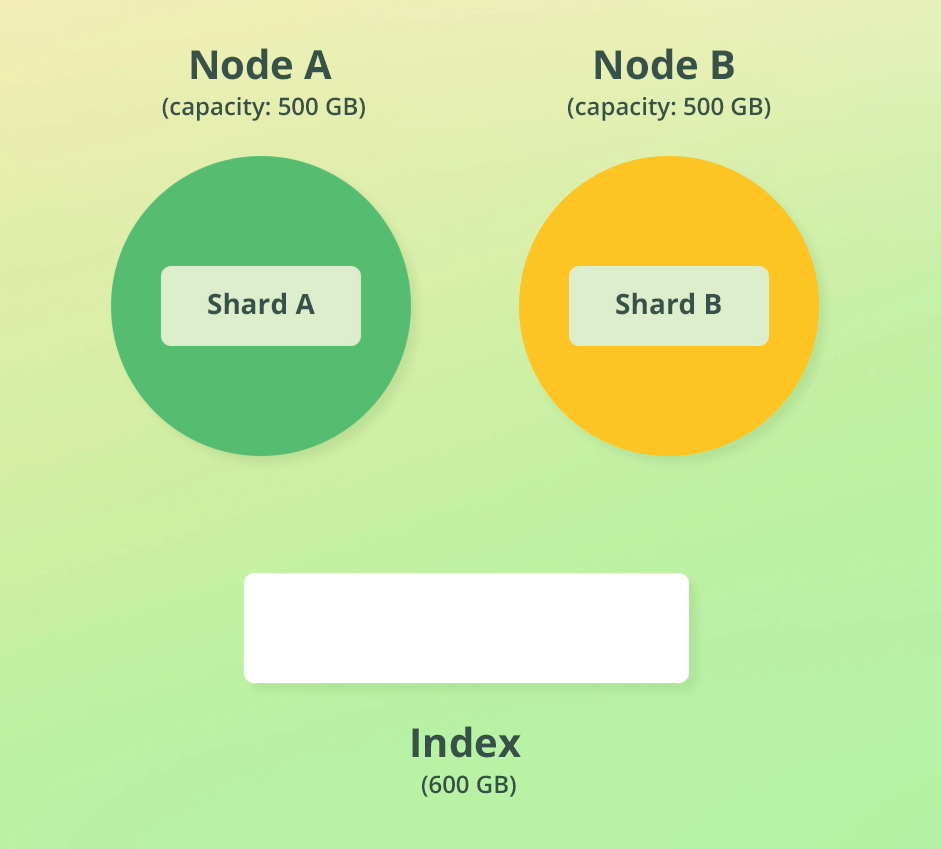

# Elastic Search Guide

This are my notes on **ElasticSearch** and **search methods** with focus on Machine Learning.

I created most of the content in this `README.md` after following the course [Complete Guide to Elasticsearch (Udemy), by Bo Andersen](https://www.udemy.com/course/elasticsearch-complete-guide), but extended it mainly consulting the official Elastic documentation and other sources that deal with data structures for search operations. The course by Bo Andersen has a Github repository with a summary of all the commands used: [codingexplained/complete-guide-to-elasticsearch](https://github.com/codingexplained/complete-guide-to-elasticsearch).

My respository is structured as follows:

- [`README.md`](./README.md): main guide.
- [`notebooks/`](./notebooks/) contains notebooks with Python code about different related topics:
  - ElasticSearch usage with Python
  - Data structures used for search operations
    - Inverted indices
    - Doc Values
    - KD-Trees
    - etc.
  - ...
- [`notebooks/products-bulk.json`](./notebooks/products-bulk.json): dummy data which contains 1000 products with their properties, used in the guide/course.

Mikel Sagardia, 2024.  
No guarantees.

Table of contents:

- [Elastic Search Guide](#elastic-search-guide)
  - [Introduction](#introduction)
    - [Elastic Stack](#elastic-stack)
    - [Common Application Architecture](#common-application-architecture)
  - [Getting Started: Setting Up Elastic Search and Kibana](#getting-started-setting-up-elastic-search-and-kibana)
    - [Setup](#setup)
      - [Elastic Cloud](#elastic-cloud)
      - [Windows](#windows)
      - [Unix: Mac OSX, Linux](#unix-mac-osx-linux)
      - [Docker](#docker)
      - [Summary: How to Start Elastic Search](#summary-how-to-start-elastic-search)
    - [Basic Architecture: Cluster, Nodes, Documents, Indices](#basic-architecture-cluster-nodes-documents-indices)
    - [Inspecting a Cluster with the Console](#inspecting-a-cluster-with-the-console)
    - [Interacting with the Cluster via cURL and Python](#interacting-with-the-cluster-via-curl-and-python)
    - [Building an Index](#building-an-index)
      - [Inverted Index](#inverted-index)
      - [B-Tree](#b-tree)
      - [BKD Tree, Block KD-tree](#bkd-tree-block-kd-tree)
      - [Doc Values](#doc-values)
    - [Sharding and Scalability](#sharding-and-scalability)
    - [Replication and Snapshots](#replication-and-snapshots)
      - [Creating Indices](#creating-indices)
    - [Adding Nodes to the Cluster](#adding-nodes-to-the-cluster)
    - [Node Roles](#node-roles)
  - [Managing Documents](#managing-documents)
    - [Creating and Deleting Indices](#creating-and-deleting-indices)
    - [Indexing and Deleting Documents](#indexing-and-deleting-documents)
    - [Retrieving Documents by ID](#retrieving-documents-by-id)
    - [Updating Documents](#updating-documents)
    - [Scripted Updates](#scripted-updates)
    - [Upserts](#upserts)
    - [Routing Documents to Shards](#routing-documents-to-shards)
    - [How Elasticsearch Reads and Writes Document Data](#how-elasticsearch-reads-and-writes-document-data)
    - [Document Versioning and Optimistic Concurrency Control](#document-versioning-and-optimistic-concurrency-control)
    - [Update and Delete by Query](#update-and-delete-by-query)
    - [Batch or Bulk Processing](#batch-or-bulk-processing)
      - [Bulk/Batch Processing with cURL](#bulkbatch-processing-with-curl)
  - [Mapping \& Analysis](#mapping--analysis)
    - [Introduction to Analysis](#introduction-to-analysis)
    - [Using the Analysis API](#using-the-analysis-api)
    - [Understanding Inverted Indices](#understanding-inverted-indices)
    - [Introduction to Mapping](#introduction-to-mapping)
    - [Data Types](#data-types)
    - [Type Coercion](#type-coercion)
    - [Arrays](#arrays)
    - [Adding Explicit Mappings and Retrieving](#adding-explicit-mappings-and-retrieving)
      - [Dot Notation](#dot-notation)
      - [Retrieving Mappings](#retrieving-mappings)
    - [Extending Mappings to Existing Indices: Adding New Fields](#extending-mappings-to-existing-indices-adding-new-fields)
    - [Date Type](#date-type)
    - [Missing Fields](#missing-fields)
    - [Overview of Mapping Parameters](#overview-of-mapping-parameters)
    - [Updating Existing Mappings: Reindexing](#updating-existing-mappings-reindexing)
    - [Field Aliases](#field-aliases)
    - [Multi-Field Mappings](#multi-field-mappings)
    - [Index Templates](#index-templates)
    - [Dynamic Mapping](#dynamic-mapping)
  - [Searching for Data](#searching-for-data)
  - [Joining Queries](#joining-queries)
  - [Controlling Query Results](#controlling-query-results)
  - [Aggregations](#aggregations)
  - [Improving Search Results](#improving-search-results)
  - [Kibana](#kibana)
  - [Logstash](#logstash)
  - [License](#license)


## Introduction

[Elastic Search](https://www.elastic.co/) is an open source analytics and full-text search engine.

We can add complex search functionalities to our applications (e.g., Wiki, e-commerce, etc.), similar to Google, with:

- autocompletion
- highlighting
- typo correction
- handling synonyms
- adjusting relevance
- etc.

We can also query structured data and we can use the platform as an analytics tool (with visualization).

Common example: APM (Application Performance Management) = store logs, be able to search in them, visualize in dashboard, etc.

We can apply ML techniques to get insights from data: forecasts, anomaly detection, etc.

In ES data is stored in **Documents**, represented as `JSON` objects:

- A Document is analog to a **row** in a relational DB.
- A Document contains **Fields**, analog to columns in a relational DB.

We perform queries via a REST API, also with `JSONs`.

Some other properties:

- ES is written in Java, on top of Apache Lucene.
- Easy to use, but has many features.
- Distributed.
- Highly scalable.
- Used by many large companies: FB, Netflix, etc.
- Queries can be done using Query DSL

### Elastic Stack

Elastic has built several products which can interact with each other:

- Elastic Search (ES): search.
- **Kibana**: analytics and visualization; dashboard for Elastic Search, ML. [Kibana Demo](https://demo.elastic.co/app/dashboards#/view/welcome_dashboard).
- Logstash: processing of logs and any data; events from different sources (there are many input/output plugins) are processed (e.g., clean, structure, etc.) and sent to Elastic Search or other destinations.
- X-Pack: additional features for ES and Kibana, such as 
  - security and access management, 
  - monitoring of resources (CPU, memory, etc.), 
  - **machine learning** (anomaly detection, forecasting, etc.)
  - graph structures
  - SQL capabilities, besides Query DSL
- Beats - Filebeats, Metricbeats, etc.: lightweight agents which collect and send data to ES. Filebeats collects logs. They are for data ingestion.


### Common Application Architecture

Let's consider an e-commerce site, where users can buy things via a web store/page. We have these components:

- The web frontend.
- The application backend.
- A relational DB where all the products are stored.

If we want to add realtime search capabilities to the web page so that users can find things easily, we need to add **Elastic Search**.

The best approach is to **replicate** all the data entries in the DB into ES; we can do that 

- initially with a script
- and then, we let the backend update ES when the DB is updated, too.

Then, we might connect **Kibana** to ES in order to visualize data in a dashboard: number of orders per week, revenue, etc.


As our web grows, we might have increeased traffic and the servers might be suffering; that's when we add **Metricbeat**, which monitors performance and resources on the backend machine and sends them to ES. Basically, ES opens an ingest node where Metricbeat sends data. We can visualize all that in Kibana, too.

Similarly, we can monitor access and error logs. We do that with **Filebeat**, similar to Metricbeat.

As the web grows we might need some data processing before ingestion to ES. One option would be to implement that processing in the backend, but it has several drawbacks: 

- the backend should run the web, not loose resources processing logs, 
- if we have a decentrilized architecture (i.e., microservices), the logging is also decentralized, and we might want to have a centralized and homogeneous processing.

Thus, it makes sense to add **Logstash** to the architecture, which enables log/data processing before ingestion to ES. Although the data from Metricbeat often times doesn't need to be processed, the data from Filebeat could need to be processed, so it is first sent to Logstash, which transforms it and sends it to ES. However, we always have the felxibility to send the data to ES first, without any processing.


<!--
Our database and ES should be synchronized. However, ideally, our application should have read permissions in ES. How is that possible?
-->

## Getting Started: Setting Up Elastic Search and Kibana

### Setup

There are many options to install Elastic Search and Kibana:

- Install on local machine: Windows, Mac OS, Linux
- Install as Docker image
- Use Elastic Cloud
- ...

Usually, we want to have an ES cluster on the cloud for scalability; it can be a self-managed ES cluster, not necessarily the Elastic Cloud solution.

#### Elastic Cloud

Elastic Cloud has everything set up and running for us: [https://cloud.elastic.co](https://cloud.elastic.co). There's a free trial for 14 days since the moment we create the cluster; after the 14 days the cluster is shut down.

This is a hosted and managed solution, the easiest one to learn how to use ES.

We can leave everything with the default options:

- If we are asked, we choose a pre-configured Elastic Stack solution.
- Additionally, we can select where to store our data! (platform &mdash; AWS, GCP, Azure &mdash;, and location &mdash; Europe, US, etc. &mdash;).
- If shown, we copy the credentials: `user:elastic`, `pw:...`
- In the new version some other variables are shown: `Elasticsearch endpoint`, `Cloud ID`.
- I copied everything to the non-committed/pushed file `elastic_cloud.txt`.

#### Windows

Full, official guide: [Install Elasticsearch with .zip on Windows](https://www.elastic.co/guide/en/elasticsearch/reference/current/zip-windows.html).

ES and Kibana can be downloaded from 

- [https://www.elastic.co/downloads/elasticsearch](https://www.elastic.co/downloads/elasticsearch)
- [https://www.elastic.co/downloads/kibana](https://www.elastic.co/downloads/kibana)

ES is programmed in Java and Kibana uses npm. However, we don't need to install those dependencies, since they are provided in the archive folder which is contained in the downloaded application. In other words, they are run directly from the uncompressed archive which is downloaded.

To set them up:

- Download the archives of Elastic Search and Kibana.
- Unzip both archives (maybe we need WinRAR/7zip or a similar, because Kibana has a very large archive...).
- Go to the extracted directory and start `elasticsearch`.

```powershell
# Elastic Search: go to extracted directory and run binary
cd C:\Users\msagardia\packages\elasticsearch-8.14.3
bin\elasticsearch.bat
# Unix: bin/elasticsearch
```

:warning: **IMPORTANT**: save the ZIP archive, since we need to extract it every time we want a new node!

When we run `bin\elasticsearch.bat` for the first time a **cluster is created** and its configuration is performed in some minutes. Some values are created are delivered:

- A **superuser** and its password, we copy and save them, e.g., in `.env`
  - User: `elastic`, PW: `...`
  - These are our credentials; we can create other users with restricted pws later one
  - To reset the superuser pw: `bin/elasticsearch-reset-password -u elastic`
- A fingerprint certificate; data is transmitted encrypted.
  - We copy it to `.env`: `ELASTIC_FINGERPRINT`.
- An enrollment token: necessary for secure communications with ES from other nodes, e.g., Kibana.
  - We copy the token to `.env`: `ELASTIC_ENROLLMENT_TOKEN`.
  - We use it to enroll Kibana.
  - The token is valid for 30 mins, but we can create new ones: `bin/elasticsearch-create-enrollment-token.bat -s kibana`
  - We can use this enrollment token to add other nodes, too

When the ES cluster is up and running, we launch Kibana:

```powershell
# Kibana: go to extracted directory and run binary
cd C:\Users\msagardia\packages\kibana-8.14.3
bin\kibana.bat
# Unix: bin/kibana
```

After a short moment, Kibaba is ready at port `5601`:

- We open the URL in the Terminal, which has a security code: `http://localhost:5601/?code=xxxxxx`.
- We are requested for the enrollment token, `ELASTIC_ENROLLMENT_TOKEN`, which we paste.

Now everything is setup. We can log in into Kibana, which is like the GUI for ES. We can user the superuser credentials.

To shut down, we need to `Ctrl+C` both Terminals. To start again, we need to run `bin\elasticsearch.bat` and `bin\kibana.bat` in separate terminals again.

**IMPORTANT: However, we might need to add the following line to the file `.../kibana-8.14.3/config/kibana.yaml`**:

```
elasticsearch.hosts: ["https://localhost:9200"]
```


#### Unix: Mac OSX, Linux

Full, official guide: [Install Elasticsearch from archive on Linux or MacOS](https://www.elastic.co/guide/en/elasticsearch/reference/current/targz.html).

Very similar setup as with Windows: download, uncompress, run scripts, copy credentials, etc.

In the case of MacOS, we need to deactivate the Gatekeeper to be able to run Kibana. So before running `bin/kibana`:

```bash
cd .../path/where/kibana/directory/is
xattr -d -r com.apple.quarantine kibana-8.14.3

# Then, we start Kibana
cd kibana-8.14.3
bin/kibana
```

#### Docker

Full, official guide: [Install Elasticsearch with Docker](https://www.elastic.co/guide/en/elasticsearch/reference/current/docker.html).

#### Summary: How to Start Elastic Search

```powershell
## -- Terminal 1
# Elastic Search: go to extracted directory and run binary
cd C:\Users\msagardia\packages\elasticsearch-8.14.3
bin\elasticsearch.bat
# Unix: bin/elasticsearch
# Wait until cluster up & running: "... current.health="GREEN"..."
# If provided, copy to .env
# - ELASTIC_USER
# - ELASIC_PASSWORD
# - ELASTIC_FINGERPRINT
# - ELASTIC_ENROLLMENT_TOKEN
# To get new ELASTIC_ENROLLMENT_TOKEN
# bin/elasticsearch-create-enrollment-token.bat -s kibana
# Also, after first time, add to .../kibana-8.14.3/config/kibana.yaml:
# elasticsearch.hosts: ["https://localhost:9200"]

## -- Terminal 2
# Kibana: go to extracted directory and run binary
cd C:\Users\msagardia\packages\kibana-8.14.3
bin\kibana.bat
# Unix: bin/kibana
# Kibana Web UI: http://localhost:5601
# NOTE: It takes some minutes until Kibana is available...
# Use ELASTIC_USER & ELASIC_PASSWORD as credentials

## -- Browser
# Kibana Web UI: http://localhost:5601
# Elastic Search API: https://localhost:9200
```

Troublesooting: If we get an error, make sure that `.../kibana-8.14.3/config/kibana.yaml` contains the line

```
elasticsearch.hosts: ["https://localhost:9200"]
```

And, additionally, check:

```powershell
# Set variables in Powershell for easier and more secure use.
# To use them: $Env:ELASTIC_USER
$Env:ELASTIC_USER = "elastic"
$Env:ELASTIC_PASSWORD = "..."
# Bash. To use them: $ELASTIC_USER
export ELASTIC_USER="elastic"
export ELASTIC_PASSWORD="..."

# Example: Basic query to get general cluster info
cd C:\Users\msagardia\packages\elasticsearch-8.14.3
curl.exe --cacert config\certs\http_ca.crt -u "$($Env:ELASTIC_USER):$($Env:ELASTIC_PASSWORD)" --insecure -X GET https://localhost:9200 --noproxy localhost

```

### Basic Architecture: Cluster, Nodes, Documents, Indices

Elastic Search is distirbuted and it consists of **nodes** within a **cluster**:

- When we start an ES instance, it is really a **node** which can contain some TBs of data.
- If our data grows, we can start another instance = another node.
- In developement, we can start several nodes on our device without the need of dealing with VMs or containers; in production, different nodes are usually assigned to different VMs or containers.
- Each/all node/s belong to a **cluster**. Usually we have one cluster for application. Clusters are completely independent from each other.
- When a node starts up:
  - it joins an existing cluster
  - or it starts a cluster and joins to it.
  - Therefore, even a setup with a single node is nested in a cluster.


Each data in our nodes is a **Document**, which:

- can be represented as a `JSON`,
- is equivalent to a row in a relational DB,
- consists of the **Fields** we want, which are equivalent to columns in a relational DB.

In addition to our fields, we also store some other metadata in the Document `JSONs`.


Documents are stored in **Indices**:

- Indices are logical groups of Documents, e.g., *People Index*, *Departments Index*.
- There are no limits in terms of how many Documents go into an Index.
- We run our search queries against Indices.


### Inspecting a Cluster with the Console


When we have started both `elasticsearch` and `kibana`, we open the web UI under the URL:

[`http://localhost:5601/`](http://localhost:5601/)

Then, we can start the **Console** in the web UI:

    Hamburger Menu > Management > Dev Tools

We can use the console to communicate with ES:

- The console uses the REST API under the hood.
- The console is the easiest way to communicate with ES: it has autocompletion.
- However, we often will use the REST API via cURL or related services.

The console takes HTTP methods:

1. **GET:** Retrieve data from Elasticsearch, such as documents or index information.
2. **POST:** Send data to Elasticsearch, typically used for creating or updating documents.
3. **PUT:** Create or replace documents or indices.
4. **DELETE:** Remove documents or indices.
5. **HEAD:** Retrieve metadata without the body.
6. **PATCH:** Apply partial updates to documents.

The query structure is

    HTTP Method + API & Command & Query
    JSON (optional parameters, if required)

For instance:

```bash
# Get cluster health: _cluster API, health Command
GET /_cluster/health
```

When we run that command (play button), we get back a `JSON`:

```json
{
  "cluster_name": "elasticsearch",
  "status": "green",
  "timed_out": false,
  "number_of_nodes": 1,
  "number_of_data_nodes": 1,
  "active_primary_shards": 31,
  "active_shards": 31,
  "relocating_shards": 0,
  "initializing_shards": 0,
  "unassigned_shards": 0,
  "delayed_unassigned_shards": 0,
  "number_of_pending_tasks": 0,
  "number_of_in_flight_fetch": 0,
  "task_max_waiting_in_queue_millis": 0,
  "active_shards_percent_as_number": 100
}
```

Further examples:

```bash
# List all nodes: _cat API (Compact Aligned Text), nodes Command, v Query (verbose)
# In our case we see a single node and its IP + properties
GET /_cat/nodes?v

# List indices
# We only have system indices, leading with a .
GET /_cat/indices?v
```


### Interacting with the Cluster via cURL and Python

We can interact with ES using its REST API, e.g., via `cURL`. We need to:

- use a certificate located in the elastic package (although that can be bypassed with the flag `--insecure`),
- use HTTPS, not HTTP,
- use our user and PW credentials.

```powershell
# General structure
cd /path/to/elasticsearch
curl --cacert config/certs/http_ca.crt -u elastic:<YOUR_PASSWORD_HERE> [--insecure] -X <HTTP_METHOD> [-H ...] [-d ...] <URL+API+Command+Query>
# NOTE: Sometimes the certificate doesn't work,
# so we can add the flag --insecure.
# This bypasses the SSL certificate verification.
# That should not be done in production!
# The option -H is a header, often used with -d
# and -d is the data we send.
# Example (Windows needs to escape "):
# ... -H "Content-Type: application/json" -d '{"name":"John", "age":30}'
# ... -H "Content-Type: application/json" -d '{\"name\":\"John\", \"age\":30}'

# Set variables in Powershell for easier and more secure use.
# To use them: $Env:ELASTIC_USER
$Env:ELASTIC_USER = "elastic"
$Env:ELASTIC_PASSWORD = "..."
# Bash. To use them: $ELASTIC_USER
export ELASTIC_USER="elastic"
export ELASTIC_PASSWORD="..."

# Example: Basic query to get general cluster info
cd C:\Users\msagardia\packages\elasticsearch-8.14.3
curl.exe --cacert config\certs\http_ca.crt -u "$($Env:ELASTIC_USER):$($Env:ELASTIC_PASSWORD)" --insecure -X GET https://localhost:9200 --noproxy localhost

# Example: Get the index products (not created yet)
curl.exe --cacert config\certs\http_ca.crt -u "$($Env:ELASTIC_USER):$($Env:ELASTIC_PASSWORD)" --insecure -X GET -H "Content-Type: application/json" -d '{ \"query\": { \"match_all\": {} } }' https://localhost:9200/products/_search --noproxy localhost
# Bash: -d '{ "query": { "match_all": {} } }'

# Example: GET /_cat/nodes?v -> get all nodes
curl.exe --cacert config\certs\http_ca.crt -u "$($Env:ELASTIC_USER):$($Env:ELASTIC_PASSWORD)" --insecure -X GET "https://localhost:9200/_cat/nodes?v" --noproxy localhost

# Example: GET /_cat/indices?v -> list all indices
curl.exe --cacert config\certs\http_ca.crt -u "$($Env:ELASTIC_USER):$($Env:ELASTIC_PASSWORD)" --insecure -X GET "https://localhost:9200/_cat/indices?v" --noproxy localhost
```

See also [Bulk/Batch Processing with cURL](#bulkbatch-processing-with-curl).

Besides using `cURL`, we can also connect to Elastic Search using Python. The notebook [`notebooks/elastic_intro.ipynb`](./notebooks/elastic_intro.ipynb) shows how to do that via `requests` and the package `elasticsearch`:

```python
import os
import requests
from requests.auth import HTTPBasicAuth
from dotenv import load_dotenv
load_dotenv()

elastic_user = os.getenv("ELASTIC_USER")
elastic_password = os.getenv("ELASIC_PASSWORD")

### -- requests

# Define the URL
url = "https://localhost:9200/_cat/nodes?v"

# Make the GET request
response = requests.get(
    url,
    auth=HTTPBasicAuth(elastic_user, elastic_password),
    #verify=False,  # Disable SSL verification
    verify="C:\\Users\\msagardia\\packages\\elasticsearch-8.14.3\\config\\certs\\http_ca.crt",
    proxies={"http": None, "https": None}  # Bypass proxy
)

# Print the response
print(response.text)

# Define the URL
url = "https://localhost:9200/_cat/indices?v"

# Make the GET request
response = requests.get(
    url,
    auth=HTTPBasicAuth(elastic_user, elastic_password),
    #verify=False,  # Disable SSL verification
    verify="C:\\Users\\msagardia\\packages\\elasticsearch-8.14.3\\config\\certs\\http_ca.crt",
    proxies={"http": None, "https": None}  # Bypass proxy
)

# Print the response
print(response.text)

### -- elasticsearch

import warnings
from urllib3.exceptions import InsecureRequestWarning
from elasticsearch import Elasticsearch

# Suppress only the specific InsecureRequestWarning
warnings.simplefilter('ignore', InsecureRequestWarning)

# Create an instance of the Elasticsearch client
es = Elasticsearch(
    ['https://localhost:9200'],
    basic_auth=(elastic_user, elastic_password),
    verify_certs=False  # This disables SSL verification, similar to --insecure
)

# Make a GET request to /_cat/nodes?v
response = es.cat.nodes(format="json")

# Print the response
print(response)

# Make a GET request to /_cat/indices?v
response = es.cat.indices(format="json")

# Print the response
print(response)
```

### Building an Index

This is my understanding of how an index works. The key idea is that we'd like to be able to search very quickly our documents.

Let's imagine we want to build an index similar to the ones in Elastic Search. Our goal is fast search in our database.

On one side, we store our Documents, probably as files.

On the other side we build the following structures:

- An **inverted index** which maps terms with documents and frequencies.
- A **B-tree**, which allows fast search and filtering of given (often data/numeric) single-dimensional fields.
- A **BKD-tree**, a variant of the k-d tree (k-dimensional tree) optimized for indexing multi-dimensional data.
- **Doc Values** or fields in **Column Format**, which allow faster sorting and aggregation operations.

In the following, I explain my intuitions of each of them.

#### Inverted Index

An inverted index is a table which maps terms with document ids, positions and frequencies. A possible data structure for that would by a hash table (like a Python dictionary).

An inverted index can be built as follows:

- Each new document is processed by tokenizing (& stemming) its text.
- For each term/token an entry is created and maintained, which contains:
  - List of document ids where the term/token appears.
  - Positions in the document where the term/token appears: field, character position, etc.
  - TF-IDF frequencies to understand how relevant the term is.

TF-IDF, Term Frequency Inverse Document Frequency:

- TF: Measures how frequently a term (word) occurs in a document.

      TF(t,d) = num times term t appears in document d / total num terms in d

- IDF: Measures the importance of a term in the corpus.

      IDF(t,D) = log(total num documents in corpus D / num documents containing term t)

- TF-IDF: **Importance of a term in a document.**

      TFIDF(t,d,D) = TF(t,d) * IDF(t,D)

Probably, for each token = term t, a table of `TF(t,d)` is maintained, as well as the value `IDF(t,D)`. Then, the `TFIDF(t,d,D)` is updated, which is unique for each `(t,d)` pair.

When we start a text search, the query will be tokenized into the indexed terms and those terms are searched in the inverted index (hash table).

With that, we have a list of all the candidate documents. We can:

- get a set of documents common to all terms
- rank the set according to their importance thanks to the `TFIDF(t,d,D)`; the TFIDF is associated to each term-document, but we could compute an aggregate value for each query-document pair.

See [ml_search/search_examples.ipynb](./ml_search/search_examples.ipynb) for a simple implementation.


#### B-Tree

A B-tree is a self-balancing tree data structure that maintains sorted data and allows for efficient insertion, deletion, and search operations. It is commonly used in databases and file systems. Key features:

- Balanced Tree Structure: Ensures that the tree remains balanced by maintaining a certain number of keys in each node. The balancing is automatic.
- Multiple Children: Each node can have multiple children (more than two), which makes the tree shallower and operations faster.
- Efficient Search: By dividing keys among nodes, B-trees allow for `log(n)` search time.
- Disk Storage Friendly: Minimizes disk reads by maximizing the number of keys stored in each node, suitable for systems that read and write large blocks of data.
- Scalability: Handles large amounts of data efficiently.

Operations:

- Search: Similar to binary search but generalized to multiple children.
- Insertion: Adds elements in sorted order, splitting nodes as necessary.
- Deletion: Removes elements while maintaining tree balance, merging nodes if needed.

B-trees are often applied to numerical fields; for instance, let's consider these documents:

```python
[
  { "id": 1, "name": "Product A", "price": 10, "date": "2023-01-01" },
  { "id": 2, "name": "Product B", "price": 20, "date": "2023-01-05" },
  { "id": 3, "name": "Product C", "price": 15, "date": "2023-02-01" },
  { "id": 4, "name": "Product D", "price": 25, "date": "2023-02-03" },
  { "id": 5, "name": "Product E", "price": 30, "date": "2023-02-05" }
]
```

When documents are indexed, the price and date fields are stored using B-trees. This ensures that these fields are efficiently organized for range queries and sorting.

The creation process could be the following:

- Initial Insertion: Start with the root node. Insert the first document's price as the root.
- Subsequent Insertions: Add each document's price in sorted order. If the current node has space (according to B-tree properties, which vary by B-tree degree), insert the new value. Otherwise, split the node and promote the middle value.
- Balancing: Ensure the tree remains balanced. Splitting nodes and promoting middle values help maintain the B-tree properties, ensuring that no node has too many or too few children.

In the previous list of Documents:

    Insert Document 1:
        Root: 10

    Insert Document 2:
        Root: 10
        Child: 20

    Insert Document 3:
        Root: 10
        Children: 15, 20

    Insert Document 4:
        Root: 15
        Children: 10, 20, 25

    Insert Document 5:
        Root: 15
        Children: 10, 20, 25, 30

```
       15
      / | \
    10 20  25
            \
            30
```

See [ml_search/search_examples.ipynb](./ml_search/search_examples.ipynb) for a simple implementation.

#### BKD Tree, Block KD-tree

A BKD tree (Block KD-tree) is a variant of the k-d tree (k-dimensional tree) optimized for indexing multi-dimensional data. It is particularly used in systems like Elasticsearch and Apache Lucene for efficient range searches and nearest neighbor queries in high-dimensional spaces.

Key Characteristics:

- Multi-Dimensional Indexing: Designed to handle multi-dimensional data, making it suitable for spatial and temporal indexing. The B-tree is primarily for single-dimensional data.
- Block-Based: Organizes data into blocks, improving performance for large datasets by reducing the number of I/O operations.
- Efficient Range Queries: Optimized for range queries across multiple dimensions.
- Space-Partitioning: Partitions the space into hyper-rectangles, recursively subdividing it into smaller regions.

Use Cases:

- Geospatial Data: Indexing and querying geographical locations.
- Time-Series Data: Managing data points that have multiple attributes, such as timestamp, location, and other dimensions.
- Full-Text Search: Used in search engines like Elasticsearch for indexing and querying multi-dimensional data such as text, numerical data, and more.

See [ml_search/search_examples.ipynb](./ml_search/search_examples.ipynb) for a simple implementation of a KD-tree and comparison to brute-force nearest vector search with numpy.

#### Doc Values

Doc Values are columnar data of numerical fields. Columnar data is stored as an array, i.e., the values are contiguous in memory. That enables much faster operations in the entire field/column, such as sorting or aggregation operations, like average computation.

I would implement the Doc Value structures with:

- An array which contains the document ids, i.e., an index.
- An array which contains the values in a column/fields, ordered according to the id index.
- A bitstring (an array of bits) used to mask whether to consider the array values or not.

Then, if we want to compute the min/max, mean or similar values of a field/column:

- We take the associated column/field array
- Update the bitstring according to the previous search results (e.g., B-trees & inverted indices).
- Run the column/field-wise operation with the masked array.

See [ml_search/search_examples.ipynb](./ml_search/search_examples.ipynb) for a simple implementation.

### Sharding and Scalability

If our node is full, we can create a new one which will increase the storage capacity of the cluster. In the process, **Sharding** is used:

- Shrading is a way to divide indices into smaller pieces.
- Each piece is referred to as shard.
- Sharding is done at the index level.
- Main purpose: horizontally scale data volume.
- Each shard is independent and a almost a fully functional index on its own.
- Each shard is an Apache Lucene index.
- Each shard can be as big as possible in terms of storage, but it can contain 2 billion documents.
- When we apply sharding, each query is parallelized, i.e., each node and shard run the query.
- We can have primary and replica shard:
  - Primary Shards: These are the main shards that contain the original data.
  - Replica Shards: These are copies of the primary shards and provide failover capabilities, ensuring high availability.

For instance, if we have an index of 600 GB and 2 nodes of 500 GB each, we can divide the index in 2 shards, A and B. Then, each shard goes to a node.



The column `pri` when we run `GET request to /_cat/indices?v` is the number of primary shards.

An index contains a single shard by default. If we need to create a new shard, we can use the split API. Similarly, we can recue the number of shards with a shrink API. The number of shards we should use depends on

- the number of indices
- the number of nodes and their capacity
- the number of queries
- ...

Note: when we create an index, we define a number of primar shards and keep it fixed; i.e., we cannot change that number. The reason is that we use that number for routing. Routing consists in deciding which shard to pick to find a Document.

Good rule of thumb: if we're going to have millions of documents, use a couple of shards. That number 5 was the default in the older versions.

### Replication and Snapshots

Sometimes node fail; a way to enable fault-tolerance is to replicate shards. Elastic Search replicates shards by default: shards are copied, creating replica shards:

-  When creating an index we can choose how many replicas we'd like (default is 1 replica, i.e, we have 2 shards: primary + replica).
- A replica shard should be always in a different node as the primary shard, i.e., the shard it was copied from, because otherwise we are not fault-tolerant. Thus, replication makes sense in terms of robustness when we have a cluster with at least 2 nodes.
  - In a cluster with a single node, the default replica will be unassigned and the index will be in yellow status.
- A replica shard can be used instead of the primary shard for all the operations.
- For critical operations, we replicate at least 2x, i.e., we'l nned at least 3 nodes.

Replication not only ensure fault-tolerance, but it can also ease the use of parallel queries: we run the same query in two index (shard) copies.; thus, the throughput increases. We can apply that also by having replica shards in the same node, i.e., the same copies in the same node. That is called a **replication group**. In those cases, multi-threding is used.


In addition to replication, Elastic Search also allows to take snapshots and backups:

- Snapshots can be used to restore to a given point.
- Snapshots can be taken at index level or for the entire cluster.
- Snapshots are state dumps to a file; those files can be used to restore the cluster, if something goes wrong.

#### Creating Indices

- When we create an index, a replica is automaticaly generated
- However, if we have a single node, that replica is unassigned, so the index is in "yellow" state, not "green" state.
- The system indices (those with leading . in their name) are auto-replicated when we create new nodes; i.e., with one node, they have no replicas.

Here's some commands to create an index and inspect it:

```bash
# Create Index pages
PUT /pages

# Get list of all indices
# pages should appear, but in "yellow" status, 
# because its shard replica is not assigned to another node
GET /_cat/indices?v

# Get list of all shards
# pages shoudl appear 2x, but the replica shard should be UNASSIGNED
GET /_cat/shards?v
```


### Adding Nodes to the Cluster

Sharding for fault-tolerance and replication for increasing throughput can be done if we have at least 2 nodes. In managed cloud solutions, nodes are added automatically. However, in local deployments, we need to create nodes manually.

If we are running Elastic Search in a development environment, we can set new nodes as follows:

- Download and extract again the elasticsearch archive in the `.../packages` directory. Name that new folder `elastic-second-node`. It should be at the same level as `elasticsearch-8.14.3/`, which is the first node. Do not copy the folder `elasticsearch-8.14.3/`, but extract a new folder frmo the original archive!
- Open `.../packages/elastic-second-node/config/elasticsearch.yaml` and uncomment/modify the line `node.name = elastic-second-node`
- Create an enrollment token for the second node.
  ```powershell
  cd .../packages/elasticsearch-8.14.3
  bin\elasticsearch-create-enrollment-token.bat --scope node
  # we take/copy the ENROLLMENT_TOKEN
  ```
- Go to `.../packages/elastic-second-node` and start a second `elasticsearch` with the enrollment token:
  ```powershell
  cd .../packages/elastic-second-node
  bin\elasticsearch --enrollment-token <ENROLLMENT_TOKEN>
  ```
- Go to Kibana/Web UI and check the cluster: now, we should have 2 nodes.
- We can kill a node simple with `Ctrl+C` in the Terminal where it is running. When that occurs, the clusters performs some house-keeping: [Delaying allocation when a node leaves](https://www.elastic.co/guide/en/elasticsearch/reference/current/delayed-allocation.html).

:warning: **IMPORTANT**: 

- This approach is only for development environments; in production, we need to perform further configurations.
- **I have not achieved to perform all these steps on a Windows machine:** I was getting a certificate error when running `bin\elasticsearch-create-enrollment-token.bat --scope node`.

I we don't add further nodes, we can continue, but the cluster and the shards/indices will be in "yellow" state, because they are not distributed across several nodes.

### Node Roles

Depending what they're used for, nodes can have different roles:

- Master: `node.master: true | false`. Resposible for performing cluster-wide operations, e.g., deleting indices, etc. For large projects, we should have dedicated master nodes.
- Data: `node.data: true | false`. Stores data and perform search queries.
- Ingest: `node.ingest: true | false`. Runs ingest pipelines, i.e., processing and adding a document to an index. Such a pipeline is like a simplified Logstash pipeline, where simple transformations are performed.
- Machine Learning:
  - `node.ingest: true | false`: to run ML jobs.
  - `xpack.ml.enabled: true | false`: enable/disable ML API for the node
- Coordination: Distribution of queries and aggregation of results; if a node has none of the previous nodes, it is a coordination node.
- Voting-only: `node.voting_only: true | false`. Rarely used; it votes which is the master node. It appears in very large projects.

We can see the roles when we run the command `GET /_cat/nodes?v`.

The field `node.role` in the response table contains the initial letters of each role assigned to each node.


## Managing Documents

### Creating and Deleting Indices

```
# Create an index
PUT /pages

# Delete an index
DELETE /pages

# Create an index with specific properties
PUT /products
{
  "settings": {
    "number_of_shards": 2
  }
}
```

### Indexing and Deleting Documents

Indexing a document means to create/add it into the index.

```
# Simple JSON Document indexed = created
# An _id is automatically assigned if not provided
# As we can see in the returned JSON
# Also, we see we have 2 shards
POST /products/_doc
{
  "name": "Coffee Maker",
  "price": 64,
  "in_stock": 10
}

# Here, we index a Document = we create one
# but we force it to be of id 100
# Note that the HTTP method is PUT, not POST!
# We can use the same code
# to replace entirely a Document
PUT /products/_doc/100
{
  "name": "Toaster",
  "price": 49,
  "in_stock": 4
}

# Delete the document with ID 100
DELETE /products/_doc/100

# Get all Documents in the index products
# The result is a JSON in which result['hits']['hits']
# contains a list of al Document JSONs
GET /products/_search
{
  "query": {
    "match_all": {}
  }
}

# Delete all the documents of an index
POST /products/_delete_by_query
{
  "query": {
    "match_all": {}
  }
}

# If the index was not created and we index
# a Document, the index will be created automatically
# and the Document added to it
PUT /products_test/_doc/1
{
  "price": 7.4
}
```

### Retrieving Documents by ID

```
# Retrieve Document by ID
GET /products/_doc/100
```

We get:

```json
{
  "_index": "products",
  "_id": "100",
  "_version": 1,
  "_seq_no": 1,
  "_primary_term": 1,
  "found": true,
  "_source": {
    "name": "Toaster",
    "price": 49,
    "in_stock": 4
  }
}
```

Notes:

- If the `id=100` would not exist, we'd get `"found":false`.
- The `JSON` has many metadata fields; the actual document is in `_source`.

### Updating Documents

In reality, Documents are **inmutable** in Elastic Search. Under the hood, when we update a Document, we replace it with a new one which contains teh modifications. 

```
# Update an existing field
# To update a Document, 
# we need to pass a JSON with an object "doc"
# The returned JSON contains "result": "updated"
POST /products/_update/100
{
  "doc": {
    "in_stock": 3
  }
}

# Add a new field: "tags": ["electronics"]
POST /products/_update/100
{
  "doc": {
    "tags": ["electronics"]
  }
}
```

If we want to completely replace a Document, though, we can explicitly use `PUT`, which is intended for creating documents (recall, there is no real updating in ES, but entirely replacing: remove + create):

```
PUT /products/_doc/100
{
  "name": "Toaster",
  "price": 79,
  "in_stock": 4
}
```

### Scripted Updates

We can write scripts in the `JSON` used to perform the update. The scripts go in a `script` object, which contains:

- a `source` field with the script
- a `params` field with the parameters used in the script

The Document entity is accessed by the variable `ctx`, short for context. This variable has several methods/data, e.g.:

- `ctx.op`: with this, we can modify the update operation nature, e.g.:
  - `noop`: no update done
  - `delete`: Document deleted
- `ctx._source`: this gives us access to the Document `JSON`

Additionally, we can add conditionals

```
# Go to Document with ID 100
# Decrease by one unit the field in_stock
POST /products/_update/100
{
  "script": {
    "source": "ctx._source.in_stock--"
  }
}

# Go to Document with ID 100
# Assign the value 10 to the field in_stock
POST /products/_update/100
{
  "script": {
    "source": "ctx._source.in_stock = 10"
  }
}

# Go to Document with ID 100
# Modify field in_stock with the values in params
POST /products/_update/100
{
  "script": {
    "source": "ctx._source.in_stock -= params.quantity",
    "params": {
      "quantity": 4
    }
  }
}

# Go to Document with ID 100
# If in_stock == 0, perform no operation
# Else, decrease in_stock in one unit
POST /products/_update/100
{
  "script": {
    "source": """
      if (ctx._source.in_stock == 0) {
        ctx.op = 'noop';
      }
      
      ctx._source.in_stock--;
    """
  }
}

POST /products/_update/100
{
  "script": {
    "source": """
      if (ctx._source.in_stock > 0) {
        ctx._source.in_stock--;
      }
    """
  }
}

# Go to Document with ID 100
# If in_stock < 0, delete the Document (product)
# Else, decrease in_stock in one unit
POST /products/_update/100
{
  "script": {
    "source": """
      if (ctx._source.in_stock < 0) {
        ctx.op = 'delete';
      }
      
      ctx._source.in_stock--;
    """
  }
}
```

### Upserts

*Upserting* means:

- If the Document exists, it is updated.
- Else, a new Document is created.

```
# Upsert: Update or Insert/Create
# If the product 101 doesn't exist, this creates it
# Else, it increases in_stock in one unit
POST /products/_update/101
{
  "script": {
    "source": "ctx._source.in_stock++"
  },
  "upsert": {
    "name": "Blender",
    "price": 399,
    "in_stock": 5
  }
}
```

### Routing Documents to Shards

In general we'll have

- several nodes,
- several indices,
- and several shards per index, distributed acorss the nodes

Howe does ElasticSearch know where (in which shard) to find the Documents we query?

That is accomplished thanks to **Routing**. A default Routing strategy is fixed as `_routing` (hidden metadata in a Document) and it is used to obtain the Shard number of a Document given its ID by the formula:

    shard_num = hash(_routing) & num_primary_shards

Routing

- enables automatically finding the shard number of a document
- and uniformly distributes Documents in the index shards

**But** it forces to create the shards of an index in the beginning and freeze them, otherwise the formula doesn't work. I we want to add a new shard later on, we need to create a new index and re-index all the Documents to it.

It is possible to chage the default Routing strategy, too.


### How Elasticsearch Reads and Writes Document Data

In general, shards are organized in **Replica Groups**: several copies of a primary shard grouped together. Thus, Routing selectes the Replica Group rather than the shard, if we have properly set the Replica Groups.

Then, if the request/query is **Read**-only operation, **Adaptive Replica Selection (ARS)** is performed, to pick among the shards in the Replica Group &mdash; however, note that the replica shards are fully functioning copies, so ARS is for load balancing purposes only. The selection is done with the goal of achieving the best performance.

When the request/query involves **writing**, the operation is directed to the *primary shard* of the Replica Group:

- The primary shards validates the request and field values.
- Then, the operation is forwarded in parallel the replicas.


Many things can go wrong in forwarding operations and synchronization of states in distributed systems, e.g., due to network delays or when a node fails. To ensure that all replica shards are consistent, ES uses **Primary Terms** and **Sequence Numbers**:

- **Primary Term** (`_primary_term`) is the number of times a primary shard has been updated; this value is sent along with the forwarded operations. That way, errors can be detected.
- **Sequence Numbers** (`_seq_no`) are operation counters: each operation has an increasing counter which is forwarded to the replicas. That way, we know the order of the operations.

In addition, other sequence numbers are maintained within a Replica Group to speed up synchronization:

- Local checkpoint: sequence number of each shard related to the las operation.
- Global checkpoint: minimum sequene number among all replicas, i.e., last synchronization/alignment.

### Document Versioning and Optimistic Concurrency Control

By default, every time a Document is updated, `_version` increases a unit; however, only the last version of the Document is stored.

We can also use *external* versioning, i.e., the version number is stored outside, e.g., in a relational DB.

**However, it is not best practice to rely on `_version` anymore; instead, `_primary_term` and `_seq_no` should be used.**

In other words, `_primary_term` and `_seq_no` are used to specify the correct version of the Document and synchronize operations in the ES distributed system. This is called **Optimistic Concurrency Control** and it prevents unwanted de-synchronized operations that might occur when requests associated to the same Document and field happen in parallel.

Optimistic Concurrency Control is implemented by passing the reference `_primary_term` and `_seq_no` in the update request:

- First, we get the values of the Document to update and fetch the current values of `_primary_term` and `_seq_no`.
- Then we build an update query/request conditioning `_primary_term` and `_seq_no` to have the fetched reference values.

If we have a multi-threaded application where multiple threads could modify the same value of a Document, we should use this approach!

```
# Get Document with ID 100
# _primary_term and seq_no are in the metadata
# We take them to formulate the conditioned update request
GET /products/_doc/100

# Update Document/product with ID 100 
# if _primary_term == 1 and seq_no == 5 (reference values obtained in previous query)
# If _primary_term and seq_no don't match, we get an error
POST /products/_update/100?if_primary_term=1&if_seq_no=5
{
  "doc": {
    "in_stock": 123
  }
}
```

### Update and Delete by Query

We can perform operations similar to the SQL `UPDATE WHERE` with the API `_update_by_query`.
To that end

- we write a `script` with the update we'd like
- we add a `query` field which filters the Documents we'd like to update; if we want all, we use `"match_all"`.

Note that this kind of filtered update might lead to errors/conflicts; if one error occurs, the request is aborted by default, but we can specify to proceed upon conflicts, too.

```
# Update a set of filtered Documents: _update_by_query
# Write the update in "script"
# Write the filterin "query"
# Errors/conflicts can occur; by default the request is aborted
# but we can specify to proceed if we want
POST /products/_update_by_query
{
  "conflicts": "proceed",
  "script": {
    "source": "ctx._source.in_stock--"
  },
  "query": {
    "match_all": {}
  }
}
```

Similarly, we can `_delete_by_query`:

```
# Delete all Documents that match the query
# in this case ALL DOCUMENTS!
# If errors/conflicts occur, the request is aborted
# unless we specify "conflicts": "proceed"
POST /products/_delete_by_query
{
  "conflicts": "proceed",
  "query": {
    "match_all": { }
  }
}
```

### Batch or Bulk Processing

We can use the **Bulk API** (`_bulk`) to process multiple Documents in batch.

The syntax for that is `NDJSON`, a modified `JSON` specification:

```ndjson
<JSON with action + metadata>\n
<OPTIONAL: source or doc fields>\n
<JSON with action + metadata>\n
<OPTIONAL: source or doc fields>\n
...
```

For example, the following bulk request indexes 2 Documents:

```json
POST /_bulk
{ "index": { "_index": "products", "_id": 200 } }             # action + metadata
{ "name": "Espresso Machine", "price": 199, "in_stock": 5 }   # source
{ "create": { "_index": "products", "_id": 201 } }            # action + metadata
{ "name": "Milk Frother", "price": 149, "in_stock": 14 }      # source
```

The `_bulk` API with the `NDJSON` specification has these properties:

- We can choose from 4 **actions**: `index, create, update, delete`; these are specified as a key in a `JSON` object. Difference between `index` and `create`:
  - `index`: always runs, even if the Document exists.
  - `create`: it fails if the Document exists.
- All actions except `delete` require a second line with the source document, also a `JSON` action.
- We can feed many actions in a `JSON` file.
- Each line must end with a return (`\n`), even the last one, i.e., we need to have a blank line at the end.
- If a single action fails, the processing **is not** stopped, but it continues.
- If all actions are for the same index, we can specify it in the API commad: `/_bulk/products`.
- If we are using `cURL` or HTTP requests, the header `Content-Type` should be `Content-Type: application/x-ndjson`.
- It is much more efficient to use the `_bulk` API if we have many requests, because we significantly minimize the traffic (round-trips are avoided).
- To avoid concurrency issues, we can still use `if_primary_term` and `if_seq_no` in the action metadata.

More examples:

```
# Create new Documents
# We can list many (action, source) pairs
# Always newline after a line, also in last JSON
# Four actions: create, index, update, delete
# Each action needs a source (the Document fields), except delete
POST /_bulk
{ "index": { "_index": "products", "_id": 200 } }
{ "name": "Espresso Machine", "price": 199, "in_stock": 5 }
{ "create": { "_index": "products", "_id": 201 } }
{ "name": "Milk Frother", "price": 149, "in_stock": 14 }

# Update Documents + Delete
POST /_bulk
{ "update": { "_index": "products", "_id": 201 } }
{ "doc": { "price": 129 } }
{ "delete": { "_index": "products", "_id": 200 } }

# If all actions are for the same index,
# we can specify it in the API commad
POST /products/_bulk
{ "update": { "_id": 201 } }
{ "doc": { "price": 129 } }
{ "delete": { "_id": 200 } }

# Get all Documents in an index
GET /products/_search
{
  "query": {
    "match_all": {}
  }
}
```

#### Bulk/Batch Processing with cURL

`cURL` commands to ingest [`products-bulk.json`](./products-bulk.json) with and without certificate:

```bash
# Set variables in Powershell for easier and more secure use.
# To use them: $Env:ELASTIC_USER
$Env:ELASTIC_USER = "elastic"
$Env:ELASTIC_PASSWORD = "..."
$Env:ELASTIC_HOME = "..."
# Bash. To use them: $ELASTIC_USER
export ELASTIC_USER="elastic"
export ELASTIC_PASSWORD="..."
export ELASTIC_HOME="..."

# Without CA certificate validation.
# This is fine for development clusters, but don't do this in production!
# "@products-bulk.json" means we ingest a file, not a path
curl --insecure -u $ELASTIC_USER:$ELASIC_PASSWORD -H "Content-Type:application/x-ndjson" -XPOST https://localhost:9200/products/_bulk --data-binary "@products-bulk.json"
# Windows
curl.exe --insecure -u "$($Env:ELASTIC_USER):$($Env:ELASTIC_PASSWORD)" -H "Content-Type:application/x-ndjson" -XPOST https://localhost:9200/products/_bulk --data-binary "@products-bulk.json"  --noproxy localhost

# With CA certificate validation. 
# The certificate is located at $ELASTIC_HOME/config/certs/http_ca.crt
# "@products-bulk.json" means we ingest a file, not a path
curl --cacert $ELASTIC_HOME/config/certs/http_ca.crt -u $ELASTIC_USER:$ELASIC_PASSWORD -H "Content-Type:application/x-ndjson" -XPOST https://localhost:9200/products/_bulk --data-binary "@products-bulk.json"
# Windows
curl.exe --cacert "$($Env:ELASTIC_HOME)\config\certs\http_ca.crt" -u "$($Env:ELASTIC_USER):$($Env:ELASTIC_PASSWORD)" -H "Content-Type:application/x-ndjson" -XPOST https://localhost:9200/products/_bulk --data-binary "@products-bulk.json" --noproxy localhost
```

The equivalent using Python, as shown in [`notebooks/elastic_intro.ipynb`](./notebooks/elastic_intro.ipynb):

```python
import os
import requests
from requests.auth import HTTPBasicAuth
from dotenv import load_dotenv
load_dotenv()

elastic_user = os.getenv("ELASTIC_USER")
elastic_password = os.getenv("ELASIC_PASSWORD")
elastic_home = os.getenv("ELASTIC_HOME")

# Verify that the environment variables are correctly set
if not all([elastic_user, elastic_password, elastic_home]):
    raise ValueError("One or more environment variables are not set")

# Define the URL
url = "https://localhost:9200/products/_bulk"

# Read the data from the file
with open("products-bulk.json", "rb") as data_file:
    data = data_file.read()

# Make the POST request
response = requests.post(
    url,
    auth=HTTPBasicAuth(elastic_user, elastic_password),
    headers={"Content-Type": "application/x-ndjson"},
    data=data,
    verify=os.path.join(elastic_home, "config", "certs", "http_ca.crt"),
    proxies={"http": None, "https": None}  # Bypass proxy
)

# Print the response
print(response.text) # {"errors":false,"took":155,"items":[{"index":{"_index":"products","_id":"...
```

## Mapping & Analysis

### Introduction to Analysis

When we index a Document, it is **analyzed**. **Analysis** is referred to as **text analysis**. ES performs an analysis of the text/sources, such that the content in `_source` is not really used during the search, but the analyzed/processed text. An analyzer has 3 building blocks:

- Character filters (`char_filter`): original text is processed by adding/removing characters. Examples:
  - `html_strip`: remove HTML characters
- Tokenizer (`tokenizer`): we have one tokenizer, which splits the text into tokens; they can modifiy/remove punctuation symbols.
- Token filters (`filter`): tokens can be modified, e.g., 
  - `lowercase`: all tokens are expressed in lower case.

The result of the analyzers is stored in a searchable data structure.


ES ships with built-in analyzers and we can combine them as we please. The standard analyzer:

- has no character filter,
- tokenizes with the `standard` tokenizer by breaking the text into words,
- has the `lowercase` token filter.


### Using the Analysis API

We can run the analyzers in our text with the `_analyze` API: 

```
# Here a text string is analyzed
# with the standard analyzer:
# no char filter, standard tokenizer, lowercase token filter
POST /_analyze
{
  "text": "2 guys walk into   a bar, but the third... DUCKS! :-)",
  "analyzer": "standard"
}
```

The output is

```json
{
  "tokens": [
    {
      "token": "2",
      "start_offset": 0,
      "end_offset": 1,
      "type": "<NUM>",
      "position": 0
    },
    {
      "token": "guys",
      "start_offset": 2,
      "end_offset": 6,
      "type": "<ALPHANUM>",
      "position": 1
    },
    {
      "token": "walk",
      "start_offset": 7,
      "end_offset": 11,
      "type": "<ALPHANUM>",
      "position": 2
    },
    {
      "token": "into",
      "start_offset": 12,
      "end_offset": 16,
      "type": "<ALPHANUM>",
      "position": 3
    },
    {
      "token": "a",
      "start_offset": 19,
      "end_offset": 20,
      "type": "<ALPHANUM>",
      "position": 4
    },
    {
      "token": "bar",
      "start_offset": 21,
      "end_offset": 24,
      "type": "<ALPHANUM>",
      "position": 5
    },
    {
      "token": "but",
      "start_offset": 26,
      "end_offset": 29,
      "type": "<ALPHANUM>",
      "position": 6
    },
    {
      "token": "the",
      "start_offset": 30,
      "end_offset": 33,
      "type": "<ALPHANUM>",
      "position": 7
    },
    {
      "token": "third",
      "start_offset": 34,
      "end_offset": 39,
      "type": "<ALPHANUM>",
      "position": 8
    },
    {
      "token": "ducks",
      "start_offset": 43,
      "end_offset": 48,
      "type": "<ALPHANUM>",
      "position": 9
    }
  ]
}
```

The tokens have:

- the `token` expression
- the character start and end offsets
- the `type`: `<NUM>`, `<ALPHANUM>`
- the `position`

Note that punctuation is removed by the `standard` tokenizer/analyzer (also smilies); that's because they don't improve the search.

We can also explicitly define the components of the analyzer:

```
# Analyzer components explicitly defined:
# character filer, tokenizer, token filters
# This call produces the same results are before
POST /_analyze
{
  "text": "2 guys walk into   a bar, but the third... DUCKS! :-)",
  "char_filter": [],
  "tokenizer": "standard",
  "filter": ["lowercase"]
}
```

### Understanding Inverted Indices

See the section [Inverted Index](#inverted-index).

In ES, inverted indices are:

- stored in Apache Lucene, which is used for search purposes
- created for each text field.

However, not only inverted indices are used for search; inverted indices are primarily for text data, for other types, some other data structures and algorithms are used:

- B-Trees and BKD Trees for numeric data.
- Doc Values for aggregation operations.

### Introduction to Mapping

A mapping is the definition of the structure of a Document, i.e., **fields and types**; it is equivalent to a table schema in a relational DB.


Mappings can be:

- Explicit: we define them ourselves.
- Implicit: ES generates mappings when we index Documents using our inputs.

### Data Types

There are many [field data types](https://www.elastic.co/guide/en/elasticsearch/reference/current/mapping-types.html). 

Some basic types:

- boolean
- integer
- short
- long
- float
- double
- date

Some other types specific to ES:

- object
- nested
- keyword
- text

An `object` is a  `JSON` dictionary; each Document is an `object`, and they can contain `objects` in one of their fields (so they can be nested). However, the type is not set to `object` in the mapping, but a new dictionary is opened with a nested dictionary called `properties`, which contains the fields of the object.


Internally, `objects` are flattened to be saved in Apache Lucene.


Lists of objects are decomposed into lists of fields in the flattened objects, which can be an issue when we search, because the concatenation of conditions with `AND` becomes an `OR` concatenation.


To solve the issue of the lists of objects, an extra type exists: `nested`. When we define a `nested` type, we are defining a list of objects which can deal with the aforementioned `AND-OR` situation; that's because the objects are stored independently, as independent Documents.


The type `keyword` is another interesting one: it's like a tag which can be used to exact-matching documents, i.e., for filtering. The `keyword` fields are put into the inverted indices, but they are analyzed with the `keyword` analyzer, which is a no-op analyzer: it outputs the unmodified string (even if it consists of a long text with thousands of words) as a single token. The goal with a keyword is to be able to find exactly its content. Some use-cases:

- Emails (eventhough we might want to lowercase them)
- Flags. For instance: we might want to search all articles with status `PUBLISHED`.

Then, `keyword` fields can be used for fast filtering which are the previous necessary step for aggregation and summarization operations.

Full-text searches are performed in `text` fields, and **the query text doesn't need to match exactly** the indexed text. The fields with `text` are ingested into inverted indices; each field has an inverted index.

### Type Coercion

When we index the first document to an index which was not created yet, the mappings (i.e., the schema, field-type pairs) are dynamically created.

Then, when we index the following documents, by default, the field values will be parsed as the types defined in the mapping; that means the values will be casted/coerced. In some cases it works, but in others it doesn't; for instance, if our type is `float`:

- Works: "1.0" (text) -> 1.0 (float)
- Does not work: "1.0m" -> cannot be parsed...

One important point is that the real values used during search are not the ones in `_source`, but in the Apache Lucene index. Thus, we might see *uncoerced* non-homogeneous values in `_source`.

Type coercion can be disabled.

```
# The index coercion_test does not exist
# but it is created and Document 1 added
# The first time, the type is inferred: float
PUT /coercion_test/_doc/1
{
  "price": 7.4
}

# The next Document contains a string number
# The type was inferred as float,
# so ES will try to cast/convert the value,
# this is called Type Coercion
# This time it works!
# HOWEVER: in _source we'll see a string
# the casted float is in Apache Lucene...
PUT /coercion_test/_doc/2
{
  "price": "7.4"
}

# This time, the type conversion cannot work
# We get an ERROR
PUT /coercion_test/_doc/3
{
  "price": "7.4m"
}

GET /coercion_test/_doc/2

DELETE /coercion_test
```

### Arrays

There are no `array` types because every type can be an `array`!

Internally, text arrays are concatenated, e.g.:

    ["Smartphone", "Computer"] -> "Smartphone Computer"

In the case of non-text fields, fields are not analyzed/processed, and they are stored as arrays in the appropriate data structures within Apache Lucene.

One constraint: 

- either all the values must be of the same type
- or all the values in an array should be coerceable to the type defined in their mapping.

Also, note that arrays can contain nested arrays; in that case, they are flattened:

    [1, [2, 3]] -> [1, 2, 3]

Finally, **arrays of objects need to be of type `nested` if we want to query the objects independently, as explained.**

### Adding Explicit Mappings and Retrieving

In this section, a mapping is created, i.e., the equivalent of a table schema. The syntax is very simple, we defined fields with their types inside `mappings.properties` and if we have an object, we nest `properties` within it:

```json
{
  "mappings": {
    "properties": {
      "field_1": { "type": "float" },
      "field_2": { "type": "text" },
      "field_2": {
        "properties": {
          ...
        }
      }
    }
  }
}
```

Example:

```
# We create a mapping for the index reviews
# For simple types, we define their type key-value
# For object types, we need to nest a properties key again
PUT /reviews
{
  "mappings": {
    "properties": {
      "rating": { "type": "float" },
      "content": { "type": "text" },
      "product_id": { "type": "integer" },
      "author": {
        "properties": {
          "first_name": { "type": "text" },
          "last_name": { "type": "text" },
          "email": { "type": "keyword" }
        }
      }
    }
  }
}

# Now we index the first Document
PUT /reviews/_doc/1
{
  "rating": 5.0,
  "content": "Outstanding course! Bo really taught me a lot about Elasticsearch!",
  "product_id": 123,
  "author": {
    "first_name": "John",
    "last_name": "Doe",
    "email": "johndoe123@example.com"
  }
}
```

#### Dot Notation

Another way of adding an object is to use the *dot-notation*, which consists in defining object fields flattened by using `object_name.field_name` keys:

```
# Objects can be defined flattened
# by using object_name.field_name keys 
PUT /reviews_dot_notation
{
  "mappings": {
    "properties": {
      "rating": { "type": "float" },
      "content": { "type": "text" },
      "product_id": { "type": "integer" },
      "author.first_name": { "type": "text" },
      "author.last_name": { "type": "text" },
      "author.email": { "type": "keyword" }
    }
  }
}

DELETE /reviews_dot_notation
```

This format is probably a bit easier.
This *dot-notation* is not exclusive to creating the mappings, it can be used any time!

#### Retrieving Mappings

```
# Retrieving mappings for the `reviews` index
GET /reviews/_mapping

# Retrieving mapping for the `content` field
GET /reviews/_mapping/field/content

# Retrieving mapping for the `author.email` field
# using dot-notation
GET /reviews/_mapping/field/author.email
```

### Extending Mappings to Existing Indices: Adding New Fields

Case: We already have an Index and we'd like to add a field to it. We can do that with the `_mapping` API, by simply adding the field in the `properties`.

```
# Here, we have an Index reviews
# and we add a new field to it: 
# "created_at": { "type": "date" }
# However, it is usually not possible to change/modify 
# existing mappings or their fields. 
# The alternative is to create new mappings 
# and `_reindex` the old index to the new one.
PUT /reviews/_mapping
{
  "properties": {
    "created_at": {
      "type": "date"
    }
  }
}

GET /reviews/_mapping
```

However, it is usually not possible to change/modify existing mappings or their fields. The alternative is to create new mappings and `_reindex` the old index to the new one.

### Date Type

Dates can be specified as:

- Specially formatted strings:
  - a date *without* time
  - a date *with* time
- Milliseconds since epoch (long) - Epoch: 1970-01-01

However, any date will be internally parsed and formatted and stored as *milliseconds since epoch (long)*, also for dates in queries.

**Don't provide UNIX timestamps (seconds since epoch), since they will be parsed as milliseconds since epoch!**

Standard formats must be used for the strings:

- [ISO 8601](https://en.wikipedia.org/wiki/ISO_8601): `yyyy-mm-ddThh:mm:ss`.
- [UTC timezones](https://en.wikipedia.org/wiki/UTC_offset): either we append `Z` to the date string (Greenwich) or the offset `+hh:mm`.

Examples:

```
# Supplying only a date: "yyyy-mm-dd"
# It will be converted and stored as milliseconds since epoch
PUT /reviews/_doc/2
{
  "rating": 4.5,
  "content": "Not bad. Not bad at all!",
  "product_id": 123,
  "created_at": "2015-03-27",
  "author": {
    "first_name": "Average",
    "last_name": "Joe",
    "email": "avgjoe@example.com"
  }
}

# Supplying both a date and time: "yyyy-mm-ddThh:mm:ss"
# It will be converted and stored as milliseconds since epoch
# ISO 8601 must be used: 
# - time separated with T
# - Z for UTC time zone, no offset (Greenwich), or offset as "+hh:mm"
PUT /reviews/_doc/3
{
  "rating": 3.5,
  "content": "Could be better",
  "product_id": 123,
  "created_at": "2015-04-15T13:07:41Z",
  "author": {
    "first_name": "Spencer",
    "last_name": "Pearson",
    "email": "spearson@example.com"
  }
}

# Specifying the UTC offset
# "yyyy-mm-ddThh:mm:ss++hh:mm"
PUT /reviews/_doc/4
{
  "rating": 5.0,
  "content": "Incredible!",
  "product_id": 123,
  "created_at": "2015-01-28T09:21:51+01:00",
  "author": {
    "first_name": "Adam",
    "last_name": "Jones",
    "email": "adam.jones@example.com"
  }
}

# Supplying a timestamp (milliseconds since the epoch)
# Equivalent to 2015-07-04T12:01:24Z
PUT /reviews/_doc/5
{
  "rating": 4.5,
  "content": "Very useful",
  "product_id": 123,
  "created_at": 1436011284000,
  "author": {
    "first_name": "Taylor",
    "last_name": "West",
    "email": "twest@example.com"
  }
}

# Retrieving documents
GET /reviews/_search
{
  "query": {
    "match_all": {}
  }
}
```

### Missing Fields

All fields are optional, in contrast to relational DBs. Even when we explicitly define a mapping with some fields, we don't have to use them. Also, when searching, missing fields are ignored.

This allows for more felxibility, but it enforces additional validation/checks at the application level.

### Overview of Mapping Parameters

Apart from adding fields and their types to the mappings, we can tune some other [**Mapping parameters**](Mapping parameters):

- [`format`](https://www.elastic.co/guide/en/elasticsearch/reference/current/mapping-date-format.html): to customize `date` fields; better, stick to defaults.
- `properties`: definition of fields for `object` (implicit type) and `nested` fields.
- `coerce`: enable/disable type coercion (default: enabled).
  - index level: before `"mappings"`, we add: `"settings": {"index.mapping.coerce": false}`
  - field level: within field, we add: `"coerce": false`; field-level configuration overwrites the index level
- `doc_values`: we can disable it with setting `false` in the field to save storage (Doc Value columnar data is part of Apache Lucene); Doc Values increase speed in aggregation operations but duplicate data.
- `norms`: we can disable normalization factors used for relevance scoring by setting `false` in the field; during search, we don't only filter, but also rank, however, ranking norms require storage space, and some tagging or numerical fields (i.e., those used for filtering and aggregation) don't actually need to be ranked.
- `index`: we can set to `false` if we want to avoid a field to be indexed, i.e., it's not going to be used for search queries, although it is in `_source`; it is often used for time series, and it still can be used for aggregations.
- `null_value`: `NULL` values are ignored, they're not indexed, but if we want to search for NA data, we can add a `null_value` parameter to the field.
- `copy_to`: we can copy the values of two fields (e.g., first name and last name) to create a new field (e.g., full name), so that the new field can be used in searches, too.


### Updating Existing Mappings: Reindexing

We have seen how new fields can be added to existing mappings. However, usually it is not possible to modify/update existing mapping fields. If we want to do that, the alternative is to create a new index and reindex the old one to it with the `_reindex` API.

That makes sense: if we want to change a text type field to be a number type, the underlying data structure is different (it wouldn't be an inverted index anymore, but a BKD tree). Therefore, we would need to re-compute everything.

However, we can sometimes add restrictions to existing fields; for instance, we can force a field to ignore items of a given length with `ignore_above`.

```
# Get mapping of reviews index
# The field product_id is of type integer
GET /reviews/_mapping

# Here, we try to change the type of product_id
# This will yield an error.
# Alternative: create an new index and reindex this to it.
PUT /reviews/_mapping
{
  "properties": {
    "product_id": {
      "type": "keyword"
    }
  }
}

# However, we can sometimes add restrictions to existing fields
# as shown here: emails longer than 256 characters are ignored now
PUT /reviews/_mapping
{
  "properties": {
    "author": {
      "properties": {
        "email": {
          "type": "keyword",
          "ignore_above": 256
        }
      }
    }
  }
}
```

The [Reindex API](https://www.elastic.co/guide/en/elasticsearch/reference/current/docs-reindex.html) can be used as follows:

```
# First, we get the mapping of an index
# We copy the output to paste it in the
# next command, which creates a new index
GET /reviews/_mappings

# This is the new index
# We paste the mapping obtained before
# and change the field(s) we want:
# "product_id": {"type": "integer"} -> {"type": "keyword"}
# PUT /reviews_new
# {
#   ... paste the mappings content here
# }
PUT /reviews_new
{
  "mappings" : {
    "properties" : {
      "author" : {
        "properties" : {
          "email" : {
            "type" : "keyword",
            "ignore_above" : 256
          },
          "first_name" : {
            "type" : "text"
          },
          "last_name" : {
            "type" : "text"
          }
        }
      },
      "content" : {
        "type" : "text"
      },
      "created_at" : {
        "type" : "date"
      },
      "product_id" : {
        "type" : "keyword"
      },
      "rating" : {
        "type" : "float"
      }
    }
  }
}

# After the new index is created
# we add documents to it by reindexing
# from the old index.
# Re-indexing is much cheaper than indexing
# the documents anew!
# We specify in the source and dest
# the old and the new indices, respectively
POST /_reindex
{
  "source": {
    "index": "reviews"
  },
  "dest": {
    "index": "reviews_new"
  }
}
# However, this does not change the _source objects
# That is not a problem, but if we want
# to be consistent, we can add a script
POST /_reindex
{
  "source": {
    "index": "reviews"
  },
  "dest": {
    "index": "reviews_new"
  },
  "script": {
    "source": """
      if (ctx._source.product_id != null) {
        ctx._source.product_id = ctx._source.product_id.toString();
      }
    """
  }
}

# Check that everything run ok
GET /reviews_new/_search
{
  "query": {
    "match_all": {}
  }
}

# We can also reindex only a subset
# of the documents.
# To that end, we need to change the match_all
# query by a more specific one,
# e.g., in this example, only
# reviews greater than 4.0
# are reindexed
POST /_reindex
{
  "source": {
    "index": "reviews",
    "query": {
      "range": {
        "rating": {
          "gte": 4.0
        }
      }
    }
  },
  "dest": {
    "index": "reviews_new"
  }
}

# To remove fields when reindexing
# we apply source-filtering,
# i.e., we specify the fields from _source
# that we want to copy -- the rest is ignored!
POST /_reindex
{
  "source": {
    "index": "reviews",
    "_source": ["content", "created_at", "rating"]
  },
  "dest": {
    "index": "reviews_new"
  }
}

# Renaming field names during reindexing
# However, reindexing to rename a field
# is a bed idea -- instead, use field aliases!
POST /_reindex
{
  "source": {
    "index": "reviews"
  },
  "dest": {
    "index": "reviews_new"
  },
  "script": {
    "source": """
      # Rename "content" field to "comment"
      ctx._source.comment = ctx._source.remove("content");
    """
  }
}

# Ignore reviews with ratings below 4.0
# However, it is better in general to use a query
POST /_reindex
{
  "source": {
    "index": "reviews"
  },
  "dest": {
    "index": "reviews_new"
  },
  "script": {
    "source": """
      if (ctx._source.rating < 4.0) {
        ctx.op = "noop"; # Can also be set to "delete"
      }
    """
  }
}
```

### Field Aliases

Reindexing to rename a field is a bad idea; instead, we can use field aliases. Alias fields can be used as regular fields and the original fields are unaffected; that's because queries with aliases are translated into queries with the original fields before being executed.

```
# Reindexing to rename a field is a bed idea;
# instead, we can use field aliases.
# Here, we
# add `comment` alias pointing to the `content` field,
# so content is an alias of comment.
# Alias fields can be used as regular fields
# and the original fields are unaffected
PUT /reviews/_mapping
{
  "properties": {
    "comment": {
      "type": "alias",
      "path": "content"
    }
  }
}

# Using the field alias
# Here we search for all items
# that have outstanding in the comment alias field
GET /reviews/_search
{
  "query": {
    "match": {
      "comment": "outstanding"
    }
  }
}

# Using the "original" field name still works
GET /reviews/_search
{
  "query": {
    "match": {
      "content": "outstanding"
    }
  }
}
```

### Multi-Field Mappings

It is possible to add two types to a field in some cases; this is frequently done with key text fields:

- Text fields can be loosely used to search for non-exact words.
- Keyword fields match exact words.
- Sometimes we'd like to be flexible in a field: in some cases we want a loosely defined search (text) and in some cases an exact match (keyword).

In the used example, we have a DB with recipies. The recipes mapping has two fields where the key ingredients could appear: `description` and `ingredients`.

The `ingredients` field is defined as multifield: this can be done by adding a `fields` key under the `"type": "text"` key-value pair, which contains `"keyword": {"type": "keyword"}`. That way, we can perform both `text` (non-exact) and `keyword` (exact) searches on the field. That is an example use case of multi-field mappings.

```
# The most common multi-field mapping
# is the one where a field is both text and keyword.
# To that end:
# We add `keyword` mapping to a `text` field
# This effectively creates an additional index:
# ingredients.keyword
# In contrast to the ingredients field,
# which allows non-exact term search
# the new (sub-)field allows exact search
PUT /multi_field_test
{
  "mappings": {
    "properties": {
      "description": {
        "type": "text"
      },
      "ingredients": {
        "type": "text",
        "fields": {
          "keyword": {
            "type": "keyword"
          }
        }
      }
    }
  }
}

# Index a test document
POST /multi_field_test/_doc
{
  "description": "To make this spaghetti carbonara, you first need to...",
  "ingredients": ["Spaghetti", "Bacon", "Eggs"]
}

# Retrieve documents: everything OK
GET /multi_field_test/_search
{
  "query": {
    "match_all": {}
  }
}

# Querying the `text` mapping
# (non-exact match/search)
GET /multi_field_test/_search
{
  "query": {
    "match": {
      "ingredients": "Spaghetti"
    }
  }
}

# Querying the `keyword` mapping (exact match)
# A new index `ingredients.keyword` has been created
# apart from `ingredients`, and here we search
# for exactly matching keywords in `ingredients.keyword`
# Thus, multi-fields allow different search types
# but bear in mind that in reality multiple indices
# are created under the hood.
GET /multi_field_test/_search
{
  "query": {
    "term": {
      "ingredients.keyword": "Spaghetti"
    }
  }
}

# Clean up
DELETE /multi_field_test
```

### Index Templates

We can create index templates that can be used to apply settings and mappings whenever a new index is created, if the name matches a pattern. We use the API `_index_template` for that.

General structure of an index template:

```
# Index Template
PUT /_index_template/my-index-template        # (Arbitraty) Name
{
  "index_patterns": ["my-index-pattern*"],    # Pattern(s) to apply template in
  "template": {
    "settings": { ... },                      # Settings for new index (optional)
    "mappings": { ... }                       # Field mappings for new index (optional)
  }
}
```

Example use-case: log data, e.g., HTTP access logs that are stored in periods, i.e., 

- yearly: `access-logs-yyyy`
- monthly: `access-logs-yyyy-mm`
- weekly, daily, etc.

For each new period, we build a new index with a standardized name and pre-defined mappings.

One great advantage of index templates is that indices are created following the templates dynamically:

- When we add a `_doc`, ES check if the index exists.
- If it exists, the `_doc` is indexed.
- If not, ES checks if a matching template exists:
  - If so, a new index is created after the template and the `_doc` is indexed.
  - If not, a new default index is created after the `_doc` and the `_doc` is indexed.

Thus, no schedule jobs are needed to create periodically emerging indices.

Additionally, we can still manually create indices when a template exists; in that case, ES checks if a matching template exists, and if so our requested index and the template are merged. This is helpful, for instance, when we want to have a new index after the template but extended with a new field.

Example index template:

```
# We can create a reusable index template
# by specifying its settings and mappings
# Example index template: access-logs-*
PUT /_index_template/access-logs
{
  "index_patterns": ["access-logs-*"],
  "template": {
    "settings": {
      "number_of_shards": 2,
      "index.mapping.coerce": false
    },
    "mappings": {
      "properties": {
        "@timestamp": { "type": "date" },
        "url.original": { "type": "wildcard" },
        "url.path": { "type": "wildcard" },
        "url.scheme": { "type": "keyword" },
        "url.domain": { "type": "keyword" },
        "client.geo.continent_name": { "type": "keyword" },
        "client.geo.country_name": { "type": "keyword" },
        "client.geo.region_name": { "type": "keyword" },
        "client.geo.city_name": { "type": "keyword" },
        "user_agent.original": { "type": "keyword" },
        "user_agent.name": { "type": "keyword" },
        "user_agent.version": { "type": "keyword" },
        "user_agent.device.name": { "type": "keyword" },
        "user_agent.os.name": { "type": "keyword" },
        "user_agent.os.version": { "type": "keyword" }
      }
    }
  }
}

# Then, we add a doc to a non-existing index
# but whose template is already created (above)
# - Index access-logs-2023-01 will be created automatically
# - doc will be indexed
POST /access-logs-2023-01/_doc
{
  "@timestamp": "2023-01-01T00:00:00Z",
  "url.original": "https://example.com/products",
  "url.path": "/products",
  "url.scheme": "https",
  "url.domain": "example.com",
  "client.geo.continent_name": "Europe",
  "client.geo.country_name": "Denmark",
  "client.geo.region_name": "Capital City Region",
  "client.geo.city_name": "Copenhagen",
  "user_agent.original": "Mozilla/5.0 (iPhone; CPU iPhone OS 12_1 like Mac OS X) AppleWebKit/605.1.15 (KHTML, like Gecko) Version/12.0 Mobile/15E148 Safari/604.1",
  "user_agent.name": "Safari",
  "user_agent.version": "12.0",
  "user_agent.device.name": "iPhone",
  "user_agent.os.name": "iOS",
  "user_agent.os.version": "12.1.0"
}

# We can also manually create an index when a template exists
# and can even extend the definition of the template,
# e.g., by adding a new field - here, url.query (keyword) is added
PUT /access-logs-2023-02
{
  "settings": {
    "number_of_shards": 1
  },
  "mappings": {
    "properties": {
      "url.query": {
        "type": "keyword"
      }
    }
  }
}

# Get/retrieve an index
GET /access-logs-2023-01
GET /access-logs-2023-02

# Retrieving an index template
GET /_index_template/access-logs

# Deleting an index template
DELETE /_index_template/access-logs
```

Final notes:

- Index template patterns cannot overlap, except we use the `priority` property.
- ES ships with some reserved index patterns:
  - `logs-*-*`
  - `metrics-*-*`
  - `synthetics-*-*`
  - `profiling-*-*`

### Dynamic Mapping


## Searching for Data

TBD.

:construction:

## Joining Queries

TBD.

:construction:

## Controlling Query Results

TBD.

:construction:

## Aggregations

TBD.

:construction:

## Improving Search Results

TBD.

:construction:

## Kibana

See [`./kibana/`](./kibana/).

## Logstash

TBD.

:construction:

## License

This project is licensed under the Apache License 2.0. See the [LICENSE](./LICENSE) file for details.

