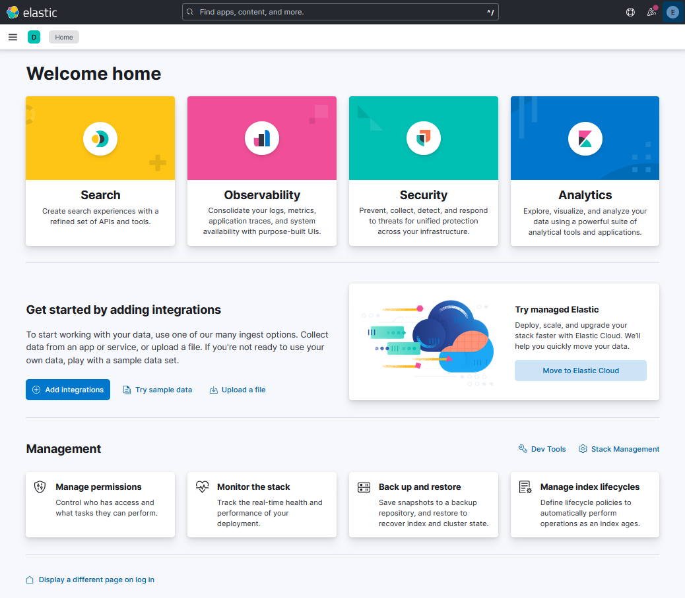

# Elastic Search Guide

This are my notes on **ElasticSearch** and **search methods** with focus on Machine Learning.

I created most of the content in this `README.md` after following the course [Complete Guide to Elasticsearch (Udemy), by Bo Andersen](https://www.udemy.com/course/elasticsearch-complete-guide), but extended it mainly consulting the official Elastic documentation. The couser by Bo Andersen has a Github repository with a summary of all the commands used: [codingexplained/complete-guide-to-elasticsearch](https://github.com/codingexplained/complete-guide-to-elasticsearch).

My respository is structured as follows:

- [`ml_search/`](./ml_search/)
- [`notebooks/`](./notebooks/)

Mikel Sagardia, 2024.  
No guarantees.

Table of contents:

- [Elastic Search Guide](#elastic-search-guide)
  - [Introduction](#introduction)
    - [Elastic Stack](#elastic-stack)
    - [Common Application Architecture](#common-application-architecture)
  - [Getting Started: Setting Up Elastic Search and Kibana](#getting-started-setting-up-elastic-search-and-kibana)
    - [Setup](#setup)
      - [Elastic Cloud](#elastic-cloud)
      - [Windows](#windows)
      - [Unix: Mac OSX, Linux](#unix-mac-osx-linux)
      - [Docker](#docker)
    - [Basic Architecture: Cluster, Nodes, Documents, Indices](#basic-architecture-cluster-nodes-documents-indices)
    - [Inspecting a Cluster with the Console](#inspecting-a-cluster-with-the-console)
    - [Interacting with the Cluster via cURL and Python](#interacting-with-the-cluster-via-curl-and-python)
    - [Sharding and Scalability](#sharding-and-scalability)
    - [Node Roles](#node-roles)
  - [Managing Documents](#managing-documents)
  - [Mapping \& Analysis](#mapping--analysis)
  - [Searching for Data](#searching-for-data)
  - [Joining Queries](#joining-queries)
  - [Controlling Query Results](#controlling-query-results)
  - [Aggregations](#aggregations)
  - [Improving Search Results](#improving-search-results)
  - [Kibana](#kibana)
  - [Logstash](#logstash)
  - [License](#license)


## Introduction

[Elastic Search](https://www.elastic.co/) is an open source analytics and full-text search engine.

We can add complex search functionalities to our applications (e.g., Wiki, e-commerce, etc.), similar to Google, with:

- autocompletion
- highlighting
- typo correction
- handling synonyms
- adjusting relevance
- etc.

We can also query structured data and we can use the platform as an analytics tool (with visualization).

Common example: APM (Application Performance Management) = store logs, be able to search in them, visualize in dashboard, etc.

We can apply ML techniques to get insights from data: forecasts, anomaly detection, etc.

In ES data is stored in **Documents**, represented as `JSON` objects:

- A Document is analog to a **row** in a relational DB.
- A Document contains **Fields**, analog to columns in a relational DB.

We perform queries via a REST API, also with `JSONs`.

Some other properties:

- ES is written in Java, on top of Apache Lucene.
- Easy to use, but has many features.
- Distributed.
- Highly scalable.
- Used by many large companies: FB, Netflix, etc.
- Queries can be done using Query DSL

### Elastic Stack

Elastic has built several products which can interact with each other:

- Elastic Search (ES): search.
- **Kibana**: analytics and visualization; dashboard for Elastic Search, ML. [Kibana Demo](https://demo.elastic.co/app/dashboards#/view/welcome_dashboard).
- Logstash: processing of logs and any data; events from different sources (there are many input/output plugins) are processed (e.g., clean, structure, etc.) and sent to Elastic Search or other destinations.
- X-Pack: additional features for ES and Kibana, such as 
  - security and access management, 
  - monitoring of resources (CPU, memory, etc.), 
  - **machine learning** (anomaly detection, forecasting, etc.)
  - graph structures
  - SQL capabilities, besides Query DSL
- Beats - Filebeats, Metricbeats, etc.: lightweight agents which collect and send data to ES. Filebeats collects logs. They are for data ingestion.


### Common Application Architecture

Let's consider an e-commerce site, where users can buy things via a web store/page. We have these components:

- The web frontend.
- The application backend.
- A relational DB where all the products are stored.

If we want to add realtime search capabilities to the web page so that users can find things easily, we need to add **Elastic Search**.

The best approach is to **replicate** all the data entries in the DB into ES; we can do that 

- initially with a script
- and then, we let the backend update ES when the DB is updated, too.

Then, we might connect **Kibana** to ES in order to visualize data in a dashboard: number of orders per week, revenue, etc.


As our web grows, we might have increeased traffic and the servers might be suffering; that's when we add **Metricbeat**, which monitors performance and resources on the backend machine and sends them to ES. Basically, ES opens an ingest node where Metricbeat sends data. We can visualize all that in Kibana, too.

Similarly, we can monitor access and error logs. We do that with **Filebeat**, similar to Metricbeat.

As the web grows we might need some data processing before ingestion to ES. One option would be to implement that processing in the backend, but it has several drawbacks: 

- the backend should run the web, not loose resources processing logs, 
- if we have a decentrilized architecture (i.e., microservices), the logging is also decentralized, and we might want to have a centralized and homogeneous processing.

Thus, it makes sense to add **Logstash** to the architecture, which enables log/data processing before ingestion to ES. Although the data from Metricbeat often times doesn't need to be processed, the data from Filebeat could need to be processed, so it is first sent to Logstash, which transforms it and sends it to ES. However, we always have the felxibility to send the data to ES first, without any processing.


<!--
Our database and ES should be synchronized. However, ideally, our application should have read permissions in ES. How is that possible?
-->

## Getting Started: Setting Up Elastic Search and Kibana

### Setup

There are many options to install Elastic Search and Kibana:

- Install on local machine: Windows, Mac OS, Linux
- Install as Docker image
- Use Elastic Cloud
- ...

Usually, we want to have an ES cluster on the cloud for scalability; it can be a self-managed ES cluster, not necessarily the Elastic Cloud solution.

#### Elastic Cloud

Elastic Cloud has everything set up and running for us: [https://cloud.elastic.co](https://cloud.elastic.co). There's a free trial for 14 days since the moment we create the cluster; after the 14 days the cluster is shut down.

This is a hosted and managed solution, the easiest one to learn how to use ES.

We can leave everything with the default options:

- If we are asked, we choose a pre-configured Elastic Stack solution.
- Additionally, we can select where to store our data! (platform &mdash; AWS, GCP, Azure &mdash;, and location &mdash; Europe, US, etc. &mdash;).
- If shown, we copy the credentials: `user:elastic`, `pw:...`
- In the new version some other variables are shown: `Elasticsearch endpoint`, `Cloud ID`.
- I copied everything to the non-committed/pushed file `elastic_cloud.txt`.

#### Windows

Full, official guide: [Install Elasticsearch with .zip on Windows](https://www.elastic.co/guide/en/elasticsearch/reference/current/zip-windows.html).

ES and Kibana can be downloaded from 

- [https://www.elastic.co/downloads/elasticsearch](https://www.elastic.co/downloads/elasticsearch)
- [https://www.elastic.co/downloads/kibana](https://www.elastic.co/downloads/kibana)

ES is programmed in Java and Kibana uses npm. However, we don't need to install those dependencies, since they are provided in the archive folder which is contained in the downloaded application. In other words, they are run directly from the uncompressed archive which is downloaded.

To set them up:

- Download the archives of Elastic Search and Kibana.
- Unzip both archives (maybe we need WinRAR/7zip or a similar, because Kibana has a very large archive...).
- Go to the extracted directory and start `elasticsearch`.

```powershell
# Elastic Search: go to extracted directory and run binary
cd C:\Users\msagardia\packages\elasticsearch-8.14.3
bin\elasticsearch.bat
# Unix: bin/elasticsearch
```

When we run `bin\elasticsearch.bat` for the first time a **cluster is created** and its configuration is performed in some minutes. Some values are created are delivered:

- A **superuser** and its password, we copy and save them, e.g., in `.env`
  - User: `elastic`, PW: `...`
  - These are our credentials; we can create other users with restricted pws later one
  - To reset the superuser pw: `bin/elasticsearch-reset-password -u elastic`
- A fingerprint certificate; data is transmitted encrypted.
  - We copy it to `.env`: `ELASTIC_FINGERPRINT`.
- An enrollment token: necessary for secure communications with ES from other nodes, e.g., Kibana.
  - We copy the token to `.env`: `ELASTIC_ENROLLMENT_TOKEN`.
  - We use it to enroll Kibana.
  - The token is valid for 30 mins, but we can create new ones: `bin/elasticsearch-create-enrollment-token.bat -s kibana`
  - We can use this enrollment token to add other nodes, too

When the ES cluster is up and running, we launch Kibana:

```powershell
# Kibana: go to extracted directory and run binary
cd C:\Users\msagardia\packages\kibana-8.14.3
bin\kibana.bat
# Unix: bin/kibana
```

After a short moment, Kibaba is ready at port `5601`:

- We open the URL in the Terminal, which has a security code: `http://localhost:5601/?code=xxxxxx`.
- We are requested for the enrollment token, `ELASTIC_ENROLLMENT_TOKEN`, which we paste.

Now everything is setup. We can log in into Kibana, which is like the GUI for ES. We can user the superuser credentials.

To shut down, we need to `Ctrl+C` both Terminals. To start again, we need to run `bin\elasticsearch.bat` and `bin\kibana.bat` in separate terminals again.



#### Unix: Mac OSX, Linux

Full, official guide: [Install Elasticsearch from archive on Linux or MacOS](https://www.elastic.co/guide/en/elasticsearch/reference/current/targz.html).

Very similar setup as with Windows: download, uncompress, run scripts, copy credentials, etc.

In the case of MacOS, we need to deactivate the Gatekeeper to be able to run Kibana. So before running `bin/kibana`:

```bash
cd .../path/where/kibana/directory/is
xattr -d -r com.apple.quarantine kibana-8.14.3

# Then, we start Kibana
cd kibana-8.14.3
bin/kibana
```

#### Docker

Full, official guide: [Install Elasticsearch with Docker](https://www.elastic.co/guide/en/elasticsearch/reference/current/docker.html).

### Basic Architecture: Cluster, Nodes, Documents, Indices

Elastic Search is distirbuted and it consists of **nodes** within a **cluster**:

- When we start an ES instance, it is really a **node** which can contain some TBs of data.
- If our data grows, we can start another instance = another node.
- In developement, we can start several nodes on our device without the need of dealing with VMs or containers; in production, different nodes are usually assigned to different VMs or containers.
- Each/all node/s belong to a **cluster**. Usually we have one cluster for application. Clusters are completely independent from each other.
- When a node starts up:
  - it joins an existing cluster
  - or it starts a cluster and joins to it.
  - Therefore, even a setup with a single node is nested in a cluster.


Each data in our nodes is a **Document**, which:

- can be represented as a `JSON`,
- is equivalent to a row in a relational DB,
- consists of the **Fields** we want, which are equivalent to columns in a relational DB.

In addition to our fields, we also store some other metadata in the Document `JSONs`.


Documents are stored in **Indices**:

- Indices are logical groups of Documents, e.g., *People Index*, *Departments Index*.
- There are no limits in terms of how many Documents go into an Index.
- We run our search queries against Indices.


### Inspecting a Cluster with the Console


When we have started both `elasticsearch` and `kibana`, we open the web UI under the URL:

[`http://localhost:5601/`](http://localhost:5601/)

Then, we can start the **Console** in the web UI:

    Hamburger Menu > Management > Dev Tools

We can use the console to communicate with ES:

- The console uses the REST API under the hood.
- The console is the easiest way to communicate with ES: it has autocompletion.
- However, we often will use the REST API via cURL or related services.

The console takes HTTP methods:

1. **GET:** Retrieve data from Elasticsearch, such as documents or index information.
2. **POST:** Send data to Elasticsearch, typically used for creating or updating documents.
3. **PUT:** Create or replace documents or indices.
4. **DELETE:** Remove documents or indices.
5. **HEAD:** Retrieve metadata without the body.
6. **PATCH:** Apply partial updates to documents.

The query structure is

    HTTP Method + API & Command & Query
    JSON (optional parameters, if required)

For instance:

```bash
# Get cluster health: _cluster API, health Command
GET /_cluster/health
```

When we run that command (play button), we get back a `JSON`:

```json
{
  "cluster_name": "elasticsearch",
  "status": "green",
  "timed_out": false,
  "number_of_nodes": 1,
  "number_of_data_nodes": 1,
  "active_primary_shards": 31,
  "active_shards": 31,
  "relocating_shards": 0,
  "initializing_shards": 0,
  "unassigned_shards": 0,
  "delayed_unassigned_shards": 0,
  "number_of_pending_tasks": 0,
  "number_of_in_flight_fetch": 0,
  "task_max_waiting_in_queue_millis": 0,
  "active_shards_percent_as_number": 100
}
```

Further examples:

```bash
# List all nodes: _cat API (Compact Aligned Text), nodes Command, v Query (verbose)
# In our case we see a single node and its IP + properties
GET /_cat/nodes?v

# List indices
# We only have system indices, leading with a .
GET /_cat/indices?v
```


### Interacting with the Cluster via cURL and Python


### Sharding and Scalability

### Node Roles

## Managing Documents

TBD.

:construction:

## Mapping & Analysis

TBD.

:construction:

## Searching for Data

TBD.

:construction:

## Joining Queries

TBD.

:construction:

## Controlling Query Results

TBD.

:construction:

## Aggregations

TBD.

:construction:

## Improving Search Results

TBD.

:construction:

## Kibana

TBD.

:construction:

## Logstash

TBD.

:construction:

## License

This project is licensed under the Apache License 2.0. See the [LICENSE](./LICENSE) file for details.

